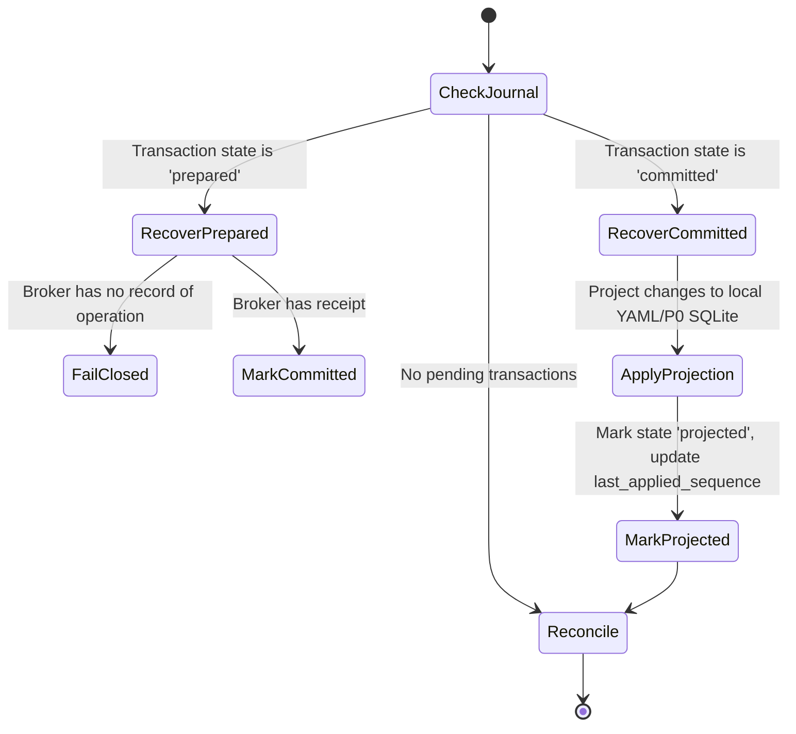

# Root-Managed Authority Integration Specification

## 1. Registry Schema and Ledger-to-Repository Binding

To map a repository to a root-managed ledger and its Unix socket, we define a root registry file. Because `/etc/operator-control-plane` is owned by `root:root` with mode `0700` (which prevents traversal by non-privileged client processes), the public registry is installed at:

`/etc/operator-control-plane-registry.json`

### File Attributes
- **Owner**: `root:root`
- **Permissions**: `0644` (world-readable, write-controlled by root)

### JSON Registry Schema
```json
{
  "schema_version": 1,
  "registrations": [
    {
      "repository_path": "/home/blueaz/operator-control-plane",
      "ledger_id": "stable-ledger-id",
      "socket_path": "/run/operator-control-plane/authority.sock"
    }
  ]
}
```

### Resolution Rules
1. The `operator` CLI resolves the active repository root by walking upward from the current working directory to locate either the first directory containing `.operator/` or the CWD itself.
2. The resolved repository path is fully resolved using `os.path.realpath()` (dereferencing symlinks and resolving relative segments).
3. The registry `/etc/operator-control-plane-registry.json` is parsed. If the resolved repository path matches a registered `repository_path`, the repository is **enrolled** under P3 authority.
4. If no registration matches, the repository runs under legacy local policy (`local_policy`). Local overrides (such as environment variables or local `identity.yaml` changes) cannot force P3 enrollment or downgrade an enrolled repository.

---

## 2. Projection Acknowledgement

We treat the broker's `projection_outbox` table as an **unacknowledged durable recovery source**.
- **Decision**: No wire-level `projection.ack` is added. The broker's audit rules expect `projection_outbox` rows to remain immutable and match commits 1:1.
- **Recovery & Reconciliation**: The client CLI tracks the `last_applied_sequence` in its local client journal. During startup, `doctor`, or an explicit `authority-reconcile` execution, the client requests `projection.snapshot` from the broker, reconciles the latest record heads starting from its last applied sequence, and applies them sequentially.

---

## 3. Local Client Journal Schema

Enrolled repositories maintain a dedicated SQLite database in their local `.operator/` directory to record local transaction states:

`.operator/client_journal.sqlite3`

### Tables and Schema

```sql
CREATE TABLE IF NOT EXISTS journal_metadata (
    key TEXT PRIMARY KEY,
    value TEXT
);

CREATE TABLE IF NOT EXISTS transaction_journal (
    operation_key TEXT PRIMARY KEY,
    canonical_digest TEXT NOT NULL,
    prepared_request TEXT NOT NULL,
    state TEXT NOT NULL CHECK (state IN ('prepared', 'committed', 'projected')),
    receipt_json TEXT,
    commit_sequence INTEGER,
    projection_snapshot_digest TEXT,
    created_at TEXT NOT NULL DEFAULT CURRENT_TIMESTAMP,
    updated_at TEXT NOT NULL DEFAULT CURRENT_TIMESTAMP
);
```

### Metadata Keys
- `last_applied_sequence`: The highest `commit_sequence` successfully projected to local YAML and P0 SQLite.

### Transaction States
1. **`prepared`**: The operation has been validated locally and written to the journal with `synchronous=FULL` before any network or socket communication.
2. **`committed`**: A valid receipt has been received from the broker socket, but the local YAML and P0 SQLite projections have not yet been updated.
3. **`projected`**: Local YAML and P0 SQLite projections have been successfully written, and the local journal metadata `last_applied_sequence` has been updated.

---

## 4. Trust Boundaries

1. **Path Traversal**: Traversal to the socket, registry, and workspace files must reject symbolic links, extra hard links, or writable ancestor directories where security enforcement is required.
2. **Socket Communication**: Client connects to the Unix socket specified in the root registry. The broker validates the client process UID via `SO_PEERCRED`.
3. **Fail-Closed**: If the repository is enrolled but the broker socket is unreachable or returns an error, the CLI must **fail closed** and abort the operation. It must never fall back to local policy or write directly to local projections.

---

## 5. Recovery State Machine

On CLI execution (and specifically during `doctor` or `authority-reconcile` runs):



### Steps
1. **Recover `prepared`**: Check if the broker has committed the operation. Query the broker with the stored `operation_key`. If the broker returns a valid receipt, transition the transaction state to `committed` and proceed. If the broker has no record, mark the transaction failed and clean up (reverting local work).
2. **Recover `committed`**: Apply the projections from the receipt to the local YAML files and P0 SQLite database. Once complete, transition the transaction state to `projected` and update `last_applied_sequence`.

---

## 6. Command Behavior Modifications

### Enrollment Resolution
Upon invocation, `operator` resolves CWD enrollment. If enrolled:
- Normal `.operator` discovery is bypassed or locked to the registered directory.
- Mutations are routed through the client socket.

### Routed Commands
The following CLI commands are intercepted and routed to the broker via the Unix socket:
- **`claim-add`** → `claim.create`
- **`evidence-attach` (status-free)** → `evidence.attach_draft` (sends open file descriptor using `SCM_RIGHTS`)
- **`evidence-attach` (status-bearing)** → `evidence.attach_status` (requires distinct verifier UID)
- **`task-create`** → `task.create` (if applicable; mapped as an implicit state transition or task registration)
- **`task-transition`** (new command) → `task.transition`

### Enrolled `session-end` Rejection
In P3 mode, `session-end --status verified|complete` is rejected. Task verification or completion state changes must occur strictly via dedicated `task-transition` commands routed through the broker.

### Doctor Reporting States
`doctor` reports the following distinct states:
1. **`current`**: Local projections match the latest commit sequence in the broker.
2. **`projection_pending`**: A local transaction is in state `committed` but not yet locally projected.
3. **`divergent_or_forged_local`**: Local YAML/SQLite projection sequence diverges or has mismatching hashes compared to the broker state.
4. **`broker_unavailable`**: The socket connection fails.
5. **`policy_rotated`**: The broker ledger policy has rotated to a new generation.
6. **`policy_revoked`**: The broker ledger policy has been terminated/revoked.
7. **`legacy_local_policy`**: The repository is not enrolled (P2/P1).

Output format displays `verification_authority` and `policy_authority` separately (e.g., `policy_authority: external_broker`).
