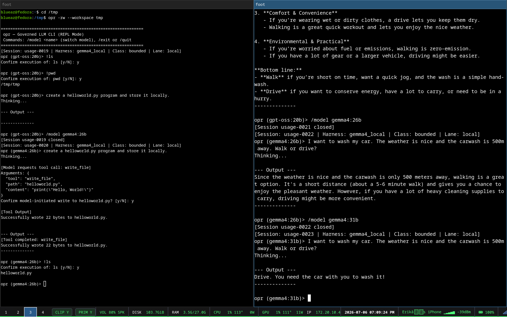

# Operator Control Plane

A small, local **governance ledger for multi-agent software work.** It enforces a
**narration-vs-execution partition**: an agent's *claim* ("I did X, it passes") is only as good as the
*evidence* attached to it and the *verification* by a different identity. The `operator` CLI records
tasks → claims → evidence → verifications as YAML projections under `.operator/`, preserves each
trust-relevant write in an append-only SQLite event history, binds writes to the executing OS identity,
guards against self-verification, and ships a `doctor` consistency checker.

Only an enforced verification by a registered verifier OS UID distinct from the claim author's UID is
recorded as `uid_isolated`. Same-UID and default `single_user` verification is explicitly advisory.

Built as the "engine room / logbook" enforcement substrate for [Bulkhead τ](https://bulkheadtau.com),
but it stands alone. **Contributions welcome** — especially on the open problems below.



*The `opr` governed REPL: every shell command and model-initiated file write requires explicit
confirmation, each session is a tracked usage record, and `/model` swaps local models mid-conversation.*

## Quickstart

```bash
pip install -r requirements.txt        # just PyYAML
./operator --help
./operator doctor                      # consistency check over the local .operator/ ledger
pytest tests/                          # subprocess-driven tests + synthetic session fixtures
```

The ledger (`.operator/`) is gitignored — it's your work history, not the tool. Its durable local event
history is stored in `.operator/ledger.sqlite3`.

## P3 broker component (not installed)

Issue #4 adds a standalone `operator-broker` process, external authority store, evidence CAS, receipts,
and projection snapshots. It is isolated from the existing `operator` CLI: it does not read or promote
`.operator` state, and development-fixture receipts confer no P3 authority on repo ledgers. Protected
policy/service installation, CLI integration, and enrollment remain separate work.

```bash
# Test/development fixture only; use throwaway absolute paths.
./operator-broker bootstrap-fixture --store /tmp/operator-authority.sqlite3 \
    --content-dir /tmp/operator-authority-content --bootstrap-config /tmp/bootstrap.json
./operator-broker serve --store /tmp/operator-authority.sqlite3 \
    --content-dir /tmp/operator-authority-content --socket /tmp/operator-authority.sock
./operator-broker audit --store /tmp/operator-authority.sqlite3 \
    --content-dir /tmp/operator-authority-content
```

See [`AUTHORITY_BROKER_SPEC.md`](AUTHORITY_BROKER_SPEC.md) for the protocol, transaction, crash-recovery,
and issue-boundary contracts.

## Commands

The `operator` CLI exposes 22 subcommands across the task → claim → evidence → verification →
session → usage lifecycle. Run `./operator <command> --help` for full flags.

**Setup** — `init` creates the `.operator/` ledger in the current repo. Re-running it on an existing
YAML-only ledger baselines those records into SQLite without changing their visible IDs or files.

**Tasks**
- `task-create --objective "…" [--id ID] [--repo R] [--assign A] [--review R]` — open a task.
- `task-show [ID]` — show a task's claims, evidence, and status.
- `task-list` — list all tasks with outcome summaries.

**Claims** (a claim is a typed, checkable assertion bound to a gate)
- `claim-add --type TYPE --text "…" [--task ID] [--gate GATE] [--by WHO]` — register a claim.
  Types: `file_exists, test_passes, numeric_measurement, real_data, model_output,
  firmware_behavior, deployment_state, supervision_credit, paper_or_report_claim`.
- `claim-show [ID]` / `claim-list [--task ID]` — inspect claims.

**Evidence & verification** (the core: a claim is only as good as its evidence + a different-identity sign-off)
- `evidence-attach PATH_OR_URL --claim CID --type TYPE [--hash SHA256] [--status {verified,false,quarantined}] [--verified-by WHO] [--verify-cmd CMD]`
  — attach an artifact and optionally verify the claim. Local files are copied into the ledger and
  fingerprinted with SHA-256, byte size, and modification time; `--hash` is an expected digest that
  must match the local bytes before any evidence write. Missing filesystem paths are rejected;
  non-file external references must use an explicit URI scheme. Evidence types: `run_log, manifest,
  database_query, test_output, git_commit, screenshot, transcript, paper_section, external_doc`.
  Under enforced identity policy, draft attachment is a builder action and any status attachment is a
  verifier action from an OS UID distinct from the claim author.
- `verify RUN_DIR` — automated audit of a run directory's artifacts.
- `doctor [--audit]` — read-only consistency check across the ledger: flags unverified claims,
  **self-verification**, advisory verification, malformed UID-isolated verification, and enforcement
  downgrades. Fails closed (exit code 1) on
  verified/completed records if they lack required evidence files, target repository references,
  matching gate/test files, or valid command run hashes. It also verifies SQLite event hashes,
  compares each latest event with the corresponding YAML projection, and recomputes local evidence
  fingerprints. A changed verified source or retained snapshot fails closed; an unavailable original
  source is reported separately when its retained snapshot is still current. Remote evidence without
  a local snapshot is explicitly uncheckable. `doctor` never executes a stored `--verify-cmd`.

**Sessions** (track a coding session and its cost)
- `session-start --harness H [--task ID] [--force]`
- `session-end --outcome {useful,partial,no_go,quarantined,reverted,unknown} --cost N`
- `session-list [--open] [--task ID] [--harness H]`

**Usage / quota accounting**
- `usage-add --harness H [--model M] [--outcome …]` — capture a pasted usage snippet.
- `usage-import --harness {claude,codex,gemini-agy} [--since …] [--dry-run]` — auto-ingest
  token/usage from implemented harness session-log adapters. Other registered harnesses, including Grok,
  can use `session-start`, `usage-add`, and manual annotation until an adapter exists.
- `usage-summary [--by-task] [--by-harness] [--by-model] [--by-lane] [--offload-audit] [--metering]` / `usage-annotate [--cost …] [--note …]`.

**Briefs & handoff**
- `brief --for H [--task ID]` / `export-brief --for H [--task ID]` — generate a harness-specific
  brief (copy-paste for the next agent).
- `handoff-add [--task ID] [--changed …] [--verified …] [--claimed …] [--open …]` — record a closeout.

## Worked example

The following end-to-end script demonstrates the creation and lifecycle of a task and claim. It shows how to initialize the local ledger, create a task, register a gate-bound claim, attach verifiable evidence (with an explicit verification command and reviewer signature), run the integrity doctor check, track a session's usage metrics, and generate a downstream brief.

```bash
./operator init                                    # create .operator/ ledger (run this in a fresh throwaway dir)

# a couple of stand-in files so the claim's gate and evidence actually exist
mkdir -p tests/out
printf 'def retries(n): return n <= 3\ndef test_retry(): assert retries(3) and not retries(4)\n' > tests/test_upload.py
printf 'ok\n' > tests/out/upload.log

# open a task
./operator task-create --objective "Add retry to the uploader" --id up-retry

# an agent registers a typed, gate-bound claim
./operator claim-add --task up-retry --type test_passes \
    --text "uploader retries 3x on 5xx" --gate tests/test_upload.py

# attach evidence and record an advisory verification in the default single_user mode;
# --verify-cmd is inert audit metadata and is not executed by operator
./operator evidence-attach tests/out/upload.log --task up-retry --claim claim-0001 \
    --type test_output --status verified --verified-by reviewer \
    --verify-cmd "pytest -q tests/test_upload.py"

# read-only consistency check: unverified / self-verified / unverifiable-evidence claims
./operator doctor

# track the session + its cost, then close out with a brief for the next harness
./operator session-start --task up-retry --harness claude   # opens the session, recorded as usage-0001
./operator session-end usage-0001 --outcome useful --cost 12.50
./operator handoff-add --task up-retry --changed "uploader.py" --verified "retry test" --open "tune backoff"
./operator export-brief --for codex --task up-retry
```

## Configuration

Operator is driven by files under `.operator/` (created by `init`); behavior is governed by a small
set of product-facing config:

- **`.operator/identity.yaml`** — the identity-enforcement policy:
  ```yaml
  mode: enforced          # or: single_user (advisory)
  uids:
    1001:
      name: builder
      roles: [builder]
    1002:
      name: reviewer
      roles: [verifier]
  ```
  In `enforced` mode, claim creation and draft evidence require the `builder` role. Status-bearing
  evidence requires the `verifier` role, a matching `--verified-by`, and a verifier UID distinct from
  the recorded claim-author UID. Rejections occur before artifacts or ledger records are written. A
  legacy scalar entry such as `1001: builder` remains loadable and grants both roles, but the distinct
  UID rule still prevents self-verification. In `single_user`, status writes remain available and are
  recorded as `advisory`, never `uid_isolated`.
- **`.operator/{tasks,claims,evidence,handoffs,usage}/`** — current YAML projections (gitignored).
- **`.operator/ledger.sqlite3`** — append-only, full-snapshot event versions for task, claim,
  evidence, handoff, and usage/session records. Session commands version their `usage-XXXX` record.

SQLite is the durable audit history for CLI writes; YAML remains the compatibility read surface. Event
versions are allocated transactionally, linked by per-record SHA-256 hashes, and protected from
`UPDATE`/`DELETE` through database triggers. `doctor` reports divergence but does not silently repair
either side. Because both live on the same writable disk, this improves local durability and
auditability; it is not an off-machine backup or an adversarial tamper-proof boundary.

The registry supplies role policy. The trusted boundary also requires the processes to run under
genuinely distinct OS UIDs; the CLI does not provision those users or containers.

### Root-managed external policy (P3b)

Issue #5 adds the separate `operator-admin` installation and policy lifecycle described in
[`AUTHORITY_POLICY_SPEC.md`](AUTHORITY_POLICY_SPEC.md). It installs the standalone broker under fixed
root-controlled paths, creates SQLite only after dropping to the broker UID, and supports strict
generation-one install, append-only rotation, terminal revocation, audit, and conservative privilege
preflight.

This is still not repo CLI integration. `operator` and existing `.operator` ledgers do not consult
the external authority yet. The service is installed but not started or enabled, and real-host privilege
proof remains issue #7. Initial installation must execute a root-owned staged copy of
`operator-admin`; its privileged wrapper intentionally refuses a user-writable checkout.

## Design specs

- [`EXECUTOR_IDENTITY_SPEC.md`](EXECUTOR_IDENTITY_SPEC.md) — process-level identity binding via `os.getuid()`.
- [`AUTHORITY_BROKER_SPEC.md`](AUTHORITY_BROKER_SPEC.md) — standalone external broker and store.
- [`AUTHORITY_POLICY_SPEC.md`](AUTHORITY_POLICY_SPEC.md) — root-managed installation and policy lifecycle.
- [`VERIFIED_BY_GUARD_SPEC.md`](VERIFIED_BY_GUARD_SPEC.md) — fail-closed on self-verification (a builder can't sign off its own claim).
- [`USAGE_AUTOIMPORT_SPEC.md`](USAGE_AUTOIMPORT_SPEC.md) — ingest per-session token/usage from Claude/Codex/Gemini harness logs without unit conflation.

## Known limitations — help wanted

These are real and known (named honestly rather than hidden — the whole point of the tool is that
unverified claims are worthless):

- **Advisory verification in `single_user` mode.** When every agent runs under one OS user, the
  builder can assert a reviewer's name. Trusted `uid_isolated` verification requires pre-provisioned,
  distinct OS users; provisioning them is outside this tool.
- **The durable ledger is still local-only.** SQLite preserves version history when a YAML projection
  is damaged or removed, but `.operator/` remains gitignored and has no off-machine backup. A disk
  loss can still remove both the event history and copied evidence.
- **The repo CLI policy gate is self-amendable.** Any agent with write access to the local config can
  weaken the gate it is supposed to be bound by. The standalone P3 broker component is not yet installed
  or integrated, so it does not remove this limitation from current `.operator` ledgers.
- **Evidence binding.** Local attachment preserves both the original source fingerprint and a retained
  snapshot fingerprint, so later byte drift is visible. Remote evidence has no bytes to recompute and is
  reported as uncheckable. Prefer binding a *re-runnable structural test* over a captured blob or a
  byte-hash of a living document.
- **Structural, not semantic, verification.** `doctor` checks bindings, metadata, and fingerprints. It
  deliberately does not execute stored verification commands; those remain inert audit metadata even
  for a UID-isolated verifier. A vacuous gate (`assert True`) or a hash of irrelevant bytes can still
  look structurally valid. Whether evidence proves the claim remains a reviewer judgment.

## License

MIT.
