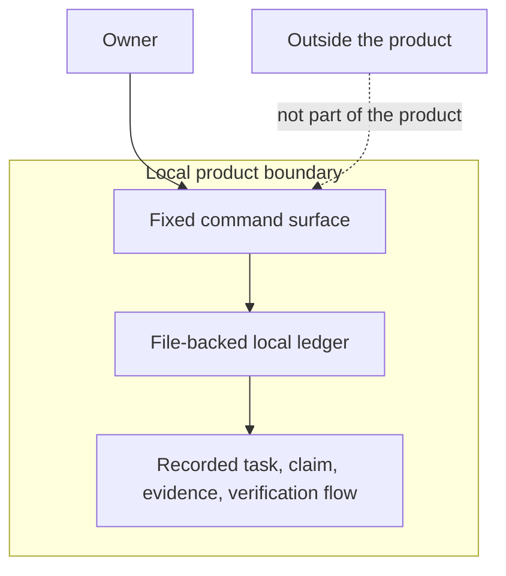
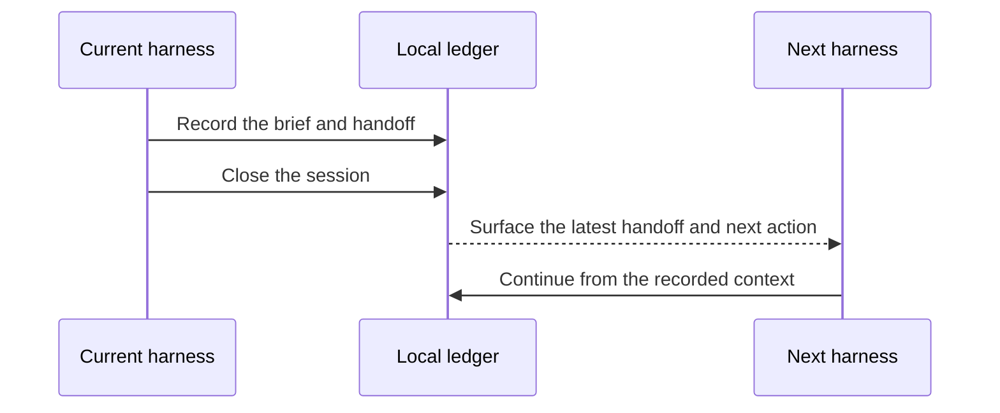
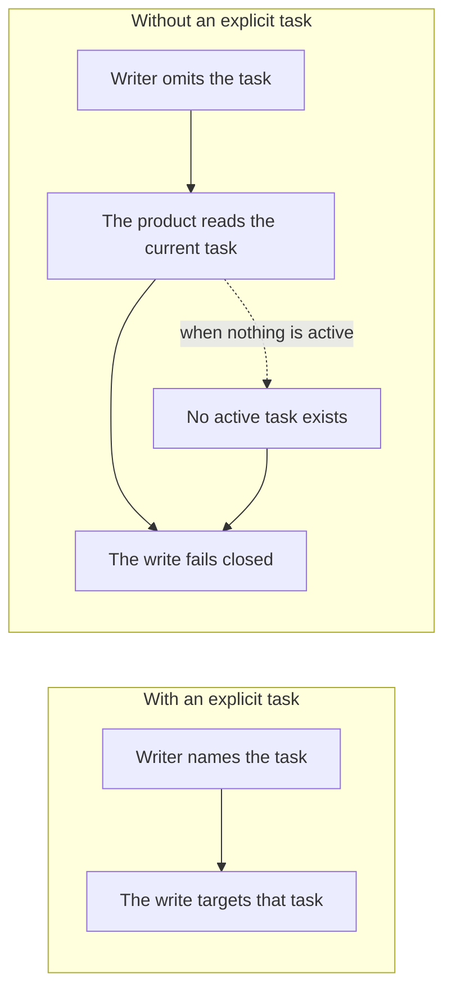
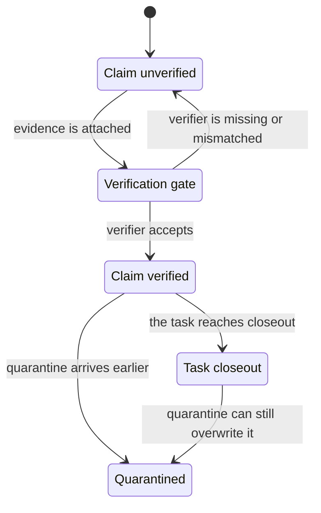

## What operator Is For

_operator is a local command-line control plane with a file-backed ledger under .operator/. Its job is not to be a general project tracker or a hosted control plane; it is to keep multi-agent work legible through a task, claim, evidence, and verification frame. For the owner, the important thing is the boundary: this product is about preserving accountable work records inside a bounded local workflow._

### One-Minute Snapshot

operator is a local command-line control plane with a file-backed ledger under .operator/. Its job is not to be a general project tracker or a hosted control plane; it is to keep multi-agent work legible through a task, claim, evidence, and verification frame.

For the owner, the important thing is the boundary: this product is about preserving accountable work records inside a bounded local workflow. The human operator maintains the ledger, assigned harnesses do the work, review harnesses check it, and verifiers are recorded when trust changes. The next chapters go deeper into the lifecycle, the records, and the verification rules; this chapter only sets the identity and the limits.

> **Figure:** The owner should read operator as a local control surface over a bounded ledger, so the product ends at the recorded workflow instead of expanding into a hosted control plane or a generic tracker.

This diagram shows the owner using a local product boundary that contains a fixed command surface, a file-backed local ledger, and the recorded task-to-claim-to-evidence-to-verification flow. Anything outside that boundary is not part of the product's scope.

### What You Should Be Able To Explain

- Understand that operator is a local CLI plus a .operator/ ledger, not a hosted SaaS control plane.
- Recognize the native roles: operator, assigned harness, review harness, and verifier.
- See the core product frame: task, claim, evidence, then verification.
- Know that brief and handoff records are the continuity path between harnesses.
- Notice the main boundary risks before deciding what to trust or correct.

### Mental Model

The owner should read operator as a local governance ledger for software work. The product matters because it turns scattered multi-agent activity into a recorded sequence: work is assigned as a task, assertions become claims, claims are supported by evidence, and trust changes only through verification. That is the load-bearing frame of the product, and it is the reason the manual keeps returning to the same vocabulary instead of treating this as generic ticket tracking.

This chapter stays at the level of identity and boundary. The detailed movement of work through the ledger belongs in the lifecycle chapter, and the mechanics of records belong in the surfaces chapter.

> **Figure:** Continuity is not informal memory here. The next harness starts from recorded context, so the handoff path keeps work legible across role changes instead of forcing a cold restart.

The current harness writes the brief and handoff into the local ledger, then closes the session. The next harness reads that recorded context and continues from the latest handoff and next action. The consequence is that work moves forward through saved records rather than through memory alone.

### How It Works

The executable surface is a fixed CLI, and the durable surface is the .operator/ ledger. Some write commands bind to the current task when the task is not passed explicitly, so the product expects there to be an active piece of work already in view. A new claim begins unverified and linked to its task; it does not become trusted just because it exists.

Briefs and handoffs are the continuity layer between harnesses. Sessions, usage, and provenance records support the work, but they do not replace the core task-to-claim-to-evidence-to-verification sequence. That keeps the product centered on accountable work records rather than on a generic activity log.

> **Figure:** Convenience comes with a dependency: if the task is omitted, the write falls back to the current ledger state, so the command is only safe when the active task is already set.

With an explicit task, the writer points the command at a known target and the write goes there directly. Without an explicit task, the product tries to use the current task from the ledger; if no active task exists, the write stops instead of guessing. The consequence is that these writes depend on existing task state when the task is not named.

### Verified Facts

- The CLI surface is statically enumerated, not dynamically discovered.
- The first run creates the standard .operator/ structure, and rerunning bootstrap does not repair a tree that already exists.
- Several task-bound writes fall back to the current task when no task is supplied, and they fail closed if no active task exists.
- Claims start unverified, with no verifier and no evidence refs, then link back to the task that owns them.
- Briefs and handoffs are designed to carry context forward to the next harness.
- Operational writes record executor provenance, while doctor acts as a diagnostic check for identity and drift rather than the product's main identity.

> **Figure:** A claim does not become trusted just because it exists, and closeout is not final if quarantine comes later. The owner should treat the terminal state as reversible when that later signal appears.

A claim starts unverified. When evidence is attached, it enters a verification gate; if the verifier is accepted, the claim becomes verified, and if the verifier is missing or mismatched, it stays unverified. When the task reaches closeout, a later quarantine can still overwrite that terminal state. The consequence is that trust is gated, and terminal status is not one-way.

### Strengths

The strongest thing about the product is that it makes work legible across harnesses without asking the owner to trust memory. The vocabulary is consistent across the command surface and the recorded workflow, which makes it easier to tell whether a task is actually supported, merely asserted, or already verified.

A second strength is that the product keeps continuity explicit. Briefs, handoffs, sessions, and provenance are recorded as part of the workflow instead of being left as informal side notes, so the ledger can answer what happened and who acted even when the work moved between roles.

### Evidence Boundary

> **Evidence boundary** — Reviewed:
- The CLI command surface and its fixed product vocabulary.
- The local .operator/ ledger layout and first-run bootstrap behavior.
- Task-bound writes that use the current task when one is not passed explicitly.
- Claim creation as an unverified task-linked record.
- Brief, handoff, session, and provenance behavior as the continuity layer around the core workflow.

Not reviewed:
- A live runtime .operator/ snapshot from an actual working workspace.
- External session logs used by usage import.
- Owner interview answers that would confirm the broader operating boundary.
- Any workflow beyond the bounded local tool that the repository evidence does not prove.

Recheck the manual against a fresh workspace by exercising the visible CLI entry points and comparing the resulting .operator/ layout and records with the described workflow. Confirm that first-run setup, repeat setup, task-bound writes, claim creation, brief and handoff generation, and session closeout still behave the same way. If live evidence shows a repair path, a broader system boundary, or different task-binding rules, revise the chapter boundary instead of stretching the current claims.

> Reviewed: blue-az/operator-control-plane repository snapshot, Founder/owner context

> Not reviewed: External runtime and integrations, Unreviewed runtime and owner context
