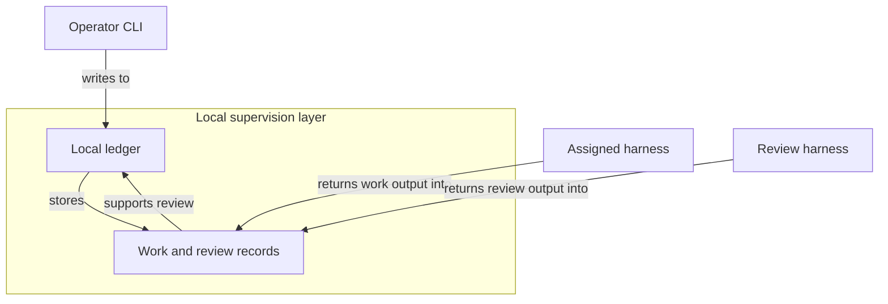
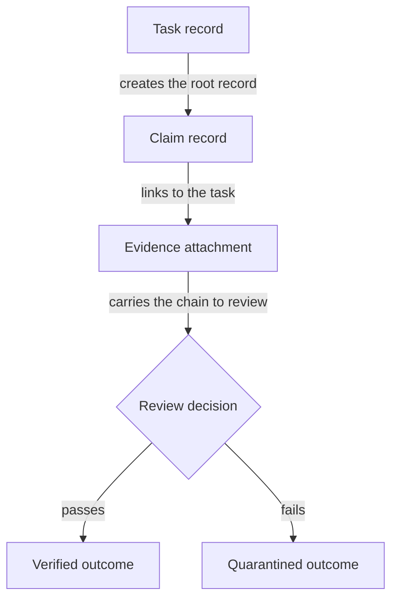
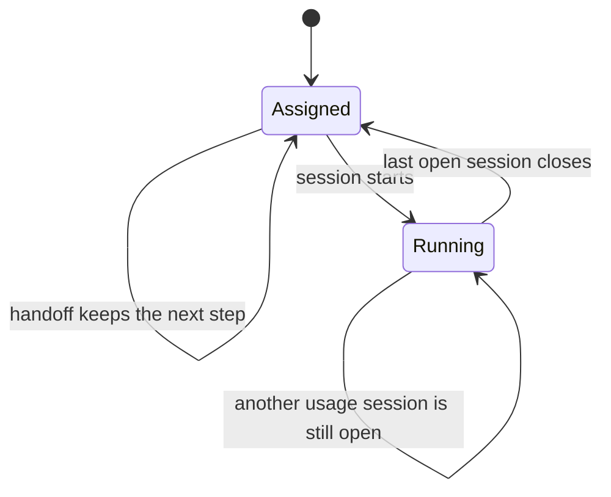
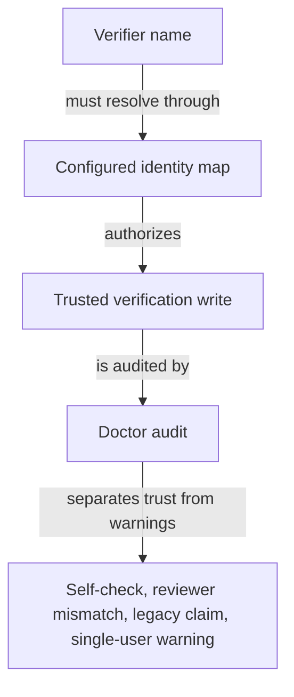

## What the Operator Control Plane Is For

_The Operator Control Plane is the owner's local supervision layer for auditable multi-agent software work. It matters because it keeps work, proof, and review in one file-backed ledger instead of letting them scatter across chat, ad hoc notes, or a generic project board._

### One-Minute Snapshot

The Operator Control Plane is the owner's local supervision layer for auditable multi-agent software work. It matters because it keeps work, proof, and review in one file-backed ledger instead of letting them scatter across chat, ad hoc notes, or a generic project board.

The operator steers the ledger through the CLI, the assigned harness does the work, the review harness checks it, and the record trail uses task, claim, evidence, handoff, session, brief, doctor, and verify as the product's core nouns. The next chapters explain how those records move, how trust is checked, how harnesses coordinate, and where the product stops.

> **Figure:** The owner should read the product as a local supervision layer that keeps the record trail in one place while outside harnesses only feed it output. That makes the system file-backed and inspectable instead of hosted and scattered across separate tools.

The diagram shows an operator CLI feeding a local ledger inside the product boundary. The local ledger stores work and review records. An assigned harness and a review harness stay outside the boundary and contribute their output through those recorded records. The consequence is that the supervision trail remains local and inspectable rather than living in a hosted workflow system.

### What You Should Be Able To Explain

- Understand why the Operator Control Plane matters to the owner and what problem it is solving.
- Recognize the core nouns and roles: operator, task, claim, evidence, handoff, session, assigned harness, review harness, and doctor.
- See the primary surfaces: the operator CLI, the local .operator ledger, and the external harnesses that participate through it.
- Know what not to assume: this is local and file-backed, not a hosted control plane or generic project-management system.

### The product in one sentence

The Operator Control Plane is the product's supervisory layer for auditable multi-agent software work. Its job is to keep the important facts in one local ledger: what the work is, what claim was made, what evidence backs it, who handed it off, and when a session was open. That makes it a governance tool first and a task tracker only in a limited sense. The next chapter explains how those records move.

> **Figure:** Work and proof stay in one auditable chain, so the owner can trace a final review result back to the task that started it. The important consequence is that the product does not treat evidence as a separate afterthought; it is part of the same record trail that determines the outcome.

The diagram starts with a task record, then shows a claim record linked to that task, then an evidence attachment that carries the chain into a review decision. From that decision, the chain ends in either a verified outcome or a quarantined outcome. The consequence is that work, proof, and result remain one auditable sequence.

### What the local control plane contains

Think of the local .operator ledger as the working memory of the product. The operator CLI writes into it, and the same vocabulary appears in the command surface so the owner can read the product the same way the system speaks: task, claim, evidence, usage, handoff, session, brief, verify, and doctor. Some actions bind to the current task through local settings, while harness-linked actions depend on a registered harness entry and fail closed when that entry is missing.

External harnesses matter only because the ledger records their output and review, not because the product exposes a hosted control plane. That distinction is deliberate: the control plane is local, file-backed, and specific to this bounded product view.

> **Figure:** A handoff by itself preserves the next step, but it does not mean the task has started. The state only falls back to assigned after the last open session closes, so closure is conditional rather than automatic.

The lifecycle begins in assigned. A handoff leaves the task in assigned while keeping the next step. When a session starts, the task moves to running. When the last open session closes, the task can return to assigned. If another usage session is still open, the task stays running. The consequence is that session closure only returns the task to assigned when the task is still running and no other usage session remains open.

### What is actually established

Three facts are solid from the evidence. Verification is not a free-floating approval label: in enforced mode it is tied to a configured identity map, and doctor can flag self-verification, reviewer mismatch, legacy claims, or test-hook drift.

Usage import also has real boundaries: provider-specific parsing keeps accounting separate across sources, and imported records keep a local provenance pointer even if the original source log later disappears. The result is a product that can explain what it knows, but not pretend that every imported or verified record is equally strong.

> **Figure:** Verification is only strong when the claimed verifier passes through the configured identity map in enforced mode. Doctor does not erase that boundary; it keeps highlighting places where the owner should treat the result as weaker or only informational.

The diagram shows a verifier name passing through a configured identity map before the system treats the verification write as trusted. Doctor then audits the write and separates real trust from warnings such as self-checks, reviewer mismatches, legacy claims with no verifier, and single-user limitations. The consequence is that not every verified claim deserves the same level of confidence.

### Why this shape is useful

This shape gives the owner three practical advantages. It keeps the audit trail local and inspectable, it separates work from review instead of collapsing them into one status change, and it preserves the manual-versus-auto baseline when usage is edited. It also helps prevent a single merged usage number from hiding which harness produced which kind of record. For an owner, that means the product is better at supervision and review than at looking broad or polished.

### Attention Cards

#### ⚠ Verification is only as strong as the identity boundary  _(attention · critical)_

**What happens:** Verification writes are tied to a configured identity map in enforced mode, while doctor flags self-verification, reviewer mismatch, and guarded override drift.

**Why it matters:** If the owner reads verification as a blanket truth stamp, accepted work can look more trustworthy than it really is.

**What to do:** Review this boundary and decide whether the current behavior is intentional.

**Revisit when:** When control plane foundation behavior or related owner decisions change.

#### ⚠ Imported usage is useful but not complete proof  _(attention · high)_

**What happens:** Usage import keeps a local provenance path, but if the source log later disappears, doctor only warns.

**Why it matters:** The owner should treat imported activity as audit support, not as a stronger record than the source actually provides.

**What to do:** Review this boundary and decide whether the current behavior is intentional.

**Revisit when:** When control plane foundation behavior or related owner decisions change.

#### ⚠ Do not let the scope inflate  _(attention · medium)_

**What happens:** The product is framed as a local, file-backed ledger under .operator/, not as a hosted service or shared platform.

**Why it matters:** Scope drift changes what the owner should expect from access, durability, and operational responsibility.

**What to do:** Review this boundary and decide whether the current behavior is intentional.

**Revisit when:** When control plane foundation behavior or related owner decisions change.

### Owner Decisions

#### ⚖ Should the manual keep the product framed as a local governance ledger, not a generic workflow platform?  _(owner decision · open)_

**Why it matters:** This choice determines whether later chapters speak in product terms or drift into broad process language.

**Revisit when:** Before changing the related control plane foundation behavior.

### Evidence Boundary

> **Evidence boundary** — Reviewed:
- The product framing in the README and the CLI surface were reviewed to confirm the local-ledger vocabulary and the primary nouns.
- The task, claim, evidence, handoff, session, brief, verify, and doctor paths were reviewed only enough to confirm that they belong to the same local control plane.
- The verification and usage-import guardrails were reviewed to confirm the trust boundary, identity checks, and provenance behavior.

Not reviewed:
- The later lifecycle chapter, verification governance chapter, harness coordination chapter, usage import chapter, and operating boundaries chapter were not re-read in full for this orientation chapter.
- Broader product intent, hosted deployment assumptions, and the larger surrounding system were not established by the evidence used here.
- Owner priorities were not supplied, so this chapter cannot decide whether the main emphasis should be auditability, coordination, or usage visibility.

Recheck the README, the CLI surface, the verification guardrail path, and the usage import path if the product scope expands, the command set changes, or the manual starts claiming hosted behavior or broader system ownership. If you later receive owner intent, revisit this chapter's scope wording first, then update the handoffs to the later chapters.

> Reviewed: blue-az/operator-control-plane repository snapshot, Founder/owner context

> Not reviewed: External runtime and integrations, Unreviewed runtime and owner context
