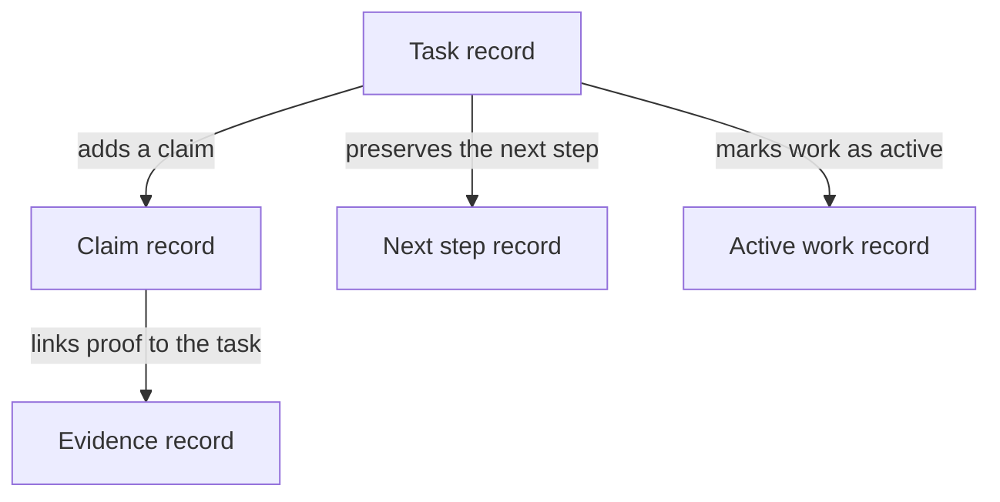
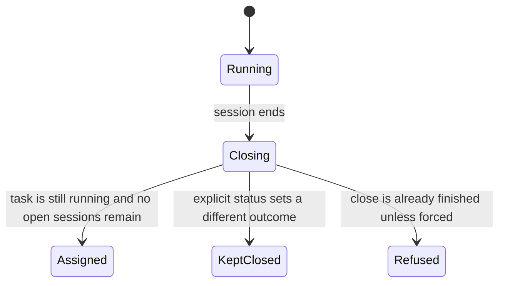
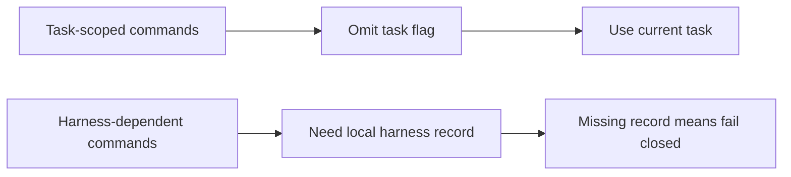

## How Work Moves Through the Ledger

_This chapter explains the part of the product that turns supervised work into a record. A task is the unit of work, a claim is the asserted outcome, evidence is the proof attached to that claim, a handoff keeps the next step visible, and a session marks when work is active and when it closes. Read the ledger as a linked trail of records, not as one simple status field._

### One-Minute Snapshot

This chapter explains the part of the product that turns supervised work into a record. A task is the unit of work, a claim is the asserted outcome, evidence is the proof attached to that claim, a handoff keeps the next step visible, and a session marks when work is active and when it closes. Read the ledger as a linked trail of records, not as one simple status field. The main owner risk is that some transitions are conditional, especially session closure and the return to assigned, so a quick read can hide whether work is still live.

### What You Should Be Able To Explain

- You can tell what each ledger record means in plain terms: task, claim, evidence, handoff, and session.
- You can follow how work becomes proof without collapsing the whole flow into one status value.
- You can see where the ledger preserves the next step and where it marks work as still active.
- You can spot the conditional points that matter for reassignment, closure, and later review.
- You can separate this workflow chapter from the later chapters that deal with trust, harness coordination, and imported usage.

### Mental Model

This chapter owns the path from supervised work to later audit trail. The operator starts with a task, attaches claims to that task, and then attaches evidence to the claim. A handoff keeps the next step visible across time. A session marks the active stretch of work so the ledger can say when work is open and when it has closed. The safest way to read the product is as a chain of linked records, not as a single status field that tells the whole story.

> **Figure:** The owner should read the ledger as a chain of linked records, not as one status field. That matters because disputes and later review depend on the full trail: the task, the claim, the attached proof, the preserved next step, and the active work marker all carry different parts of the story.

A task record sits at the center of the ledger. From that task, a claim record is added. The claim points to an evidence record that carries the proof. The task also keeps a next step record for handoff and an active work record for the session that marks when work is running. The consequence is that the owner has to read several linked records together to understand what actually happened.

### How It Works

Work begins as a task record and becomes more specific as the operator adds claims, evidence, and handoffs. Evidence attachment is not just a note; it can also change the claim and the task outcome. Handoffs preserve the next step on the task so the work does not lose its direction when time passes or the work moves between harnesses. Sessions show when work is active. Closing a session is not a blind flip back to idle: if the task is still running and no open sessions remain, the ledger can return it to assigned unless the close request asks for a different outcome. That conditional return is the point where a quick reading can go wrong.

> **Figure:** Session closure is conditional, so the owner should not read every finished session as an automatic return to assigned. The important consequence is that reassignment only happens when the task is still running and nothing is left open, while an explicit outcome or a guarded second close keeps the task from falling back.

The lifecycle begins in running. When a session ends, the task moves into a closing step. From there, it returns to assigned only if the task is still running and no open sessions remain. If an explicit status requests a different outcome, the task stays kept closed. If a close is already finished and not forced, the close is refused. The consequence is that session end does not by itself mean the task is ready for reassignment.

### Verified Facts

The reviewed evidence supports a small, local, file-backed ledger model with the same workflow nouns the command line uses. It also supports a single mutation chain from task to claim to evidence, where proof material and task history stay linked. Handoff capture stores the next step on the task, and session start and end record when work is running and when it closes. The manual also shows that omitting a task name is only a shortcut on task-scoped commands, while commands that depend on harness registration fail if that local registry entry is missing. That makes the workflow more precise than a generic project tracker, but also less forgiving if the operator assumes one rule applies everywhere.

> **Figure:** The shortcut is narrow, not universal. The owner should expect omitted task context to work only where the command is already task-scoped, while commands that depend on local harness state still stop when that record is missing.

One branch shows task-scoped commands: if the task flag is omitted, the command uses the current task. The other branch shows harness-dependent commands: they need a local harness record, and if that record is missing they fail closed. The consequence is that omitted task context does not apply everywhere, so the owner should read fallback behavior per command.

### Strengths

The strongest part of this workflow is traceability. The owner can follow a task from creation, to claim, to evidence, to handoff, to session closure without losing the thread. The second strength is restraint: the ledger does not pretend that one status change is enough to prove the work is finished. Session closure has a duplicate-close guard, and the return to assigned is conditional rather than automatic. The third strength is boundary discipline. This chapter can stay focused on the movement of work while later chapters handle trust, identity, and external coordination.

### Attention Cards

#### ⚠ Do not treat one status as the whole story  _(attention · high)_

**What happens:** Task state is spread across task, claim, evidence, handoff, and session records. Evidence attachment and session closure can change more than one record at once, so the latest status by itself is not the full audit trail.

**Why it matters:** If the owner reads only the end state, disputes can hide the record chain that shows what actually happened.

**What to do:** Review this boundary and decide whether the current behavior is intentional.

**Revisit when:** When ledger workflow behavior or related owner decisions change.

#### ⚠ Session closure only returns to assigned under narrow conditions  _(attention · high)_

**What happens:** A finished session does not automatically mean the task is back at assigned. The task must still be running, no open sessions can remain, and an explicit close request can override the fallback.

**Why it matters:** The owner could think work is ready for reassignment while the ledger still treats it as active.

**What to do:** Review this boundary and decide whether the current behavior is intentional.

**Revisit when:** When ledger workflow behavior or related owner decisions change.

#### ⚠ Current-task fallback is command-specific  _(attention · medium)_

**What happens:** Omitting a task name binds only some task-scoped commands to the current task. Commands that depend on harness registration also fail closed when that local registry entry is missing.

**Why it matters:** If the manual overgeneralizes this rule, operators will expect the same fallback or the same validation everywhere.

**What to do:** Review this boundary and decide whether the current behavior is intentional.

**Revisit when:** When ledger workflow behavior or related owner decisions change.

### Owner Decisions

#### ⚖ Should this chapter keep the product framed as a local ledger rather than a hosted workflow system?  _(owner decision · open)_

**Why it matters:** That framing sets the owner's expectation for where records live and how much of the workflow is meant to be local and inspectable.

**Revisit when:** Before changing the related ledger workflow behavior.

#### ⚖ Should the manual say session closure falls back to assigned only when the task is still running and no open sessions remain?  _(owner decision · open)_

**Why it matters:** This is the point where a quick reading can produce the wrong operational conclusion about whether the work is actually finished.

**Revisit when:** Before changing the related ledger workflow behavior.

#### ⚖ Should the manual list which commands use the current-task fallback and which commands check harness state?  _(owner decision · open)_

**Why it matters:** This affects how much the owner can trust omitted task context and missing harness files.

**Revisit when:** Before changing the related ledger workflow behavior.

#### ⚖ Should this chapter keep evidence capture separate from later verification?  _(owner decision · open)_

**Why it matters:** The workflow is easier to understand when proof material is attached first and trust is judged in the later chapter.

**Revisit when:** Before changing the related ledger workflow behavior.

### Evidence Boundary

> **Evidence boundary** — Reviewed:
- The local ledger framing and the command vocabulary that this product uses to talk about work.
- The linked path from task to claim to evidence, including how evidence can also change the recorded outcome.
- The handoff and session lifecycle, including the conditional return to assigned after the last open session closes.
- The fact that current-task fallback is command-specific rather than a blanket rule, with missing harness registration causing some commands to fail closed.

Not reviewed:
- The full identity and trust rules for verification.
- The external harness coordination model beyond how it affects this workflow.
- Imported usage and cost accounting in depth.
- Broader durability, retention, recovery, and stewardship guarantees.

Recheck this chapter when task, claim, evidence, handoff, or session commands change, when the close-and-return behavior changes, or when the product scope moves beyond the local ledger model.

> Reviewed: blue-az/operator-control-plane repository snapshot, Founder/owner context

> Not reviewed: External runtime and integrations, Unreviewed runtime and owner context
