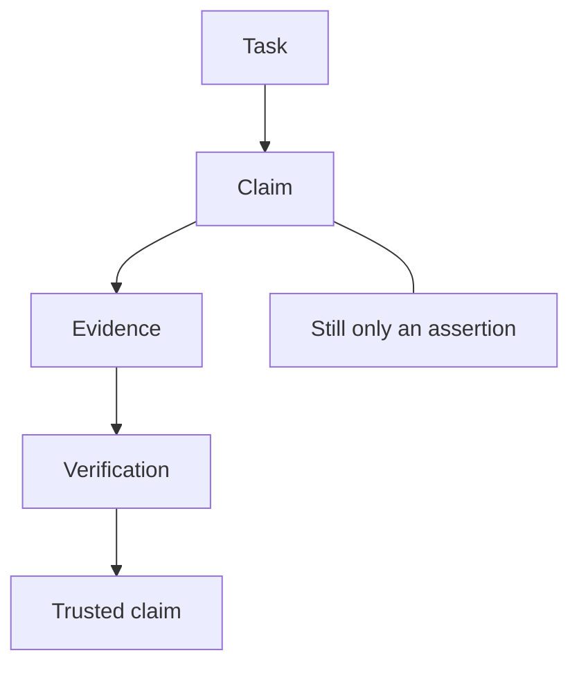
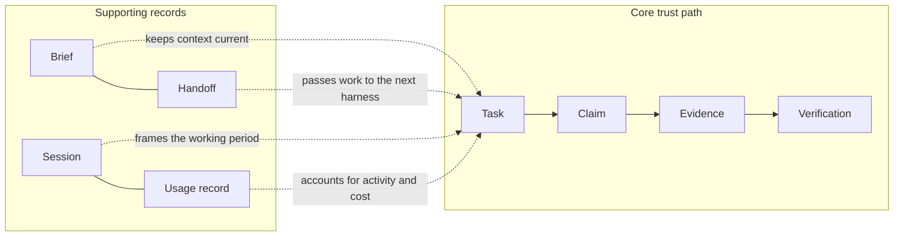
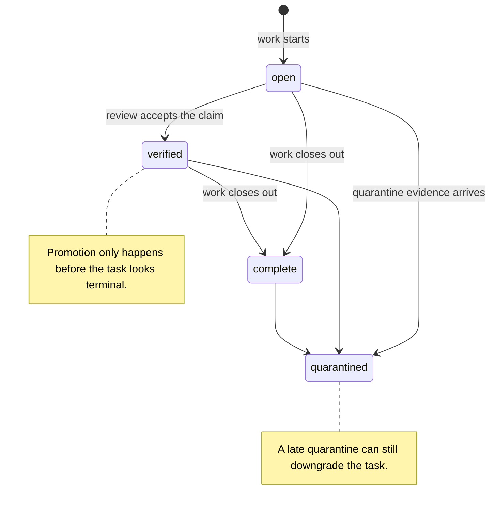

## How Work Moves Through the Ledger

_The product matters to the owner because it turns work into a governed record instead of a pile of loosely related notes. A task becomes a claim when an assigned harness says what it did, evidence supports that claim, and verification is the separate trust step that decides whether the claim should be treated as trusted._

### One-Minute Snapshot

The product matters to the owner because it turns work into a governed record instead of a pile of loosely related notes. A task becomes a claim when an assigned harness says what it did, evidence supports that claim, and verification is the separate trust step that decides whether the claim should be treated as trusted. Sessions, briefs, and handoffs sit around that core path so the next harness can continue without losing context. Usage records are also governed, but they are secondary to the trust path and should not be mistaken for proof of work.

### What You Should Be Able To Explain

- Understand the difference between a task, a claim, evidence, and verification.
- See why claims and evidence stay separate until a verifier signs off.
- Recognize which records are essential for auditability and which records mainly preserve continuity.
- Spot where the workflow can drift, downgrade, or stay ambiguous before it becomes a governance problem.
- Know which follow-on chapters handle surfaces, trust, usage, and operating rhythm in more detail.

### Mental Model

Think of the ledger as a governed work trail. The task is the container for work. The claim is the statement that something was done. Evidence is the support for that statement. Verification is the trust step that tells the owner whether the claim should count as trusted. Those are related, but they are not the same thing.

The supporting records sit beside that core path. Briefs and handoffs are there so the next harness can pick up the work with context intact. Sessions capture the working period and help close it out cleanly. Usage records account for activity and cost. A healthy workflow makes those layers visible instead of blending them into one vague status stream.

> **Figure:** The owner should read trust as a separate gate, not something created by the claim itself. A task can become a claim before it is trusted, and only evidence plus verification changes how that claim counts.

A task leads to a claim. The claim can gather evidence. Verification is a separate step that decides whether the claim becomes trusted. Until that review happens, the claim remains only an assertion about work, not proof.

### How It Works

The normal sequence is straightforward: a task exists, an assigned harness works it, a claim records what was done, evidence supports that claim, and verification decides whether the claim is trusted. The owner should read that as a chain of responsibility, not a set of interchangeable statuses.

A few supporting rules matter for how the chain behaves. Some writes follow the current active task automatically when no task is named, so the ledger depends on task state being correct. A new claim starts unverified and has no verifier until later evidence and verification are recorded. When claim-backed evidence is being marked with a status, the verification step is separate from the evidence itself, and the trust check is stricter in enforced mode than in single-user mode. Briefs and handoffs carry the latest context to the next harness, while session start and end frame the working period and the usage placeholder that belongs to it.

> **Figure:** Briefs, handoffs, sessions, and usage records sit beside the core path to preserve continuity and accounting. They help the next harness continue cleanly, but they do not replace the proof path.

The core path is task, claim, evidence, and verification. Around it sit briefs, handoffs, sessions, and usage records. Those supporting records keep context moving, frame the working period, and account for activity and cost, but they do not serve as proof of work.

### Verified Facts

The reviewed evidence supports a few concrete behaviors that matter to the owner:

- Claim creation is not trust creation. A new claim begins unverified, with no verifier and no evidence refs, and it is linked back to its task.
- Claim-backed evidence updates only enforce the verifier rule when a status is being recorded on a claim. That is the protected trust path; it is not a blanket rule for every evidence write.
- Local evidence copying is fail-closed. Copy or fingerprint failure prevents the evidence and trust
  records from being written.
- Doctor is a diagnostic check, not a single binary gate. It separates self-verification errors, reviewer mismatch warnings, and legacy records that lack verifier metadata, and it fails closed (exit code 1) on verified records if required evidence files, target repository references, matching gate/test files, or valid command run hashes are missing.
- Briefs are meant to hand work to the next harness. They carry the latest handoff, the current task state, and the next action, and they tell builders to attach evidence while leaving verification to the review harness.
- Usage has two lanes. Imported usage is tied to session history, while direct usage intake is a separate accounting write that goes straight into the dated usage ledger.
- Executor identity is stamped on operational writes, but bootstrap is a known exception, and single-user mode can accept a write while still warning that verification is not identity-enforced.

> **Figure:** Verified promotion is guarded by terminal-state checks, but quarantine still has the power to overwrite the parent task. That makes closeout reversible when late quarantine evidence arrives.

A task can move from open to verified or complete when review and closeout happen. Verified promotion only happens before the task looks terminal. If quarantine evidence arrives later, the task can still be moved to quarantined even after it looked finished. The owner should treat terminal-looking status as provisional when quarantine remains possible.

### Strengths

The strongest part of this lifecycle is that it separates assertion, support, and trust. That gives the owner a cleaner audit trail than a simple done/not-done status. The workflow also preserves continuity: the next harness does not have to guess what happened, because the brief and handoff records carry the recent context forward.

The second strength is that the ledger does not force every record into one bucket. Usage, session closeout, and direct handoff records remain visible as supporting material instead of being hidden inside the claim itself. That makes it easier to tell whether the workflow is actually trusted, merely in progress, or already drifting into a state that needs review.

### Evidence Boundary

> **Evidence boundary** — Reviewed:
- Reviewed the task, claim, evidence, verification, session, handoff, usage, identity, and bootstrap behaviors that define how work moves through the ledger.
- Reviewed the diagnostic behavior that separates trust errors, reviewer mismatch warnings, and in-flight lifecycle drift.
- Reviewed the boundary between core auditability records and supporting coordination records such as briefs, handoffs, sessions, and usage.

Not reviewed:
- No live runtime ledger snapshot was mounted, so the chapter stays with documented behavior rather than observed production state.
- No external home-directory session log corpus was available for usage import, so source availability and exact import results remain runtime-unverified.
- Owner-confirmed product intent was not supplied, so the chapter avoids broader product-framing claims beyond the reviewed repository evidence.

Recheck the command surface, bootstrap path, claim creation, evidence update behavior, brief and handoff generation, session closeout, usage import, direct usage intake, and doctor diagnostics if the implementation or manual vocabulary changes. Mount a live ledger snapshot and the external session logs before making stronger claims about on-disk state or import source selection.

> Reviewed: blue-az/operator-control-plane repository snapshot, Founder/owner context

> Not reviewed: External runtime and integrations, Unreviewed runtime and owner context
