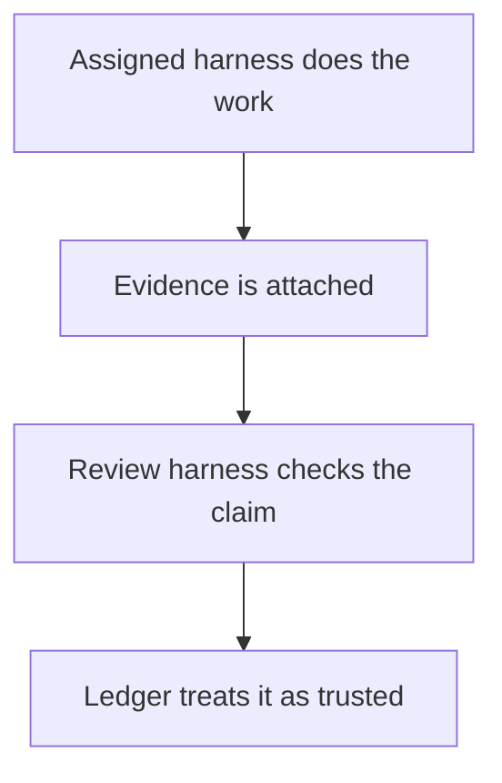
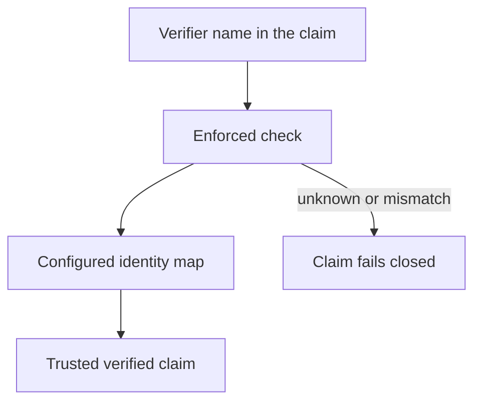
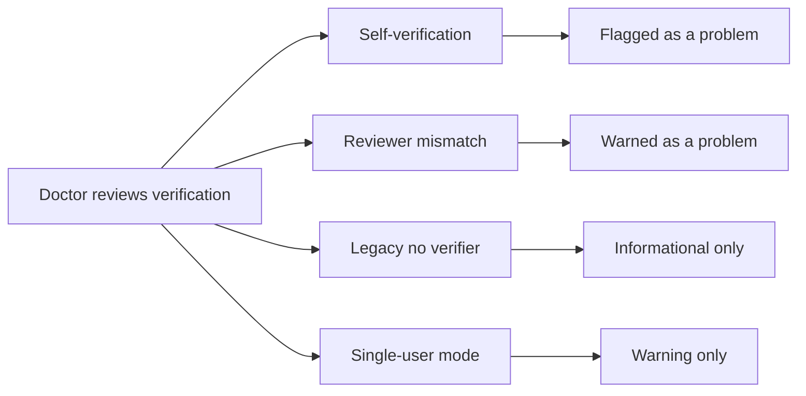

## How Verification Creates Trust

_Verification is the point where recorded work becomes something the operator can trust. The assigned harness does the work and leaves evidence; the review harness is the separate checker; and doctor is the backstop for spotting self-verification, reviewer mismatch, and identity drift._

### One-Minute Snapshot

Verification is the point where recorded work becomes something the operator can trust. The assigned harness does the work and leaves evidence; the review harness is the separate checker; and doctor is the backstop for spotting self-verification, reviewer mismatch, and identity drift. The important boundary is that verification is a governance signal, not a decorative status, and the product only earns that signal when the verifier identity matches the configured rules.

### What You Should Be Able To Explain

- Understand why verification is separate from execution and why the review harness matters.
- See how verifier identity turns a verified claim into something the ledger can trust.
- Recognize self-verification and identity mismatch as real risks, not edge-case noise.
- Know what doctor checks and what responsibility remains with the operator.

### Mental Model

Verification is the product's trust layer. Work can be completed, logged, and handed off, but that is not the same thing as trusted work. The assigned harness produces the evidence trail; the review harness checks it; and the operator still owns the rules that decide which verification is credible. Session movement and handoff state organize the work, but they do not by themselves prove anything.

That separation is the core governance idea in this chapter: the ledger should show who did the work, who reviewed it, and whether the verifier identity is the one the operator intended to trust.

> **Figure:** A task only turns into a trusted claim after evidence is attached and the separate review step accepts it; completion by itself does not earn trust.

The diagram shows two distinct steps. First, the assigned harness does the work and evidence is attached. Second, the review harness checks that evidence. Only after that does the ledger treat the claim as trusted. The consequence is that finished work is not automatically trusted work.

### How It Works

The builder instructions keep evidence capture separate from verification. The generated brief tells the worker to attach evidence and leave final status to the review harness, which keeps the review step from being blurred into the work step.

When a claim status is written, the verifier name is required. In enforced mode, the product resolves that name against the configured identity map and fails closed if the identity cannot be matched. That is the practical guardrail against a status that looks verified but is not tied to the verifier the operator expects.

Doctor is the follow-up check. It looks for self-verification, warns when the verifier is not the task's review harness, treats older verified claims with no verifier as informational, and warns in single-user mode instead of pretending that local use alone proves identity separation. The product does not claim that its own checks replace broader machine or container isolation.

> **Figure:** A verified claim only becomes trustworthy after the verifier name passes the operator's configured identity map; a typed name by itself is not enough.

The diagram shows a verifier name entering an enforced check that consults the configured identity map. When the name matches, the claim becomes a trusted verified claim. When the name cannot be matched or does not fit the mapping, the claim fails closed. The consequence is that trust depends on the operator's configured identity rules, not on the presence of a name alone.

### Verified Facts

Verification is not a decorative label. It is the signal that the ledger can treat a claim as reviewed rather than merely reported.

A verified claim status cannot be written without naming the verifier.

Enforced verification uses the configured identity map and fails closed when the verifier cannot be matched.

Doctor does not flatten all verification cases into one answer. It distinguishes self-verification, review-harness mismatch, older claims that carry no verifier, and the single-user warning path.

Workflow movement and trust are related but not identical. A task can move through handoff and session states without that movement becoming proof of verified work.

> **Figure:** Doctor does not flatten verification into one verdict. The owner has to treat the branches differently, or real trust problems get mixed together with softer warnings.

The diagram splits doctor's verification checks into four branches. Self-verification is flagged as a problem. A mismatch between the verifier and the review harness is also treated as a problem. Older verified claims with no verifier remain informational. Single-user mode produces a warning rather than proof of identity separation. The consequence is that the owner must read the branches differently instead of assuming one generic verification result.

### Strengths

The strongest part of this model is separation. The work path, the review path, and the verifier identity are not collapsed into one vague status. That makes the ledger more useful to an owner who needs to ask, "Who actually checked this?"

A second strength is that the product keeps a visible audit trail for the trust decision itself. The operator can see when verification was intended, who it was tied to, and whether doctor considers the result trustworthy or suspicious. That is more useful than a simple done-or-not-done marker.

A third strength is that the product does not pretend local use is enough on its own. It keeps the manual honest about where trust comes from and where it still depends on the operator's environment and discipline.

### Attention Cards

#### ⚠ Self-verification can undermine the whole trust model  _(attention · critical)_

**What happens:** If the same party can do the work and present the work as independently verified, the ledger can carry a trusted-looking record that is not actually independent review.

**Why it matters:** The product's value here is audit credibility. If self-verification slips through, downstream decisions can rest on a false trust signal.

**What to do:** Review this boundary and decide whether the current behavior is intentional.

**Revisit when:** When verification governance behavior or related owner decisions change.

#### ⚠ The tool is not the whole identity boundary  _(attention · high)_

**What happens:** The product checks verifier identity through its own rules, but the reviewed evidence also says real isolation may still depend on the broader machine or container setup.

**Why it matters:** A clean ledger check is not the same thing as a fully isolated execution environment. The owner should not read the tool's own guardrails as a universal security guarantee.

**What to do:** Review this boundary and decide whether the current behavior is intentional.

**Revisit when:** When verification governance behavior or related owner decisions change.

#### ⚠ Doctor warns, it does not replace judgment  _(attention · medium)_

**What happens:** Doctor surfaces self-verification, wrong-reviewer verification, legacy no-verifier cases, and single-user mode warnings, but those warnings still need owner interpretation.

**Why it matters:** A warning-only path can be easy to overread. The owner should decide which warnings are tolerable and which ones mean the process has drifted too far.

**What to do:** Review this boundary and decide whether the current behavior is intentional.

**Revisit when:** When verification governance behavior or related owner decisions change.

### Owner Decisions

#### ⚖ Should verified claim writes stay locked to the configured identity map, or do you want a stronger external isolation rule in the operating setup?  _(owner decision · open)_

**Why it matters:** The current model depends on a configured identity map, but the evidence also says broader isolation may live outside the tool. If you need stronger trust, that boundary should be explicit in the manual.

**Revisit when:** Before changing the related verification governance behavior.

#### ⚖ Should doctor warnings about self-verification or reviewer mismatch be treated as stop-the-line issues?  _(owner decision · open)_

**Why it matters:** This changes whether audit drift is acceptable noise or a release blocker. The answer should match how much you rely on verification for protected decisions.

**Revisit when:** Before changing the related verification governance behavior.

#### ⚖ Should single-user mode remain only a warning, rather than being described as enforced identity separation?  _(owner decision · open)_

**Why it matters:** The reviewed behavior does not treat single-user mode as strong identity enforcement. Overstating it would make the manual more confident than the product is.

**Revisit when:** Before changing the related verification governance behavior.

### Evidence Boundary

> **Evidence boundary** — Reviewed:
- The local ledger framing of the product and the matching workflow nouns used by the CLI.
- The brief guidance that separates evidence capture from verification and leaves final review to the review harness.
- The claim-status rules that require a named verifier and use the configured identity map in enforced mode.
- The doctor checks that look for self-verification, reviewer mismatch, legacy no-verifier claims, and the single-user warning path.
- The session and handoff state transitions that can move task status but do not themselves establish proof.

Not reviewed:
- We did not verify any broader hosted service, shared platform, or SaaS-style surface.
- We did not prove the operator's real deployment isolation, so broader machine or container controls remain outside this chapter's guarantee.
- We did not receive owner-confirmed product intent, so the chapter stays scoped to the evidence supplied here.

After any change to verification writes, identity mapping, review-harness rules, or doctor output, rerun the relevant verification and audit paths and confirm that self-verification, reviewer mismatch, legacy no-verifier cases, and single-user warnings still behave the same. If the deployment boundary changes, rewrite the boundary language instead of assuming the tool itself supplies that guarantee.

> Reviewed: blue-az/operator-control-plane repository snapshot, Founder/owner context

> Not reviewed: External runtime and integrations, Unreviewed runtime and owner context
