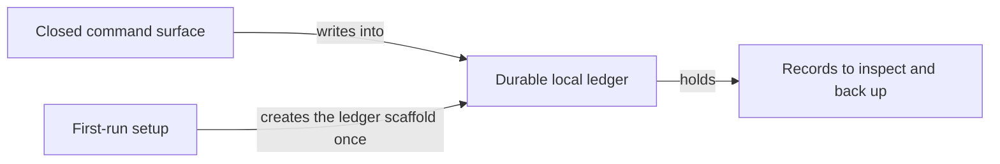
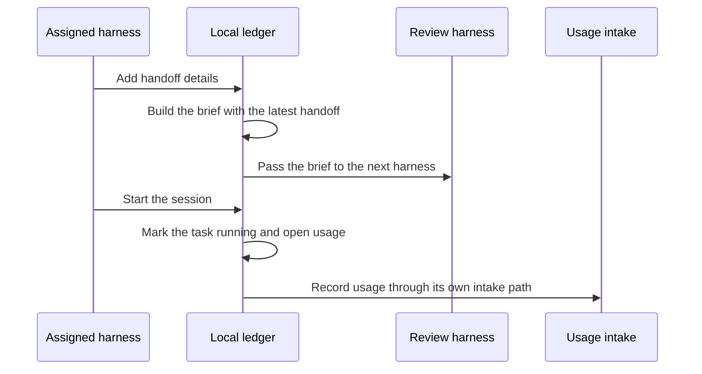
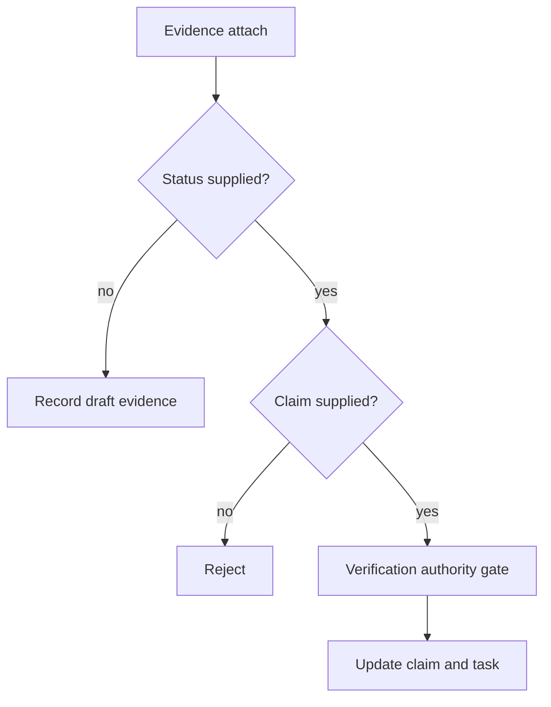
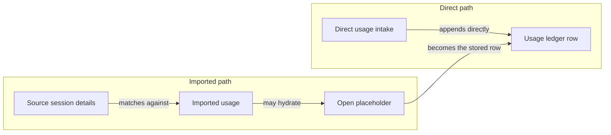

## The Surfaces and Records You Actually Operate

_This chapter gives the owner the map of what is actually operated: a fixed command surface and a durable local ledger. The important part is not the command count, but which records the product creates, what it expects you to inspect, and how briefs, handoffs, sessions, and usage move context between harnesses._

### One-Minute Snapshot

This chapter gives the owner the map of what is actually operated: a fixed command surface and a durable local ledger. The important part is not the command count, but which records the product creates, what it expects you to inspect, and how briefs, handoffs, sessions, and usage move context between harnesses. Because no live runtime ledger snapshot is mounted here, this chapter stays at the documented category level instead of pretending to show observed live state.

### What You Should Be Able To Explain

- Recognize that operator is a fixed CLI surface, not a loose script.
- See the local ledger as the durable record surface that matters for inspection and backup.
- Understand how briefs and handoffs move context between an assigned harness and a review harness.
- Know the main record families: tasks, claims, evidence, verification, sessions, usage, briefs, and handoffs.
- Notice where this chapter relies on documented behavior rather than a live runtime snapshot.

### Why the Surfaces Matter

If you do not know which surfaces are real, you cannot tell what to inspect, what to back up, or what to review after something drifts. Here the product is not a single opaque script; it is a fixed CLI family plus a durable local ledger. That ledger is where the product remembers tasks, claims, evidence, verification, sessions, usage, briefs, and handoffs. The evidence for this chapter is bounded, and there is no live runtime ledger snapshot mounted here, so the safe reading is the documented surface, not an imagined live state.

> **Figure:** The owner should treat the CLI as a fixed front door and the ledger as the durable record surface; first-run setup lays the scaffold once, but the real operating records live in the ledger.

The diagram shows a fixed command surface feeding a durable local ledger. First-run setup creates the ledger scaffold once. The ledger holds the records the owner inspects and backs up.

### How the Surface and Ledger Fit Together

The command surface is a family of named entry points, and several write paths follow the current task automatically when the caller does not supply one. That makes the local ledger behave like a governed workspace, not a free-form note pad. First-run bootstrap creates the standard local ledger structure; it does not repair an already-partial tree. Briefs and handoffs are the native document flow between an assigned harness and a review harness, and the generated brief is meant to carry forward the latest handoff, the current state, and the next action. Usage has a separate path: some usage comes from imported session records, and some comes from direct usage intake. The direct path is a first-class ledger write, not a hidden side channel.

> **Figure:** Context moves through recorded briefs, handoffs, and session transitions, while usage follows a separate intake path instead of being reconstructed from memory.

An assigned harness writes handoff details into the local ledger, the ledger builds the brief and passes it to the review harness, and the session marks the task running while opening usage. Usage is recorded through its own intake path.

### What the Reviewed Evidence Supports

A task is the parent record; a claim is a tracked assertion attached to that task; a fresh claim starts unverified, with no verifier and no evidence links. Evidence can be attached to a claim, but verification is not the same thing as simply adding a record. The record families around the core lifecycle are distinct enough to matter: sessions frame activity, usage records account for it, and briefs and handoffs carry context forward. The command surface and the README use the same lifecycle vocabulary, which reduces the chance that the manual invents terms the product itself does not use.

> **Figure:** Draft evidence can be attached without changing claim status. Any status-bearing attach
> requires a claim and then follows the configured verification-authority gate.

Draft evidence remains separate from verification. A status cannot be silently dropped onto bare
evidence: the command requires a claim before any authority, artifact, projection, or event write.

### What Is Strong Here

The strongest part of this product is the clarity of its surface. The ledger is local and durable, so inspection, backup, and review can happen on the same machine that created the records. Bootstrap is predictable. The command surface is fixed rather than discovered at runtime. The brief and handoff flow gives the next harness something structured instead of forcing it to reconstruct context from memory. Executor stamping on operational writes gives the operator a provenance trail for most ongoing record changes.

> **Figure:** Imported usage is built for reconciliation and can fill an open placeholder instead of creating a fresh row, while direct intake writes straight to the ledger and keeps provenance simpler but less source-linked.

One path imports usage from source session details, where it can fill an open placeholder and rewrite that row in place. The other path adds usage directly to the ledger as a first-class write. The owner gets smoother reconciliation on the import path and a cleaner source trail on the direct path.

### Evidence Boundary

> **Evidence boundary** — Reviewed:
- The reviewed evidence covers a fixed command family, a local durable ledger, and the native record categories that the owner is expected to inspect.
- It also covers first-run bootstrap, task-bound writes, claim creation, evidence and verification behavior, briefs and handoffs, usage intake and import, and the diagnostic checks that surface drift.
- The reviewed material is enough to describe the documented operating surfaces, but not enough to pretend there is a live runtime example in this chapter.

Not reviewed:
- No live local ledger snapshot was mounted for this stage.
- No runtime session log corpus from the host environment was mounted for this stage.
- Owner interview answers and product-intent framing were not supplied for this run.

Compare the current executable and documentation with a live local ledger snapshot and a real session log from the same environment. Then confirm that the command surface, bootstrap behavior, task binding, brief and handoff flow, usage intake, and diagnostic checks still match the record categories described here.

> Reviewed: blue-az/operator-control-plane repository snapshot, Founder/owner context

> Not reviewed: External runtime and integrations, Unreviewed runtime and owner context
