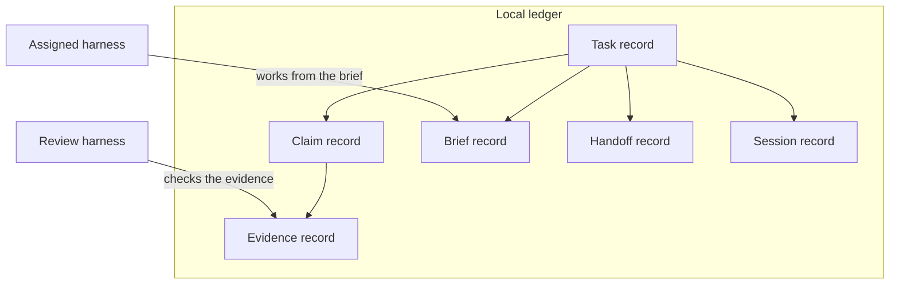
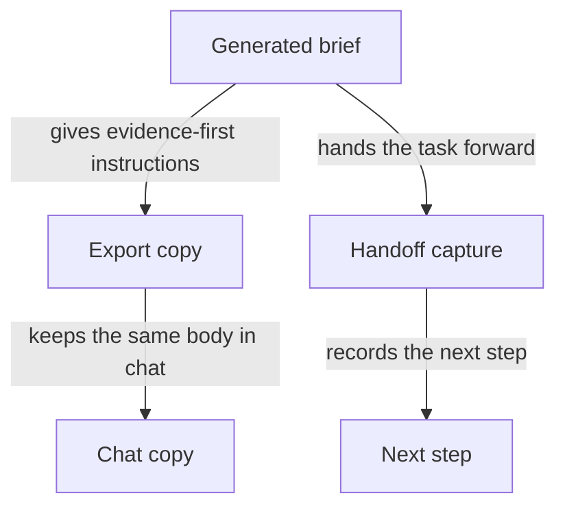
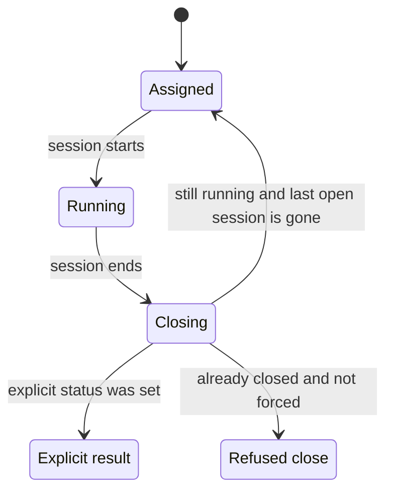

## How Harnesses Coordinate Work

_This chapter shows how the Operator Control Plane coordinates external harnesses through the local ledger and the CLI nouns your product already uses. It does not own the harness machines; it records the work, the handoff, the brief, the session, and the review step so an operator can keep supervision intact._

### One-Minute Snapshot

This chapter shows how the Operator Control Plane coordinates external harnesses through the local ledger and the CLI nouns your product already uses. It does not own the harness machines; it records the work, the handoff, the brief, the session, and the review step so an operator can keep supervision intact. The reviewed code shows the assigned harness doing the work, the review harness checking it, brief export carrying the same instructions into chat, and session close only returning a task to assigned when the task is still running and the open session is actually done. That is the product's current behavior, so it tells you what the system does today, not the broader operating model you may want tomorrow.

### What You Should Be Able To Explain

- Explain the difference between the assigned harness, the review harness, and the local ledger that records their work.
- Describe how briefs, handoffs, and sessions keep work continuous across harnesses without pretending the product owns their runtime.
- Tell which commands change coordination state and which ones only package, carry, or review the work.
- Spot the places where coordination stops short of orchestration, scheduling, or environment control.

### The Coordination Model

### Ledger first
The right way to picture this product is as a local ledger that supervises outside work, not as a system that owns the harness machines or promises control over their runtime. The ledger is where the operator keeps the running record of the task, the claim, the evidence, the brief, the handoff, and the session. Coordination happens because those records give the operator a stable place to direct the next step and to see what happened after the fact. What the product does not establish is control over the harness environment itself: the evidence supports supervision through the ledger, not ownership of the machine that executes the work.

That distinction matters because it sets the boundary of responsibility. If the assigned harness stalls, changes, or gets replaced, the operator is not relying on a hidden scheduler inside the product to recover the work. The continuity comes from the ledger entries and the instructions they carry forward. In practice, that means the manual should be read as a guide to supervised work, not as a promise of full orchestration. The product records enough to keep the work legible and restartable, but it does not claim to run the harness for you.

### Two harness jobs
The assigned harness and the review harness are not two names for the same role. The assigned harness is the one doing the work and producing the next claim or evidence. The review harness is the separate checker that confirms or rejects what was produced. Keeping those jobs apart is what makes the coordination model readable: one harness advances the task, the other evaluates the result, and the ledger remembers which step is which.

For an owner, the consequence is practical. A task should not be treated as finished just because one harness produced output, and a review harness should not be treated as a second worker that simply repeats the same job. The product’s vocabulary draws a line between execution and verification so the operator can tell who was supposed to do what. That separation also reduces confusion when the work moves between harnesses. If a claim comes back needing review, the ledger still tells the operator which harness created the work and which one is expected to examine it.

### Briefs carry continuity
Briefs are the mechanism that keeps the next step from being reinvented every time the work changes hands. The reviewed behavior shows that generated briefs tell the builder to attach evidence and leave verification to the review harness, and that exported briefs preserve the same brief body for copy-paste into chat. The important point is not the packaging itself; it is that the instruction survives the handoff. A new harness or a new operator can continue from the same brief without re-deriving the process from memory.

That gives the operator a concrete continuity model: the brief defines the work, the export keeps the wording intact for transfer, and the ledger retains the surrounding record so the next person is not starting from a blank page. The reviewed evidence also shows that when a handoff is captured, it preserves the next step, and that session closure only falls back to an assigned state when the task is still running and the open session is actually finished. That is enough to maintain continuity across turns, but it still stops short of saying the product schedules the harness or manages its runtime. The continuity is real; the orchestration remains external.

A simple example makes the model easier to hold in mind. An operator gives an assigned harness a task, exports the brief into chat, and later a different harness picks up the same brief. Because the brief body stayed intact and the ledger kept the handoff context, the new harness does not need a fresh process invented for it. It can continue the same work, and the operator can still see, in the ledger, how the task moved from one step to the next.

> **Figure:** The owner should read the ledger as the place where work is remembered, not as the place where harnesses live. That boundary matters because coordination only works through the records that the ledger keeps; the product supervises the work, but it does not absorb the harness runtime.

The local ledger contains the task record, claim record, evidence record, brief record, handoff record, and session record. The assigned harness stays outside the ledger and works from the brief, while the review harness stays outside and checks the evidence. The consequence is that coordination happens by writing and reading records, not by taking ownership of the harness machines.

### What the Workflow Actually Does

When this workflow generates a brief, it is doing two things at once: it gives the assigned harness the next step, and it deliberately stops short of deciding whether the work is done. The brief tells the builder to attach evidence, but not to set a final status. That matters because it keeps the work instruction separate from the judgment call. Verification is left to the review harness, so the brief is a handoff into execution, not a substitute for review. The boundary is important: the product is preserving the sequence of work, not collapsing builder and reviewer into one role.

The export brief path keeps that same instruction intact. It does not rewrite the body for a different audience or invent a second version of the message. Instead, it wraps the same brief body so it can be copied into chat. For an operator, the practical consequence is that the wording the builder receives and the wording that gets pasted elsewhere stay aligned. That reduces drift between the local ledger and the external conversation. The limit is just as important: this preserves text, not meaning beyond what was already in the brief. If the brief is vague, export makes it portable, not better.

Handoff capture is the point where the ledger records continuity between one step and the next. It writes a handoff record for the task and updates the task's next step. That means the system is not merely logging that something happened; it is pointing the task forward. A concrete example is a task that finishes evidence collection and hands the work to review. The handoff record preserves what was passed on, while the updated next step tells the next actor what should happen now. The qualifier is that this is a record of intended continuity. It does not prove the next step succeeded, only that the task was advanced cleanly in the ledger.

Session start and session end are the other gates that change live task state. Starting a session opens a usage placeholder and marks the task as running. Ending a session is narrower than a simple close button. The system refuses to re-close a finished usage record unless the operator forces it. If the task is still running and the last open session has just been closed, the task returns to assigned unless an explicit status was requested. Otherwise, the close result follows the explicit status or the duplicate-close guard instead of falling back automatically. For the owner, that means session closure is conditional state management, not a blanket reset. The product only restores assigned in the narrow case where the task is still active and no open sessions remain.

| Closure case | Task result | Condition |
| --- | --- | --- |
| Duplicate close without force | Close is blocked; the finished usage record stays closed | Session end reaches a usage record that is already finished, and force is not supplied |
| Same close with force | Close completes | Force is supplied, overriding the duplicate-close guard |
| Normal close where the task is still running and no open sessions remain | Task falls back to assigned | The last open session closes, the task is still running, and no explicit status was requested |
| Fallback case when the return-to-assigned conditions are not met | No automatic return to assigned; the explicit close result or duplicate-close guard controls the outcome | The task is not still running, open sessions remain, or an explicit status was provided |

Read that table as a gate map, not as a promise of orchestration. The workflow is precise about when a session may close, when a task can be handed back to assigned, and when it must stay in whatever status was explicitly chosen. That precision is what keeps the ledger coherent across brief, handoff, and session boundaries, while still stopping short of claiming control over the harness runtime itself.

> **Figure:** The important part is not that text moves around; it is that the text does not mutate while the task advances. That keeps the builder instructions and the later handoff aligned, so the operator can move work between surfaces without re-deriving the rules.

A generated brief gives the builder evidence-first instructions. The same brief body is exported into a chat copy without being rewritten. Handoff capture then records the next step for the task. The consequence is that the instructions stay stable while the task moves forward.

> **Figure:** Session close is a gate, not a reset button. The task only returns to assigned when the last open session has gone away and the task is still running; explicit outcomes and duplicate-close protection can keep it somewhere else.

The lifecycle starts assigned, moves to running when a session starts, and enters closing when a session ends. From closing, the task returns to assigned only if it is still running and no open sessions remain. If an explicit outcome is set, the task follows that outcome instead. If the session is already finished and not forced, the close is refused. The consequence is that reassignment happens only in the narrow case the reviewed behavior allows.

### What the Evidence Confirms

The reviewed material is consistent on the product's basic framing: it presents the Operator Control Plane as a small, local, file-backed governance ledger, and it uses the same workflow nouns in the CLI that the manual uses in prose. That matters because it fixes the scope of the chapter. The evidence supports a ledger-centered model of work, proof, handoffs, and sessions; it does not support recasting the product as a hosted workflow platform or a general orchestration layer. In other words, the vocabulary is not decorative. It is the operating boundary the product itself is already using.

| Evidence area | Confirmed behavior | Why it matters |
|---|---|---|
| Local ledger framing and shared workflow nouns | The manual-facing framing and the CLI vocabulary both point to a local governance ledger with the same core workflow words: task, claim, evidence, usage, handoff, session, brief, export, doctor, and verify. | The owner can keep the manual aligned with the product's own language instead of drifting into hosted-platform or project-management terms. |
| Brief generation and copy-paste export | The brief generator keeps builder and reviewer instructions separate, and the export path carries the same brief body into a copy-paste wrapper without rewriting it. | A handoff can move between tools without the instructions changing underneath the operator, which reduces ambiguity when a new harness or a chat channel picks up the work. |
| Task, claim, and evidence updates | Task creation records the task and executor, claim registration appends the claim to the task, and evidence attachment can copy a local artifact into task-scoped evidence storage, hash it, link it to the claim, and update the task and claim status. The reviewed tests cover that end-to-end mutation chain. | Work, proof, and status stay in one auditable chain instead of spreading into separate, unlinked records. The owner can trace what happened without treating evidence as a loose attachment. |
| Handoff capture and session handling | Handoff capture writes a task-scoped handoff record and updates the task's next step. Session start opens usage and marks the task running; session end refuses to close the same usage record twice unless forced, and only falls back to assigned when the task is still running and no open sessions remain. | The ledger keeps continuity across pauses and resumptions. The task does not drift back to assigned too early, but it also does not stay stuck in a running state after the last open session is gone. |

Taken together, these checks show a narrow but useful truth: coordination is recorded locally, not inferred from conversation history. A concrete example is a task that moves from assignment to claim, then receives attached evidence, then gets a handoff when the work pauses. If the open session later closes and the task is still running, the ledger can return it to assigned only under the reviewed conditions. That gives the operator a durable record of where the work stands and what the next step is, while still keeping the actual harness work external to the product.

The brief path confirms the same discipline at the text level. A generated brief tells the builder to attach evidence and leaves verification to the separate review side, while export preserves that same body so it can be pasted into chat without being rewritten. The practical consequence is that the instruction set does not fork just because the medium changes. The owner gets a single source of handoff text for the builder path, and the review role remains distinct because the brief itself does not collapse evidence capture into verification. This is the current reviewed behavior, so it should be treated as confirmed for the present snapshot, not as a claim about every possible future brief format or export style.

### What Is Solid Here

### Narrow on purpose

The strongest thing about this coordination layer is that it stays narrow and explicit. It does not try to look like a general harness platform, and that restraint is a feature for an owner: the product is framed as a local governance ledger with a small set of workflow nouns, not as a system that owns external execution environments. That keeps the manual honest about what the product is actually responsible for. The reader can see that the control point is the ledger, while the harnesses remain external actors whose work is recorded, handed off, and reviewed rather than magically absorbed into the product itself. The boundary matters because it prevents a false expectation of orchestration, scheduling, or machine control that the evidence does not establish.

### Briefs keep the divide intact

The brief and export path is also a clean design choice. A generated brief tells the builder to attach evidence and leave verification to the review harness, while export preserves that same brief body in a form that is easy to paste into chat. Mechanically, that means the instructions do not need to be reinvented every time work moves between people or harnesses; the same underlying guidance can be carried forward without blurring who is supposed to do what. For the owner, this reduces a common failure mode in multi-harness work: the builder starts acting like the reviewer, or the reviewer starts inheriting builder language by accident. The evidence supports the split, but only within this workflow boundary. It does not prove that every possible manual process outside this path will stay that clean; it shows that this product gives you a reliable place to keep the divide visible.

### The branches are exercised, not implied

The chapter can speak with confidence because the relevant branches are covered by tests. Task creation, claim registration, evidence attachment, handoff capture, and session start and end are not just described in prose; the reviewed evidence shows that these state changes are exercised as a chain. That matters because coordination systems are easy to oversimplify: a handoff can look sound in a diagram even when the actual transitions around claims, evidence, and session closure are inconsistent. Here, the test coverage lets the manual say that the coordination behavior is grounded in checked branches rather than in a hoped-for flow. The qualifier is still important: the tests support the behavior that was reviewed, but they are not a promise about every future change or every external harness condition.

### A ledger you can reconstruct from

The local ledger is the other solid anchor. Because the task, claim, evidence, handoff, and session records live together, an operator can reconstruct who did what, when it was handed off, and what happened next without stitching together an outside system of record. That is the practical value of the model: continuity survives even when the work itself moves across harnesses. A concrete example is a task that is claimed by one harness, receives evidence, gets a handoff record with the next action, and then moves through a session boundary before returning to a ready state. The ledger keeps those steps legible as one chain. What the evidence does not establish is stronger storage guarantees such as tamper resistance or indefinite retention. What it does establish is enough to make the coordination trail durable in the ordinary owner sense: you can come back later and reconstruct the sequence from the local records that were written.

### Attention Cards

#### ⚠ Do not turn coordination into runtime ownership  _(attention · critical)_

**What happens:** The product coordinates external harnesses through records and handoffs, but the evidence does not show it launching, hosting, or fully managing their execution environments.

**Why it matters:** If the manual blurs this boundary, the reader will assume the product controls infrastructure that it does not actually own.

**What to do:** Review this boundary and decide whether the current behavior is intentional.

**Revisit when:** When harness coordination behavior or related owner decisions change.

#### ⚠ Do not blur the builder/reviewer split  _(attention · high)_

**What happens:** Generated briefs tell builders to attach evidence and leave verification to the review harness; export keeps that same body for carry-forward.

**Why it matters:** If that separation softens, the handoff instructions stop matching the real operating model.

**What to do:** Review this boundary and decide whether the current behavior is intentional.

**Revisit when:** When harness coordination behavior or related owner decisions change.

#### ⚠ Do not describe session close as automatic reassignment  _(attention · high)_

**What happens:** Session end only falls back to assigned when the task is still running and there are no open sessions left; otherwise the explicit status or duplicate-close guard controls the result.

**Why it matters:** A simplified description would mislead operators about when a task actually returns to assigned.

**What to do:** Review this boundary and decide whether the current behavior is intentional.

**Revisit when:** When harness coordination behavior or related owner decisions change.

#### ⚠ Harness metadata is secondary to the ledger record  _(attention · medium)_

**What happens:** Harness details matter for coordination, but the ledger remains the source of record for work, handoff, and session continuity.

**Why it matters:** This chapter should stay focused on supervision, not drift into harness-administration detail.

**What to do:** Review this boundary and decide whether the current behavior is intentional.

**Revisit when:** When harness coordination behavior or related owner decisions change.

### Owner Decisions

#### ⚖ Should the manual keep the assigned harness and review harness as a hard distinction?  _(owner decision · open)_

**Why it matters:** That choice determines whether the chapter reads as supervised multi-harness work or as a generic collaboration flow.

**Revisit when:** Before changing the related harness coordination behavior.

#### ⚖ Should coordination be framed as controlled recordkeeping rather than orchestration?  _(owner decision · open)_

**Why it matters:** This is the main boundary that keeps the chapter honest about what the product does and does not own.

**Revisit when:** Before changing the related harness coordination behavior.

#### ⚖ Should session close be documented as a conditional return to assigned?  _(owner decision · open)_

**Why it matters:** The operator needs the exact fallback rule to avoid assuming a task is reassigned earlier than it really is.

**Revisit when:** Before changing the related harness coordination behavior.

### Evidence Boundary

> **Evidence boundary** — Reviewed:
- The README framing of the product as a local ledger with the workflow nouns used in the manual.
- The brief generation and export behavior that separates evidence capture from verification.
- The task, claim, evidence, handoff, and session lifecycle, including the tested branches around session close.
- The explicit review-harness instruction that keeps verification separate from builder work.

Not reviewed:
- Any hosted UI, shared service, or broader platform behavior.
- Any harness infrastructure, scheduling system, or environment ownership beyond the local coordination model.
- Any owner intent beyond the supplied prompt.
- Any adjacent chapter topics that belong to verification governance, usage import, or operating boundaries.

If the CLI nouns, brief wording, or session-close rules change, re-check the README, command registry, brief generation and export path, and lifecycle tests. If the product gains a hosted surface or harness scheduling, widen the boundary before rewriting this chapter.

> Reviewed: blue-az/operator-control-plane repository snapshot, Founder/owner context

> Not reviewed: External runtime and integrations, Unreviewed runtime and owner context
