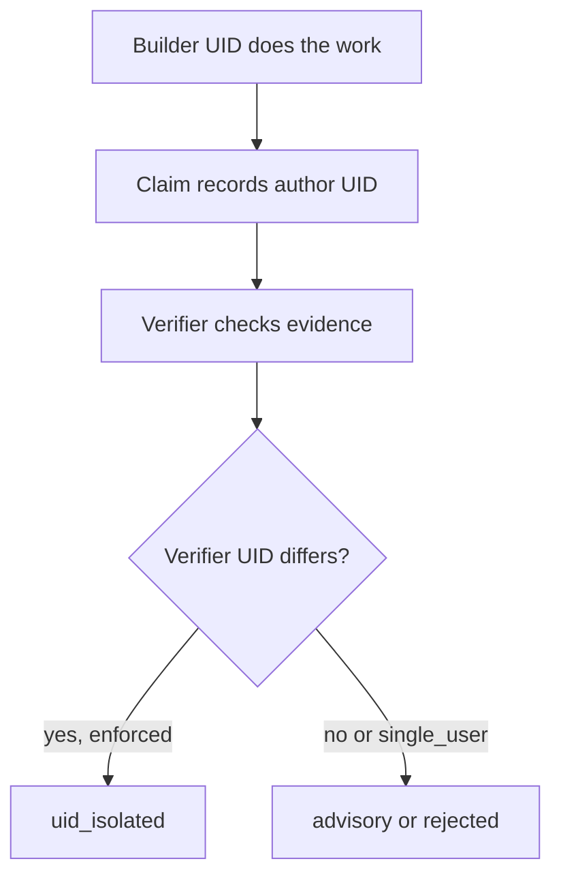
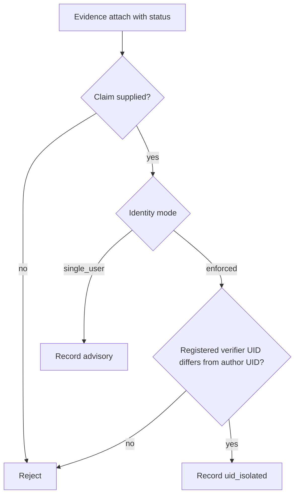
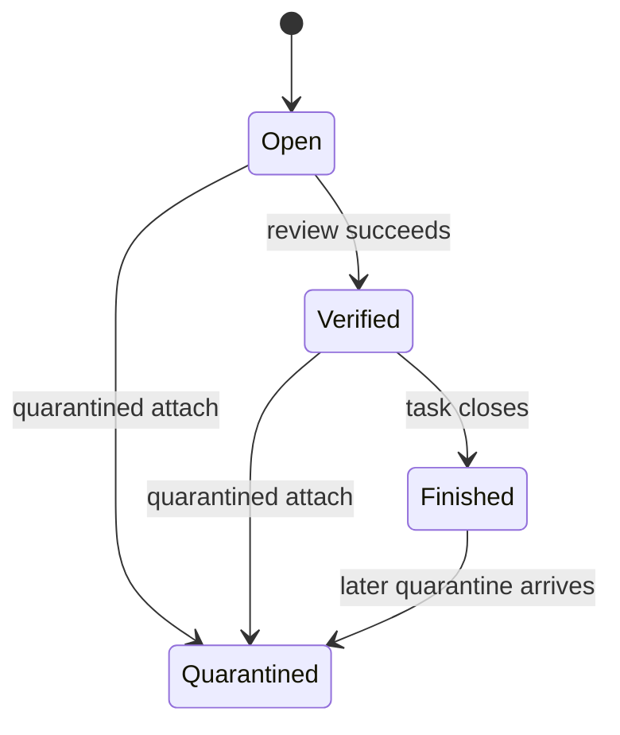

## Trust, Identity, and Verification

> **Historical snapshot:** This generated chapter predates the current distinct-UID P2 authority
> model. Use the repository `README.md` and `EXECUTOR_IDENTITY_SPEC.md` for current behavior; in
> particular, bare status writes now fail closed and role labels alone do not create isolation.

_Trust in this product is not a feeling; it is the result of separated roles, evidence-backed claims, and identity checks. A task becomes dependable only when the assigned harness has produced a claim, the evidence is attached, a separate verifier has confirmed it under the right identity rules, and doctor no longer sees integrity drift._

### One-Minute Snapshot

Trust in this product is not a feeling; it is the result of separated roles, evidence-backed claims, and identity checks. A task becomes dependable only when the assigned harness has produced a claim, the evidence is attached, a separate verifier has confirmed it under the right identity rules, and doctor no longer sees integrity drift. The risky part is that several of these guarantees change with mode or command path, so the operator has to watch the boundaries, not just the status label.

### What You Should Be Able To Explain

- Tell whether work is merely recorded or actually trusted.
- See the difference between assigned harness, review harness, and verifier.
- Understand which command paths enforce identity and which only warn.
- Spot when missing evidence, self-verification, or quarantine drift weakens the ledger.
- Decide where the product needs a stricter rule instead of another reminder.

### Mental Model

Trust is a governance layer on top of the ledger, not a synonym for activity. The builder does the
work and records a claim; trusted verification requires a registered verifier process running under a
different OS UID. Harness names organize work but do not create isolation. A claim starts unverified,
so present, supported, and trusted are different states. Doctor audits the structural authority and
ledger integrity without judging evidence semantics or executing stored commands.

> **Figure:** Recording and trusting work are different steps. Trust requires a distinct verifier UID,
> not only a different review-harness label.

The claim preserves its author UID. A verification becomes UID-isolated only when a registered
verifier under another UID records it in enforced mode.

### How It Works

The trust path is narrow on purpose. A new claim is unverified and records its author executor. In
enforced mode, claim and draft-evidence writes require a registered builder; every status write
requires a registered verifier whose OS UID differs from the author UID. In single-user mode, the
same workflow remains available but is recorded as advisory. The generated brief carries this
boundary forward. Sessions and handoffs support continuity, but they are not proof.

> **Figure:** A bare status is rejected. Claim-backed status writes either pass the distinct-UID gate
> in enforced mode or are explicitly advisory in single-user mode.

Status cannot be silently dropped onto bare evidence. Enforced verification receives trusted
authority only after the role and distinct-UID checks pass; single-user verification stays usable
without being presented as isolated.

### Verified Facts

The CLI surface is fixed rather than dynamically discovered. Task-bound writes fall back to the
current task if no task id is provided and fail closed when there is no active task. Init creates the
standard ledger layout on first run and does not repair an existing partial tree. Operational writes
stamp executor identity. Enforced claim and draft-evidence writes require a builder role; status writes
require a verifier role and a UID distinct from the claim author. Quarantine can overwrite terminal
task status. Doctor distinguishes advisory, UID-isolated, malformed, and legacy authority while also
checking evidence, projection, and event integrity.

> **Figure:** Verification can move a task forward only before it reaches a terminal state, but quarantine can still land later and pull a finished task back to a quarantined state. Closeout is therefore reversible when integrity evidence arrives late.

A task starts open, can move to verified after review, and can then close. A quarantined attach can move an open, verified, or finished task into quarantined. The important consequence is that closeout is not final when a later integrity finding arrives.

### Strengths

The design makes the role and UID boundaries explicit. Unverified claims stay untrusted until evidence
and verification are added, and single-user verification is never relabeled as isolated. Doctor keeps
legacy and advisory records visible while failing malformed UID-isolated records. Handoffs and briefs
preserve continuity without serving as proof.

### Evidence Boundary

> **Evidence boundary** — Reviewed:
- The executable CLI surface, including the trust-related command paths for claims, evidence, doctor checks, sessions, handoffs, and usage import.
- The repository README and tests where they describe the same lifecycle vocabulary and the trust rules around verification and identity.
- The policy and spec language that sits beside the executable surface where it affects how trust and verification are interpreted.
- The ledger behaviors that matter to this chapter: unverified claims, identity enforcement, quarantine handling, executor provenance, and usage import rules.

Not reviewed:
- No live .operator ledger snapshot was mounted, so this chapter does not claim observed live-state behavior beyond the reviewed material.
- External session logs used by usage import were not mounted, so import-source availability remains runtime-unverified.
- No owner interview answers were supplied, so the chapter stays inside repository evidence and does not widen the product boundary.

Recheck the command inventory, claim-backed evidence verification, doctor classifications, identity enforcement, and usage import behavior whenever the CLI, policy text, or tests change. Reverify bootstrap behavior if first-run setup changes, and recheck quarantine handling if task closeout rules are edited.

> Reviewed: blue-az/operator-control-plane repository snapshot, Founder/owner context

> Not reviewed: External runtime and integrations, Unreviewed runtime and owner context
