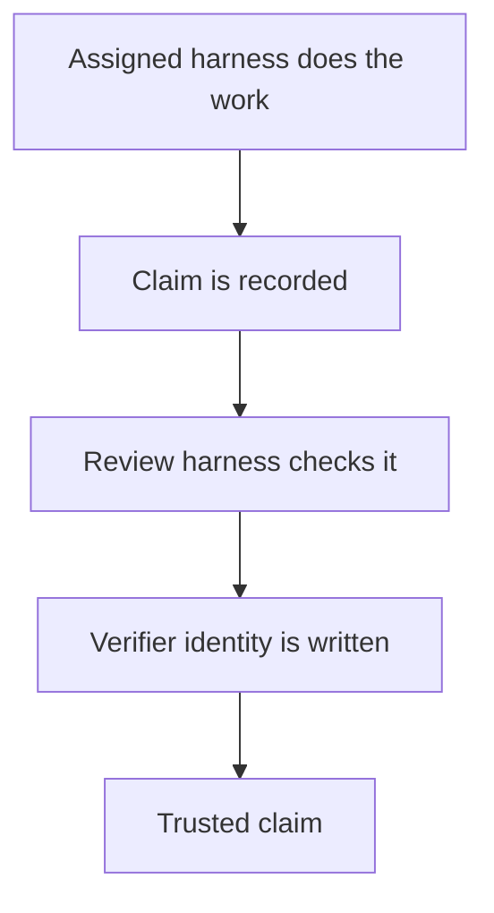
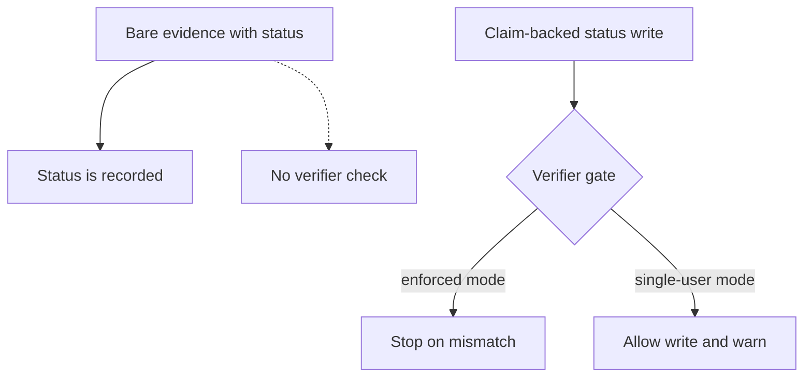
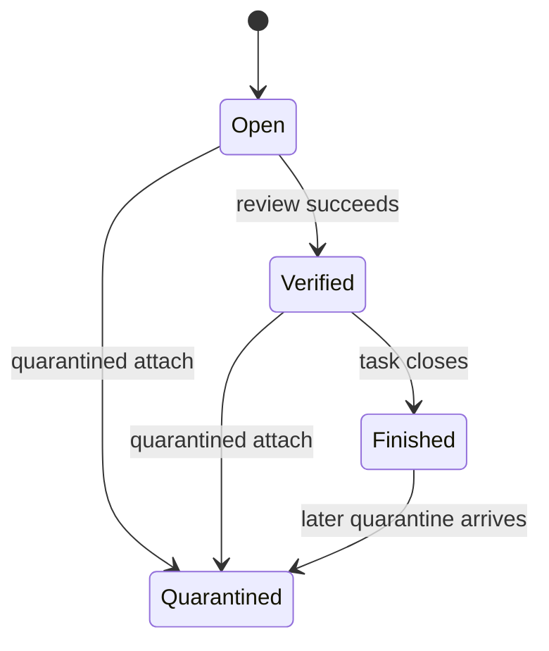

## Trust, Identity, and Verification

_Trust in this product is not a feeling; it is the result of separated roles, evidence-backed claims, and identity checks. A task becomes dependable only when the assigned harness has produced a claim, the evidence is attached, a separate verifier has confirmed it under the right identity rules, and doctor no longer sees integrity drift._

### One-Minute Snapshot

Trust in this product is not a feeling; it is the result of separated roles, evidence-backed claims, and identity checks. A task becomes dependable only when the assigned harness has produced a claim, the evidence is attached, a separate verifier has confirmed it under the right identity rules, and doctor no longer sees integrity drift. The risky part is that several of these guarantees change with mode or command path, so the operator has to watch the boundaries, not just the status label.

### What You Should Be Able To Explain

- Tell whether work is merely recorded or actually trusted.
- See the difference between assigned harness, review harness, and verifier.
- Understand which command paths enforce identity and which only warn.
- Spot when missing evidence, self-verification, or quarantine drift weakens the ledger.
- Decide where the product needs a stricter rule instead of another reminder.

### Mental Model

Trust is a governance layer on top of the ledger, not a synonym for activity. The assigned harness does the work, the review harness checks it, and the verifier is the identity attached when trust is written. A claim starts unverified, so present, supported, and trusted are different states. Doctor is the integrity audit that looks for self-verification, reviewer mismatch, missing verifier metadata, and session or usage drift before the ledger quietly drifts. Some of this trust framing comes from the command behavior itself, and some from the surrounding policy language that explains how those commands are meant to be interpreted.

> **Figure:** Recording the work and trusting the work are different steps: the assigned harness can create the claim, but trust only exists after a separate review harness writes a verifier identity.

The assigned harness does the work first, then a claim is recorded. A separate review harness checks that claim, and only after that is a verifier identity written. The consequence for the owner is that trust depends on a second role, not just on work being present in the ledger.

### How It Works

The trust path is narrow on purpose. A new claim is unverified and carries no verifier or evidence refs. When evidence is attached to a claim and a status is being set, the command requires a verifier identity; in enforced mode it rejects unknown identities and mismatches before the ledger accepts trusted verification. If identity is configured more loosely, the command can still accept the write and doctor will warn rather than treat the mismatch as fully enforced. The generated brief is meant to hand the task to the next harness with the latest handoff and next action, while telling the builder to attach evidence and leave verification to the review harness. Sessions and handoffs support continuity, but they are not the same thing as trust; they help the next harness continue work without pretending the work has already been proven.

> **Figure:** The same write can carry different trust strength: claim-backed status updates hit a hard gate in enforced mode, but single-user mode only warns, and bare evidence updates can bypass verifier checks altogether.

Bare evidence with status moves straight to a recorded status and is shown outside the verifier gate. Claim-backed status writes pass through a verifier gate, where enforced mode stops mismatches and single-user mode allows the write but records a warning. The consequence is that not every status update carries the same trust guarantee.

### Verified Facts

The CLI surface is fixed rather than dynamically discovered. Task-bound writes fall back to the current task if no task id is provided and fail closed when there is no active task. Init creates the standard ledger layout on first run and does not repair an existing partial tree. Most operational writes stamp executor identity, but init is exempt. Claim-backed evidence updates require a verifier identity and can change task status to verified or quarantined. Quarantine can overwrite terminal task status. Usage import can match a source session by more than exact equality, can hydrate an existing placeholder, and rewrites that row in place. Direct usage intake writes a row without a source-session import trail. Doctor separates self-verification errors, reviewer mismatch warnings, and legacy no-verifier informational cases instead of collapsing them into one bucket.

> **Figure:** Verification can move a task forward only before it reaches a terminal state, but quarantine can still land later and pull a finished task back to a quarantined state. Closeout is therefore reversible when integrity evidence arrives late.

A task starts open, can move to verified after review, and can then close. A quarantined attach can move an open, verified, or finished task into quarantined. The important consequence is that closeout is not final when a later integrity finding arrives.

### Strengths

The design already gives the owner several guardrails that make trust legible. Role separation is explicit. Unverified claims stay untrusted until evidence and verification are added. Doctor does not collapse every irregularity into one failure bucket; it separates self-verification, reviewer mismatch, legacy gaps, and in-flight drift. Handoffs and briefs keep cross-harness continuity structured, and usage imports are idempotent on their provenance key instead of blindly duplicating records. Those are real strengths because they let the owner inspect trust as a set of narrow checks instead of one vague sense of progress.

### Attention Cards

#### ⚠ Verifier gate is claim-bound  _(attention · critical)_

**What happens:** Bare evidence attaches with status can skip verification logic when no claim is supplied.

**Why it matters:** If the owner assumes every status change enforces verification, unsupported evidence can look trusted.

**What to do:** Review this boundary and decide whether the current behavior is intentional.

**Revisit when:** When trust and verification behavior or related owner decisions change.

#### ⚠ Identity mode changes the guarantee  _(attention · critical)_

**What happens:** Enforced mode fail-closes on unknown or mismatched identities; single-user mode accepts the write and warns.

**Why it matters:** The same workflow carries different trust strength depending on configuration, so a trust promise is not universal.

**What to do:** Review this boundary and decide whether the current behavior is intentional.

**Revisit when:** When trust and verification behavior or related owner decisions change.

#### ⚠ Evidence copy is best-effort  _(attention · high)_

**What happens:** The ledger can record the verification change even if the local file copy fails and the file never lands on disk.

**Why it matters:** The owner cannot assume the artifact exists just because the ledger says the claim was updated.

**What to do:** Review this boundary and decide whether the current behavior is intentional.

**Revisit when:** When trust and verification behavior or related owner decisions change.

#### ⚠ Quarantine can downgrade a finished task  _(attention · high)_

**What happens:** A later quarantine write can overwrite verified or complete task status.

**Why it matters:** Closeout is not one-way, so a late integrity finding can reopen a supposedly settled task.

**What to do:** Review this boundary and decide whether the current behavior is intentional.

**Revisit when:** When trust and verification behavior or related owner decisions change.

#### ⚠ Bootstrap is not self-healing  _(attention · medium)_

**What happens:** Init makes the standard layout once, then stops; it does not repair a partial tree and it does not stamp executor identity.

**Why it matters:** A broken initial setup can persist unnoticed, and trust audits should not assume bootstrap records prove provenance.

**What to do:** Review this boundary and decide whether the current behavior is intentional.

**Revisit when:** When trust and verification behavior or related owner decisions change.

#### ⚠ Usage import can merge instead of append  _(attention · medium)_

**What happens:** Import selection can widen beyond exact equality and can rewrite an existing placeholder in place.

**Why it matters:** If the owner expects a strict append-only accounting trail, the import path does not behave that way.

**What to do:** Review this boundary and decide whether the current behavior is intentional.

**Revisit when:** When trust and verification behavior or related owner decisions change.

### Owner Decisions

#### ⚖ Should evidence attaches with status be rejected when no claim is supplied?  _(owner decision · open)_

**Why it matters:** This decides whether verification is a universal gate or only a claim-backed one, which changes how much trust the operator can read from the status field.

**Revisit when:** Before changing the related trust and verification behavior.

#### ⚖ Should single-user mode remain a warning-only trust mode, or should it fail closed when identity rules are configured?  _(owner decision · open)_

**Why it matters:** This sets whether identity mismatches are an audit warning or a hard stop, which directly affects how much the owner can rely on the ledger.

**Revisit when:** Before changing the related trust and verification behavior.

#### ⚖ Should a local evidence copy failure abort the write instead of letting verification continue?  _(owner decision · open)_

**Why it matters:** This decides whether trust can advance without a durable artifact on disk, which is a concrete integrity boundary.

**Revisit when:** Before changing the related trust and verification behavior.

#### ⚖ Should quarantine be allowed to overwrite verified or complete task status?  _(owner decision · open)_

**Why it matters:** This decides whether terminal status is final or whether a late integrity finding can still downgrade the task.

**Revisit when:** Before changing the related trust and verification behavior.

#### ⚖ Should usage import stay permissive on matching and placeholder hydration, or should it require an exact match and append-only writes?  _(owner decision · open)_

**Why it matters:** This sets whether usage import is a flexible reconciliation path or a stricter provenance trail.

**Revisit when:** Before changing the related trust and verification behavior.

### Evidence Boundary

> **Evidence boundary** — Reviewed:
- The executable CLI surface, including the trust-related command paths for claims, evidence, doctor checks, sessions, handoffs, and usage import.
- The repository README and tests where they describe the same lifecycle vocabulary and the trust rules around verification and identity.
- The policy and spec language that sits beside the executable surface where it affects how trust and verification are interpreted.
- The ledger behaviors that matter to this chapter: unverified claims, identity enforcement, quarantine handling, executor provenance, and usage import rules.

Not reviewed:
- No live .operator ledger snapshot was mounted, so this chapter does not claim observed live-state behavior beyond the reviewed material.
- External session logs used by usage import were not mounted, so import-source availability remains runtime-unverified.
- No owner interview answers were supplied, so the chapter stays inside repository evidence and does not widen the product boundary.

Recheck the command inventory, claim-backed evidence verification, doctor classifications, identity enforcement, and usage import behavior whenever the CLI, policy text, or tests change. Reverify bootstrap behavior if first-run setup changes, and recheck quarantine handling if task closeout rules are edited.

> Reviewed: blue-az/operator-control-plane repository snapshot, Founder/owner context

> Not reviewed: External runtime and integrations, Unreviewed runtime and owner context
