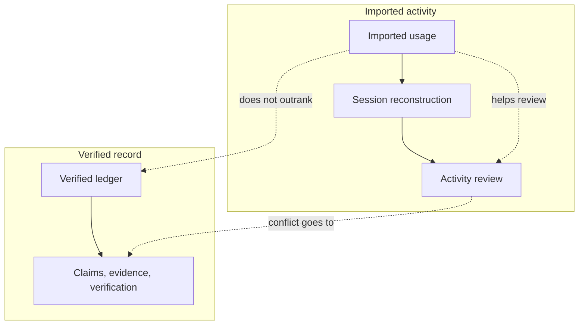
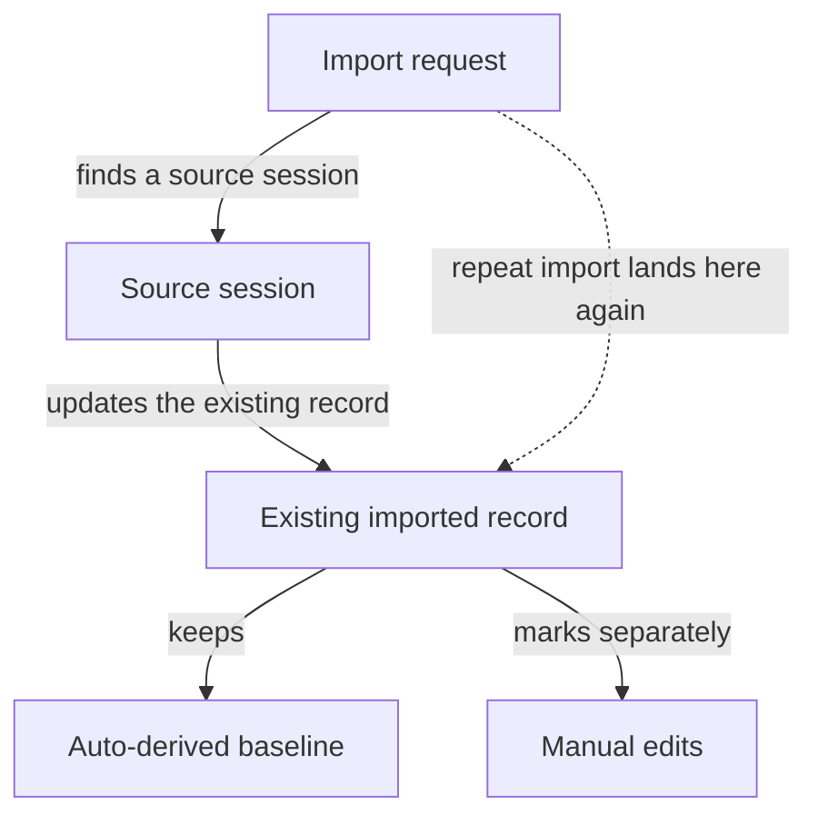
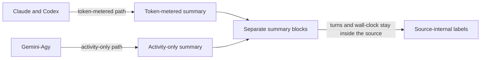

## How Usage Import Supports the Audit Trail

_Usage import gives the owner a second line of sight into work: it pulls supported harness activity into the local ledger so you can reconstruct sessions, compare activity or cost patterns, and review provenance. It helps the audit trail, but it does not replace claims, evidence, or verification, and it should stay subordinate when imported activity conflicts with verified ledger records._

### One-Minute Snapshot

Usage import gives the owner a second line of sight into work: it pulls supported harness activity into the local ledger so you can reconstruct sessions, compare activity or cost patterns, and review provenance. It helps the audit trail, but it does not replace claims, evidence, or verification, and it should stay subordinate when imported activity conflicts with verified ledger records.

### What You Should Be Able To Explain

- Understand what imported usage adds to the audit trail and what it does not prove.
- See how imported activity relates to sessions, task records, and later review.
- Recognize the split between token-metered and activity-only harnesses.
- Know the main risks: uneven coverage, best-effort provenance, and the need to keep claims and evidence authoritative.

### Usage import is audit context, not proof

Usage import is native to the Operator Control Plane, but it is a secondary line of sight. It collects activity from supported harness ecosystems so an operator can reconstruct work, compare sessions, and review activity patterns. The record that matters most is still the ledger record attached to the task, claim, evidence, and verification chain; imported activity helps the review, but it does not replace it.

> **Figure:** Imported usage helps the owner reconstruct work and review patterns, but it stays on the lower side of the trust boundary. If it conflicts with the verified record, the claims, evidence, and verification chain still decide what the product should treat as authoritative.

The diagram separates imported activity from the verified record. Imported usage feeds session reconstruction and activity review, while the verified ledger leads to the claims, evidence, and verification chain. Imported usage can help explain what happened, but when the two disagree the verified record remains the authority.

### Imported activity is matched back to a source session

The import path can select a source session by an exact session ID, a time window, overlap with the current operator session, or a scored fallback. Once matched, repeated imports do not create a duplicate for the same source session; they update the existing record instead. The local record keeps the auto-derived baseline while marking manual edits separately, so later review can still see what came from the harness and what was adjusted locally. Different providers do not all land in the same shape: Claude and Codex are treated as token-metered, while Gemini-Agy is activity-only. That split matters because the imported record is carrying audit context, not a single blended accounting story.

> **Figure:** The owner gets a stable review trail because repeat imports update the same record instead of creating another copy. That preserves the auto-derived baseline while keeping later manual changes visible as edits, so provenance survives without turning the import into duplicate noise.

An import request finds a source session, then updates the existing imported record. If the same source session is imported again, it lands on that same record instead of creating a duplicate. The record keeps the auto-derived baseline and marks manual edits separately. The consequence is a single provenance trail that still shows what was imported and what was changed locally.

### What the current behavior actually preserves

Usage import is not one uniform meter across all harnesses. The summary keeps token-metered and activity-only records in separate blocks, and it labels turns and wall-clock as harness-internal rather than cross-harness comparable. Imported records are idempotent on the source session reference, so the same source session updates an existing record instead of accumulating a duplicate. If the source file later disappears, doctor warns instead of treating the import as broken. That means the provenance is useful, but it is not fail-closed after import.

> **Figure:** The owner should not expect one blended usage total, because the imported data does not all measure the same thing. Keeping token-metered and activity-only sources in separate summary blocks prevents a false comparison and keeps harness-internal numbers from looking more universal than they are.

Claude and Codex follow a token-metered path into a token summary, while Gemini-Agy follows an activity-only path into a separate activity summary. Both branches feed separate summary blocks, and the result keeps turns and wall-clock labeled as harness-internal. The consequence is that the owner sees distinct accounting modes instead of a single blended total.

### Why this layer is still worth having

The value of usage import is that it gives the owner something concrete without pretending too much. It helps reconstruct what happened when direct proof is thin, it preserves a manual-versus-auto provenance trail for later review, and it avoids double-counting the same imported source session. Used well, it supports oversight of activity and cost patterns while keeping the audit trail anchored in the ledger.

### Attention Cards

The main risk is over-weighting imported activity because it is concrete and measurable. That temptation is exactly what makes this chapter easy to misread: the data is useful, but it is still downstream of the records that establish claims, evidence, and verification. The other risk is assuming coverage is uniform across providers or that source provenance is permanent after import. Neither assumption is supported by the current evidence.

#### ⚠ Imported activity is context, not proof  _(attention · high)_

**What happens:** Imported usage helps reconstruct what happened, but it does not outrank verified claims, evidence, or verification. If the manual treats imported activity as proof on its own, it overstates what the product knows.

**Why it matters:** Owners need a clear trust order. Otherwise a noisy import can look more authoritative than the ledger record that was actually verified.

**What to do:** Review this boundary and decide whether the current behavior is intentional.

**Revisit when:** When usage import audit behavior or related owner decisions change.

#### ⚠ The accounting model is not uniform across harnesses  _(attention · high)_

**What happens:** Claude and Codex are treated as token-metered, while Gemini-Agy is activity-only. Summary blocks stay separate, so one blended total would hide differences in what each provider actually records.

**Why it matters:** The owner can misread cost or activity if the chapter collapses distinct metering rules into one number.

**What to do:** Review this boundary and decide whether the current behavior is intentional.

**Revisit when:** When usage import audit behavior or related owner decisions change.

#### ⚠ Missing source logs only warn  _(attention · high)_

**What happens:** Imported records keep a local link back to the source session, but if that source later disappears, doctor warns instead of failing the record.

**Why it matters:** The audit trail remains useful, but the owner should not assume fail-closed retention or permanent source-log availability.

**What to do:** Review this boundary and decide whether the current behavior is intentional.

**Revisit when:** When usage import audit behavior or related owner decisions change.

### Owner Decisions

#### ⚖ Should imported usage stay advisory when it conflicts with verified ledger records?  _(owner decision · open)_

**Why it matters:** This chapter currently treats import as supporting evidence, not the record of truth. Changing that would change how every audit review is read.

**Revisit when:** Before changing the related usage import audit behavior.

#### ⚖ Should the manual keep separate language for token-metered and activity-only harnesses?  _(owner decision · open)_

**Why it matters:** A single blended summary would hide the real differences in the imported data.

**Revisit when:** Before changing the related usage import audit behavior.

#### ⚖ Should a missing source log stay a warning instead of a hard failure?  _(owner decision · open)_

**Why it matters:** The current behavior preserves best-effort provenance after import, but it does not guarantee permanent source availability.

**Revisit when:** Before changing the related usage import audit behavior.

### Evidence Boundary

> **Evidence boundary** — Reviewed:
- I reviewed the product framing that keeps the control plane local and file-backed, plus the command behavior that makes usage import a first-class but secondary workflow.
- I reviewed the import behavior that matches records back to a source session, deduplicates repeated imports, and preserves manual-versus-auto provenance.
- I reviewed the summary behavior that keeps token-metered and activity-only records separate and labels some reported values as harness-internal.
- I reviewed the audit behavior that warns, rather than fails, when a source log later disappears.

Not reviewed:
- I did not review any hosted UI, server API, broader platform service, billing system, or other surface that was not established in the supplied evidence.
- I did not review providers beyond the supported usage import paths, so coverage for other harnesses is not claimed.

Recheck this chapter if usage import gains new providers, changes how it selects a source session, stops deduplicating repeated imports, starts treating missing source logs as errors, or begins overriding verified ledger records.

> Reviewed: blue-az/operator-control-plane repository snapshot, Founder/owner context

> Not reviewed: External runtime and integrations, Unreviewed runtime and owner context
