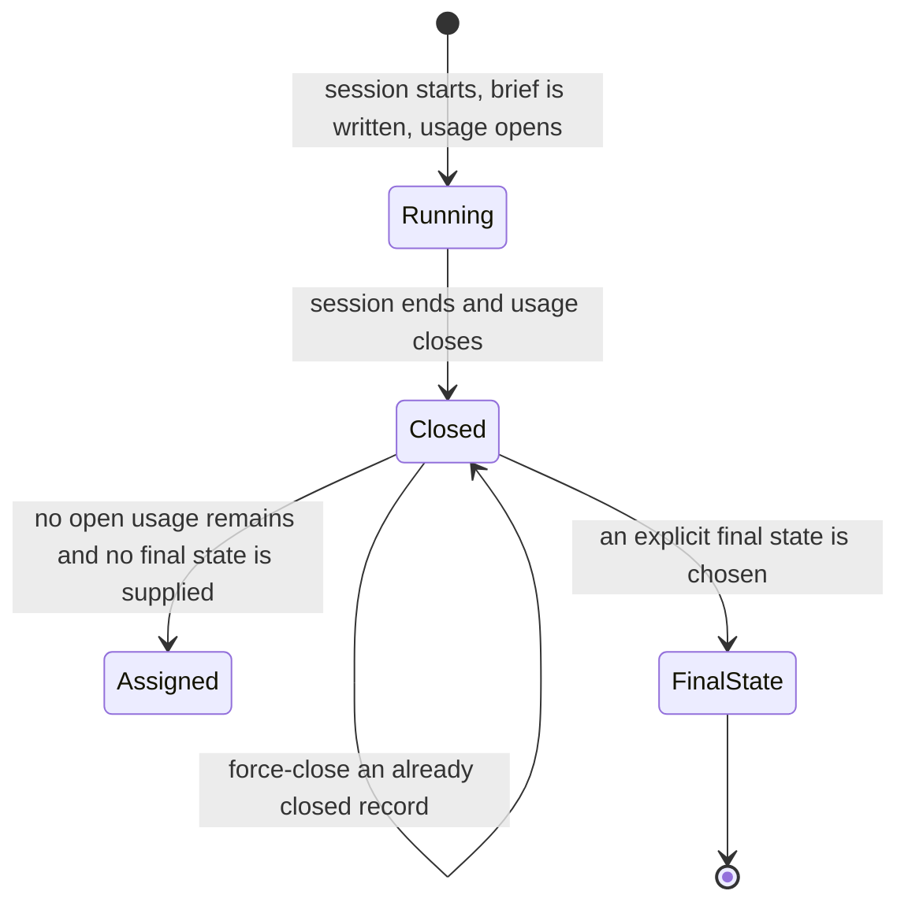
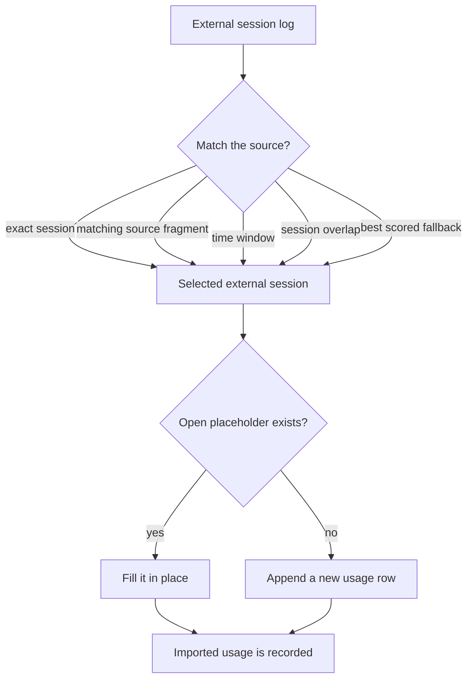
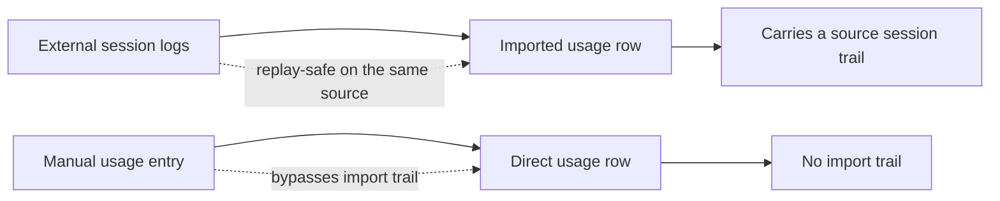

## Sessions, Usage, and Accountability

_Sessions are the accountability wrapper around governed work. For the operator, usage is a way to explain what happened and when, not the product's center. A session opens usage, writes the brief that hands the task to the next harness, and closes usage when the work stops. Imported usage can pull external session history into the ledger; direct usage entries remain a separate write path._

### One-Minute Snapshot

Sessions are the accountability wrapper around governed work. For the operator, usage is a way to explain what happened and when, not the product's center. A session opens usage, writes the brief that hands the task to the next harness, and closes usage when the work stops. Imported usage can pull external session history into the ledger; direct usage entries remain a separate write path. Read usage as supporting evidence, not as a spend dashboard.

### What You Should Be Able To Explain

- Understand why sessions exist and why they support, rather than replace, the core ledger workflow.
- Separate imported session usage from direct usage entries and know why the product keeps both.
- See where matching rules, closeout behavior, and external logs can change the usage trail.
- Know which usage facts are verified and which still depend on runtime evidence that was not mounted here.

### The role sessions play

Think of a session as the time boundary around the real work record. The work still lives in task, claim, evidence, and verification; the session only gives that work a start, a stop, and a handoff to the next harness. For the operator, that makes usage a supporting record, not the decisive record.

### How sessions and usage move together

Starting a session writes the brief, opens a usage placeholder, and marks the task running. That gives the assigned harness a clean start while leaving verification to the review harness. Ending a session closes usage, can force-close a previously closed record, and normally lets the task fall back to assigned once no open usage remains unless someone supplies an explicit final state.

Imported usage is selected from external session data by more than one path: exact session match, a matching source reference fragment, a time window, overlap with the operator session, or a score-based fallback. Re-importing the same source is idempotent on the source reference, and an existing open placeholder can be filled in place instead of appended again. Direct usage entries are separate writes with caller-supplied details and no imported-session trail.

> **Figure:** Session boundaries are not just timestamps: they open the usage wrapper, close it, and can still reshape the task's ending. The important consequence for the owner is that assigned is a fallback, not a guarantee, and explicit closeout choices can override it.

A session starts in the running state, where the brief is written and the usage placeholder opens. When the session ends, usage closes. If no open usage remains and nobody supplies a final state, the task falls back to assigned. If an explicit final state is chosen, that state wins instead. The diagram also shows that an already closed record can be force-closed again.

> **Figure:** Import is flexible on purpose, which is useful when source logs are messy, but it also means the importer is choosing among several possible matches. The owner should read the result as a selected-and-merged path, not a single exact lookup.

Imported usage begins with an external session log and then chooses a source session by one of several matching paths: exact session, matching source fragment, time window, session overlap, or a best-scored fallback. After a session is selected, the importer checks whether an open placeholder already exists. If it does, the importer fills that row in place; otherwise it appends a new usage row. The consequence is that import can merge into existing accounting instead of always creating a duplicate row.

### What is actually recorded

Most operational writes carry executor identity, which helps retrospective accountability, but the initial bootstrap path is a special case. Usage records also stay split between token-based and activity-based accounting, and the diagnostic check treats missing pricing coverage or automatic activity cost as accounting problems rather than hiding them.

The boundary to keep in mind is that usage records are evidence-adjacent. They help explain what happened and when, but they do not replace claim verification or make imported history complete on their own.

> **Figure:** There are two different trust paths here: imported usage preserves where it came from, while direct usage writes do not. For the owner, the consequence is that a later review can trust imported provenance more easily than a manual row, so the two habits must stay distinct.

External session logs feed imported usage rows, and those imported rows carry a source session trail. Re-importing the same source is replay-safe on that same source. Manual usage entries follow a separate direct path into the ledger, creating direct usage rows that do not carry the import trail. The key consequence is that imported and direct usage should not be treated as the same kind of evidence.

### What this layer does well

The strongest part of this layer is structure. Briefs and handoffs carry the latest handoff, current state, and next action forward to the next harness instead of leaving the operator to reconstruct context from memory. Imported usage is replay-safe on its source reference, so repeated intake does not automatically duplicate accounting. That combination gives the owner something usable for review and continuity without pretending this is a spend dashboard.

### Evidence Boundary

> **Evidence boundary** — Reviewed:
- Reviewed only repository evidence, with no owner-confirmed product intent supplied for this run.
- Reviewed the documented session start and end flow, including how usage opens, closes, and can shape task state at closeout.
- Reviewed the handoff and brief behavior that carries the next harness forward.
- Reviewed the imported-versus-direct usage split, the separate accounting classes, and the diagnostic checks that surface identity and accounting drift.

Not reviewed:
- No live runtime ledger snapshot was mounted, so active on-disk session state could not be observed here.
- The external session logs that imported usage depends on were not mounted, so source availability and log-convention edge cases remain unverified.

Compare the documented flow against a live ledger and representative source logs. Confirm that session start still opens usage and writes the brief, that imported usage still follows the same selection and merge behavior, that direct usage entries still stay separate, and that session closeout still falls back to assigned when open usage ends.

> Reviewed: blue-az/operator-control-plane repository snapshot, Founder/owner context

> Not reviewed: External runtime and integrations, Unreviewed runtime and owner context
