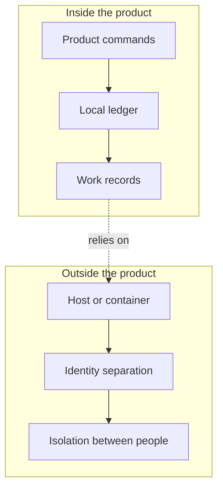
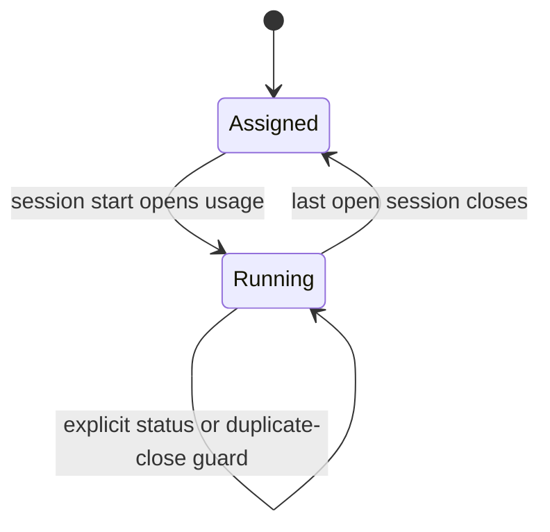
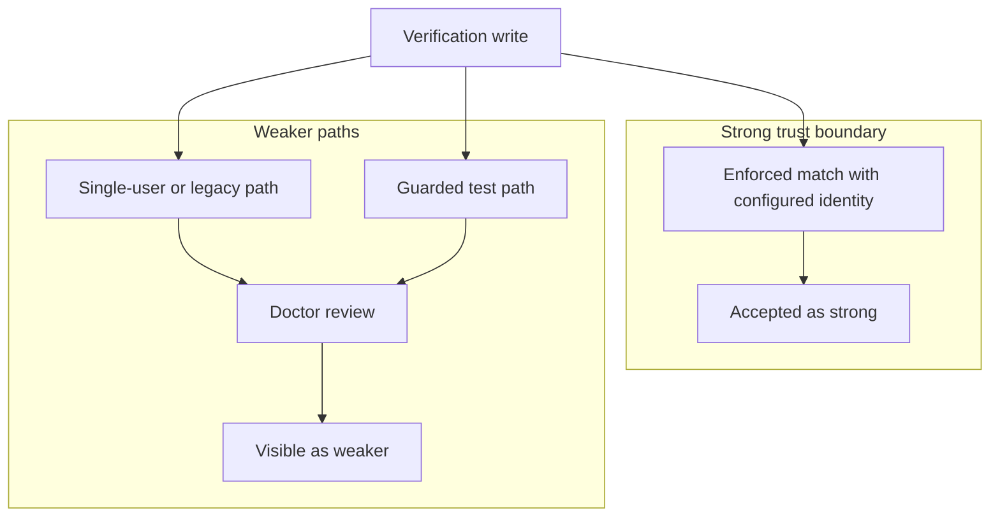
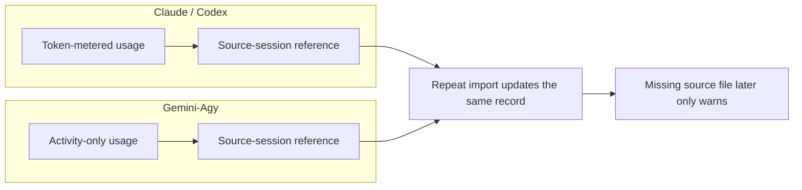

## Operating Boundaries, Failure Modes, and Stewardship

_This chapter is about the limits around a local CLI ledger, not a hosted service. The reviewed evidence shows a product that records tasks, claims, evidence, handoffs, sessions, verification checks, and usage in local files, with some commands binding to the current task and others stopping when the right registry or identity file is missing._

### One-Minute Snapshot

This chapter is about the limits around a local CLI ledger, not a hosted service. The reviewed evidence shows a product that records tasks, claims, evidence, handoffs, sessions, verification checks, and usage in local files, with some commands binding to the current task and others stopping when the right registry or identity file is missing. It also shows where the product stops: the CLI can check and record a lot, but it does not prove durable, tamper-proof history or host-level identity separation on its own. Imported usage keeps a source reference, yet a missing source log later only warns instead of stopping the record from existing. This chapter stays honest about what the product does today and where your operating environment still has to carry part of the burden.

### What You Should Be Able To Explain

- Explain which trust boundaries are enforced inside the product and which still depend on the host environment.
- Distinguish fail-closed behavior from warning-only or fallback behavior when records, identity, or source logs are missing.
- Describe what verification and usage import do not guarantee, even when they leave a record behind.
- Decide where external controls are needed for retention, identity separation, or provenance.
- Keep later chapter boundaries narrow when the reviewed evidence does not establish the broader system around the product.

### Treat It as a Local Ledger, Not a Hosted Service

### A local ledger, not a platform
The cleanest way to read the Operator Control Plane is as a local governance ledger that lives with the workspace and speaks in the product’s own workflow nouns: task, claim, evidence, usage, handoff, session, brief, export brief, doctor, and verify. That framing matters because it tells you what kind of system you are actually steering. It is not presented as a hosted service with a remote control plane of its own; it is a small, file-backed record of work and review that depends on the local environment to exist and remain meaningful.

That mental model changes how you interpret every record the CLI creates. A task is not just a loose ticket; it is part of a local chain that the product is trying to keep auditable. A claim and its evidence are not decorative metadata; they are the product’s way of binding proof to work inside that ledger. Verification, doctor, and the surrounding handoff and session vocabulary exist to make the local record usable for stewardship. The point is to make work legible in one place, not to pretend the product has become the whole operating system around it.

### Stewardship does not stop at the CLI
The reviewed evidence also leaves a boundary that matters for owners: some identity and isolation guarantees may still depend on the surrounding operating system or container. In other words, the CLI can record and check a lot, but it does not, by itself, prove that two operators are truly isolated from one another on the same machine, or that the environment has given each person a durable, separate identity boundary. The repository snapshot explicitly does not establish the wider deployment shape, and it even notes that real deployment isolation belongs outside the snapshot.

For an owner, that means the stewardship burden is shared. You can rely on the local ledger to structure work, but you still need the host environment to supply the parts that the product does not claim to own: separation between people, stable execution boundaries, and whatever local policy is needed to keep the ledger attached to the right operator. If you run the product in a shared shell, on a shared workstation, or inside a container whose identity rules are not already clear, the ledger may still function while the human boundary around it becomes weaker than the manual suggests. The product can record who it thinks the verifier is, but the surrounding environment is what determines how strong that identity claim really is.

A simple example makes the risk concrete. Two people open the same workspace on a shared machine. The ledger still writes task, claim, and verification records locally, so the history looks orderly. But if the machine or container does not separate identities the way you expect, the records can still be tied to the wrong human context. That is why the manual should not read the CLI as a full trust boundary. It is a governance layer over local files, not a substitute for host-level isolation.

### Preserve the boundary when evidence stops
The last rule is disciplined restraint. When the reviewed evidence does not confirm the wider product boundary or owner intent, treat that as a boundary to preserve rather than a gap to fill with guesswork. This chapter is the place to keep that honesty intact. If the snapshot does not establish a hosted surface, a broader system scope, or an owner-confirmed intent, do not promote any of those into the manual as if they were already proven.

That discipline is not a disclaimer for its own sake; it is how you avoid building false confidence into the operating model. The verified chapters can explain how records move, how verification is checked, and how usage is imported. This chapter’s job is narrower: hold the line around what the product demonstrably is, and keep the unproven parts outside the frame until better evidence appears. If the manual says the product is a local ledger, then the owner knows where to look for truth, where to add external controls, and where not to assume more than the evidence supports.

> **Figure:** The product can keep an auditable local ledger, but the stronger boundary around who is actually separated still comes from the host or container. Owners should not treat the ledger itself as the whole trust boundary.

The figure splits the system into what the product controls and what the host or container controls. Inside the product, commands write to a local ledger and produce work records. Outside the product, the host or container determines identity separation and isolation between people. The consequence is that the ledger can organize and check work, but it does not by itself prove the stronger human separation boundary.

### What the Product Enforces, and What It Leaves Outside

## Task binding and registry checks

When a task-scoped command is allowed to omit a task, it does not create a new target. It binds to the current task already recorded in the local settings, so the operator stays on the same ledger state without having to repeat the task every time. That fallback is narrow. It applies only where the command is already task-scoped, and it stops there. If the command also depends on a harness registry entry, the behavior changes from fallback to refusal: a missing registry file is treated as a stop, not a guess.

A concrete case makes the boundary clear. If an operator runs a task-scoped write without naming the task, the product can attach it to the current task. If the same operator then runs a harness-dependent command after the registry has been removed, the command does not silently continue. The ledger does not pretend it knows which harness should answer.

| Situation or action | What it changes | Key condition or exception |
| --- | --- | --- |
| Task-scoped command without an explicit task | Uses the current task from local settings | This fallback applies only to task-scoped commands, not every write path |
| Command that depends on a harness registry entry | No ledger change; the command stops | Missing registry data causes fail-closed behavior |
| Handoff capture | Records the next step on the task and updates the task's next action | The handoff is task-scoped and preserves the next step rather than inventing a new one |
| Session start | Opens usage and marks the task running | The open usage record is part of the state change, not a separate afterthought |
| Session end | Returns the task to assigned only when the closeout conditions are met | The task must still be running and there must be no open usage sessions; otherwise explicit status or the duplicate-close guard controls the result |
| Verification write | Records a named verifier and the claim status | A named verifier is required; enforced mode checks the configured identity map and rejects unknown or mismatched names; guarded test overrides are stamped for later audit |
| Doctor review | Flags self-verification, reviewer mismatch, and guarded test overrides | Legacy verified claims with no verifier remain informational, and single-user mode is only a warning |

## Handoffs and session state

Handoff capture writes the next step into the task record, which keeps the ledger's forward motion visible instead of leaving it inside conversation state. That matters because the next step is not just a note to the operator. It is part of how the product remembers what should happen after the current work is done. Session start works the same way: it opens usage and marks the task running in one move, so activity becomes an explicit open period in the ledger rather than a vague sign that work began.

Session end is more conditional than session start. It does not simply flip the task back to assigned. The fallback only happens when the task is still running and no open usage sessions remain. That protects the ledger from closing over an active session or from returning a task to the queue too early. If those conditions are not met, the explicit status or the duplicate-close guard decides what happens instead. In practice, that means the product prefers an honest state boundary over an optimistic one.

## Verification identity gates

Verification writes are stricter than ordinary workflow notes because they need a named verifier. In enforced mode, that name is checked against the configured identity map. If the name is unknown or does not match the mapped identity, the write fails closed rather than recording a doubtful verifier as if it were valid. The guarded test path is different: it is allowed, but it is marked so doctor can recognize it later instead of treating it as ordinary identity.

For the owner, the consequence is straightforward. A verification record only carries full weight if it passed the identity gate. The ledger may still keep the record when the path is guarded, but the trust level changes because the product has preserved the fact that the identity was special. That is why the audit branch matters here: doctor does not rewrite the workflow, but it can flag self-verification, reviewer mismatch, and the guarded test override so the owner does not overread a result that came through a weaker path.

> **Figure:** Session start opens usage and marks the task running. Session end only falls back to assigned after the last open session is closed while the task is still running, otherwise explicit status or duplicate-close rules decide the outcome.

The lifecycle starts in assigned. A session start moves the task to running and opens usage. When the last open session closes, the task can return to assigned, but only if it is still running. If that condition is not met, the explicit status or the duplicate-close guard controls the result instead of an automatic return.

> **Figure:** Only enforced-mode verification that matches the configured identity carries the strong trust boundary. Single-user, legacy, and guarded test paths stay visibly weaker, and doctor is where that weakness is surfaced later.

The diagram shows one strong path and several weaker paths. A verification write can go through an enforced match with the configured identity, which is treated as the strong boundary. Single-user, legacy, and guarded test paths do not get the same strength; they go through doctor review and remain visible as weaker. The consequence is that the owner should trust only the enforced path as strong identity proof.

### Checkable Facts the Evidence Confirms

### Separate by source type
The evidence draws a clean line between how the product counts different harness logs. Claude and Codex are treated as token-metered sources, which means their imported records carry token accounting and the parser looks for session, model, token, tool-call, and quota details. Gemini-Agy is treated differently: it is activity-only. For the owner, that split matters because a blended summary would overstate what the ledger can compare across providers. The ledger keeps separate accounting rules instead of forcing one common metric, so the report reflects the source it came from. That is a boundary, not a promise of cross-provider equivalence; the evidence shows separation, not a universal normalization layer.

| Source type or import condition | How it is counted or matched | What stays separate or preserved |
| --- | --- | --- |
| Claude or Codex source logs | Counted as token-metered imports, with parser rules that extract session, model, token, tool-call, and quota fields | Provider-specific accounting rules stay separate |
| Gemini-Agy source logs | Counted as activity-only rather than token-metered | Activity-only records stay separate from token-metered records |
| Exact session ID match | Matched directly to the named session | The imported record keeps its source-session reference |
| Time-window match | Matched by falling within the selected time window | Matching stays tied to the imported session record |
| Overlap with the current operator session | Matched by overlap with the active operator session | The record remains tied to the current operator session context |
| Scored fallback match | Matched by the scored fallback when the stronger matches are not available | The chosen source-session reference is still recorded |
| Repeat import of the same source session | Matched back to the existing source-session reference instead of being appended again | The earlier record is updated in place rather than duplicated |
| Missing source file later | Doctor only warns when the source file has disappeared | The source-session reference remains as provenance, but not as fail-closed retention |
| Manual override after import | Manual edits are written after import while preserving the earlier auto-derived values | Auto-derived values stay in the baseline, and edited fields are marked separately |

### What the summary tells you
The reporting behavior is also intentionally split. Usage summary can put token-metered and activity-metered records into separate blocks, with harness-internal labels for the measures it uses. That means the owner should read the summary as an accounting view, not a merged story about every harness in one number. If a report shows both types side by side, that is the point: the product is preserving the distinction rather than flattening it.

### Why provenance still has a limit
The strongest continuity the evidence establishes is local, not archival. Imported usage keeps a source-session reference, so later review can point back to where the record came from. But if the source file disappears afterward, doctor warns instead of stopping the record from existing. In practice, that means a deleted log does not erase the imported entry, and it does not cause the product to fail closed on the already-imported data. It does, however, leave the owner with a weaker chain than a retained source file would have provided.

A simple example makes the boundary clear. Suppose an operator imports one Claude log and one Gemini-Agy log from the same week. The Claude entry lands as token-metered, the Gemini-Agy entry lands as activity-only, and usage summary keeps them in separate blocks. If the same Claude source is imported again, the ledger updates the existing source-linked record instead of creating a second one. If the original log file is later deleted, doctor warns about the missing source, but the imported record and its source reference remain. If the operator then adds a manual correction, the earlier automatic numbers stay available in the baseline while the edited fields are marked as such. That is a useful audit shape, but it is still a local accounting record, not a guarantee that the underlying source will remain present forever.

> **Figure:** The provider split is preserved instead of flattened: Claude and Codex stay token-metered, Gemini-Agy stays activity-only, repeated imports update the same source-linked record, and a missing source file later weakens provenance without erasing the imported usage.

The comparison shows two parallel accounting branches. Claude and Codex imports are token-metered, while Gemini-Agy imports are activity-only. Both branches keep a source-session reference, and repeat imports update the existing record instead of creating a duplicate. If the source file disappears later, the product only warns, so the imported usage remains but the provenance is weaker.

### Where the Reviewed Evidence Is Strongest

## The product boundary is consistent

The strongest part of the reviewed record is that it says the same thing from three angles: the documentation, the command behavior, and the tests all point to a local, file-backed ledger rather than a hosted workflow system. That matters because it gives the owner a stable operating picture. The product is not being described as a remote service that centralizes state for you; it is a local control plane whose records live alongside the rest of the operator’s working files. In practice, that means the owner should expect the usual responsibilities of a local system: the machine, container, or workspace still carries part of the burden for identity, isolation, and preservation. What this evidence does establish is the product’s own stance. It is organized around local governance records, and the vocabulary in the interface matches that model closely.

The boundary here is also clear. This evidence does not turn the ledger into a promise of durable infrastructure or tamper-proof history. It is strong on product identity, not on enterprise guarantees. So the useful owner conclusion is narrower and more reliable: if you are deciding how much trust to place in the product itself, the review supports treating it as a local ledger with explicit records and checks, not as a hosted system that silently supplies the missing operational guarantees.

## The workflow is exercised, not just described

The second strong point is that the task, claim, evidence, handoff, and session path is directly exercised. That is a higher-quality signal than prose alone, because it shows the workflow is not only intended but actually driven end to end. A task is recorded, a claim is attached, evidence can be linked to that claim, and the transitions around handoff and session closure are tested as part of the same chain. For the owner, this reduces the risk that the manual is describing an aspirational process. The records are being mutated in the order the product claims to support, so the workflow can be explained as an operating sequence rather than as a loose set of nouns.

That direct exercise also makes the consequence easier to understand. If the owner is supervising work, the important question is not just whether the product names these records, but whether the records actually move together in a coherent way. The evidence says yes. It supports a model where the next step survives as a handoff, a session can open usage and mark the task running, and session closure can return the task to assigned only when the recorded conditions are satisfied. That is a concrete workflow boundary, not a vague claim about automation.

The qualifier is important: this strength is about the path the tests and commands cover, not about every conceivable workflow state in the universe of local files. The reviewed evidence is enough to trust the documented chain, but it does not license broad assumptions about unrelated states or external integrations.

## The guardrails have explicit branches

Verification and imported usage are easier to explain honestly than a softer product would be because both have explicit branch checks. Verification does not simply accept any asserted identity and call that trust. In enforced mode, it checks the verifier against a configured identity map, and the audit path distinguishes self-verification, reviewer mismatch, legacy records with no verifier, and single-user warnings. That is valuable to the owner because it makes the limits legible: the product is not pretending that every verification is equally strong. It is separating stronger and weaker cases so the manual can describe what the system actually did, rather than smoothing all outcomes into a single approval story.

Imported usage shows the same kind of honesty. The import path preserves a source reference, distinguishes provider types, keeps token-metered and activity-only records separate, and treats missing source logs as a warning branch rather than as a hard stop after the fact. For the owner, this is useful precisely because it is bounded. It means imported usage can support auditability without being oversold as proof of completed work or as fail-closed provenance. The product keeps the provenance trail, but it does not claim that a later missing source file erases the imported record or turns the system into a stronger retention mechanism than it is.

The practical upside of these branch checks is that the manual can stay precise. A looser product would force the owner into broad, hand-wavy statements about trust. Here, the evidence gives specific branches that can be described plainly: verified or not, reviewer-aligned or not, imported from a known source session or recovered through fallback, and later warned on if the source file goes missing. That clarity is the real strength. It lets the owner plan oversight around known branches instead of assuming a single, uniform trust level across all records.

### Attention Cards

#### ⚠ Local files are not proven durable or tamper-proof  _(attention · critical)_

**What happens:** The reviewed evidence shows a local, file-backed ledger and path-backed imported usage, but it does not establish enterprise-grade durability, retention, or tamper resistance.

**Why it matters:** If you treat the ledger as stronger than the evidence supports, you can lose records or trust a history the product does not actually guarantee.

**What to do:** Review this boundary and decide whether the current behavior is intentional.

**Revisit when:** When operating boundaries behavior or related owner decisions change.

#### ⚠ Identity checking still leans on the host boundary  _(attention · high)_

**What happens:** Verification can be checked inside the CLI, but the review also says real enforcement needs separate OS users or containers, and single-user mode is only an honor-system warning path.

**Why it matters:** Do not assume the command alone creates a hard identity boundary.

**What to do:** Review this boundary and decide whether the current behavior is intentional.

**Revisit when:** When operating boundaries behavior or related owner decisions change.

#### ⚠ Imported provenance can survive a missing source file  _(attention · high)_

**What happens:** The import keeps a reference to the source session, yet if that source file disappears later, doctor warns instead of failing closed.

**Why it matters:** Missing source logs do not erase the imported record, so audit confidence drops quietly unless you watch for it.

**What to do:** Review this boundary and decide whether the current behavior is intentional.

**Revisit when:** When operating boundaries behavior or related owner decisions change.

#### ⚠ Session closure is conditional, not automatic  _(attention · medium)_

**What happens:** Session end only falls back to assigned when the task is still running and no open usage sessions remain.

**Why it matters:** A reader can wrongly assume closure is automatic when it is actually state-dependent.

**What to do:** Review this boundary and decide whether the current behavior is intentional.

**Revisit when:** When operating boundaries behavior or related owner decisions change.

#### ⚠ Owner intent is still missing  _(attention · medium)_

**What happens:** The supplied evidence does not confirm whether this repository is the whole product or one component in a larger system.

**Why it matters:** Boundary, retention, and dependency language should stay narrow until the real operating context is confirmed.

**What to do:** Review this boundary and decide whether the current behavior is intentional.

**Revisit when:** When operating boundaries behavior or related owner decisions change.

### Owner Decisions

#### ⚖ Do you want the local ledger to be your operational source of truth, or do you need extra backup and retention controls around it?  _(owner decision · open)_

**Why it matters:** The reviewed evidence does not establish durable or tamper-proof storage.

**Revisit when:** Before changing the related operating boundaries behavior.

#### ⚖ Is CLI-level identity checking enough, or do you need real separation from the host OS or container?  _(owner decision · open)_

**Why it matters:** The review says the stronger identity boundary may sit outside the product itself.

**Revisit when:** Before changing the related operating boundaries behavior.

#### ⚖ Should missing source logs stay a warning, or should they trigger stricter handling?  _(owner decision · open)_

**Why it matters:** Imported usage can remain present after the source file is gone.

**Revisit when:** Before changing the related operating boundaries behavior.

### Evidence Boundary

> **Evidence boundary** — Reviewed:
- The reviewed notes about the local ledger model, workflow nouns, and CLI entry points.
- The reviewed notes about task, claim, evidence, handoff, session, verification, and usage-import behavior.
- The reviewed notes about identity checks, doctor warnings, and the difference between local checks and host-level enforcement.
- The reviewed notes about usage import idempotency, provenance, and missing-source warnings.
- The open decision that broader owner intent is still unconfirmed.

Not reviewed:
- Raw source files, tests, or commands outside the supplied reviewed knowledge.
- Any hosted user interface, shared service, or API surface not established by the supplied evidence.
- Any retention, backup, disaster recovery, or tamper-proofing design not established by the supplied evidence.

Recheck the chapter evidence if the product gains a hosted surface, the local record layout changes, verification rules change, or usage import stops preserving source references and manual-versus-auto provenance.

> Reviewed: blue-az/operator-control-plane repository snapshot, Founder/owner context

> Not reviewed: External runtime and integrations, Unreviewed runtime and owner context
