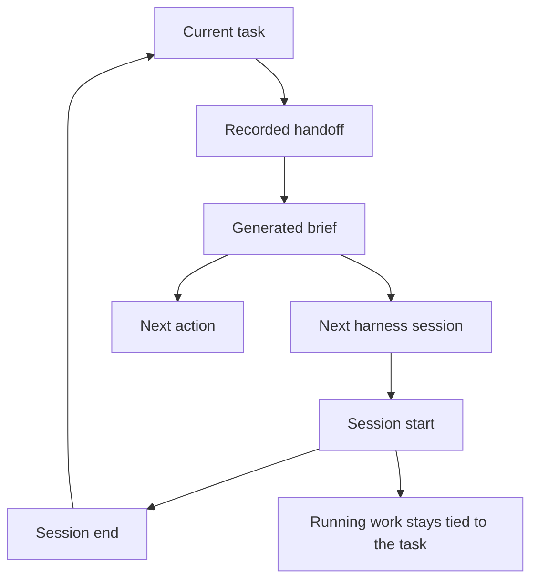
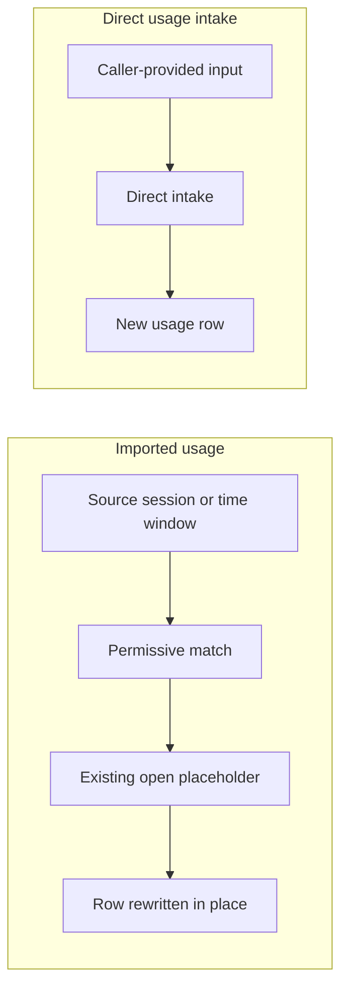
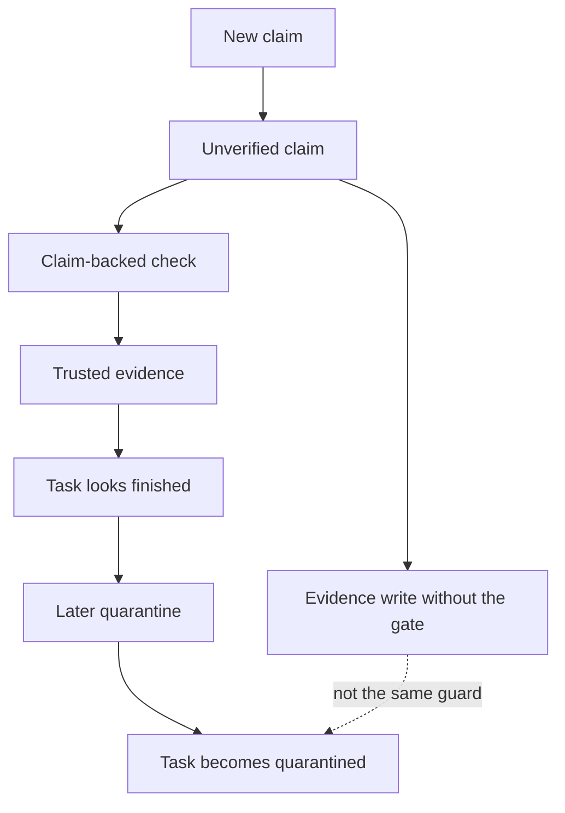

## Running a Multi-Harness Workflow

_This chapter is about continuity. The product does not just record isolated tasks; it keeps a local operating rhythm where an operator, an assigned harness, and a review harness move work forward through briefs, handoffs, session closeout, and usage records._

### One-Minute Snapshot

This chapter is about continuity. The product does not just record isolated tasks; it keeps a local operating rhythm where an operator, an assigned harness, and a review harness move work forward through briefs, handoffs, session closeout, and usage records. The practical question for the owner is whether each handoff still points to the same task, the same next action, and the same trust boundary, or whether the workflow has drifted into overlapping sessions, mismatched status, or unclear accountability.

### What You Should Be Able To Explain

- Understand how briefs and handoffs carry work from one harness session to the next.
- See which actions stay bound to the current task and which ones can change task state across closeout.
- Recognize when continuity is healthy and when the ledger is drifting away from the work actually being done.
- Know where the local ledger workflow ends and where any broader external system would still need separate confirmation.

### Mental Model

Think of this product as a governed local workflow, not a loose pile of notes. The operator keeps continuity, the assigned harness does the work, and the review harness checks it before trust changes. The important pattern is not just task to claim to evidence to verification, but the wrapper around that pattern: a brief starts the next session, a handoff records what changed, and the session records keep the work aligned with the current task.

Because owner-confirmed operating context is not supplied, this chapter treats the workflow as a local multi-harness rhythm rather than a proven end-to-end external system. That means the owner should read every continuity rule as a local ledger rule first, and only extend it outward if later evidence proves a larger orchestration boundary.

> **Figure:** The handoff does not live as a loose note stream. It becomes a brief that carries the task, the latest handoff, and the next action into the next session, so continuity stays attached to the active task instead of drifting.

The diagram shows a current task feeding a recorded handoff, which is packaged into a generated brief for the next harness session. Session start and session end keep the work moving while preserving the tie back to the same task. The consequence is that continuity stays in the ledger as a structured transfer, not an informal handoff.

### How It Works

The handoff path is deliberate. A handoff can come in through structured input, and it is stored against the task rather than floating as an informal note. The generated brief then packages the latest handoff, the current task state, and the next action so the next harness does not have to reconstruct context from scratch. It also tells builders to attach evidence and leave verification to the review harness, which keeps work and trust in separate lanes.

Session start and session end are part of the same rhythm. Starting a session writes the export brief, opens usage, and marks the task running. Ending a session closes usage and usually returns the task to assigned when no open usage remains, unless an explicit status is supplied. That matters because task state and usage closeout are related but not identical, so the owner should read them as linked records, not one merged state.

Usage import sits beside that flow as a secondary accounting path. It can match by more than one selector, and it can update an existing open placeholder instead of always appending a fresh row. Direct usage intake is also separate: it writes a usage record from caller-provided input without using the same import trail. That means accountability is real, but it is not all funneled through a single path.

> **Figure:** Imported usage is forgiving and can land on an existing open placeholder, which makes it good for recovery but risky for mistaken attachment. Direct intake skips the source-session trail and writes a fresh ledger row, so it is simpler but less connective.

The left side shows imported usage: the importer looks for a source session or time window, makes a permissive match, and can rewrite an existing open placeholder in place. The right side shows direct usage intake: caller-provided input goes straight into a new usage row. The consequence is that import is more flexible and can merge into existing accounting, while direct intake is a standalone write without the same source-session trail.

### Verified Facts

The workflow surface is fixed rather than open-ended: the command set is enumerated, and the same vocabulary appears in the manual and the executable surface.

Several task-bound writes depend on the current task when no explicit task is supplied. That makes the active task record part of the operating state, not just a convenience.

A new claim starts unverified, with no verifier and no evidence attached. Claim creation records that an assertion exists; it does not make the assertion trusted.

Verification checks are not blanket checks on every evidence write. The trusted-status branch is gated by the presence of a claim and a status update, and identity enforcement can be strict or warning-only depending on configuration.

Doctor is a diagnostic check, not a generic failure for every inconsistency. It separates self-verification, reviewer mismatch, legacy verifier gaps, and lifecycle drift so the owner can see what is broken versus what is merely incomplete.

> **Figure:** Verification is a gated path, not a blanket promise over every evidence write. Even after a task appears finished, quarantine still has the power to pull it back and change the owner’s reading of completion.

The diagram starts with a new claim that is still unverified. Only the claim-backed check leads into trusted evidence. A separate evidence write path is shown outside that gate. After a task looks finished, a later quarantine can still move it to quarantined. The consequence is that closeout is not one-way, and finish-like status can be reversed.

### Strengths

The strongest part of this design is that continuity is explicit. Briefs and handoffs are structured records, not casual conversation, so the next harness can inherit work with a real task state and a real next action.

The second strength is separation. Work creation, review, session closeout, and usage accounting do not collapse into one vague status. That separation makes it easier for the owner to see whether the system is progressing, merely logging, or actually crossing a trust boundary.

A third strength is auditability. Re-importing usage does not have to create duplicates, and executor provenance is stamped on operational writes. That gives the owner a better chance of spotting drift instead of guessing which session produced which record.

### Attention Cards

#### ⚠ A quarantine can still downgrade a finished task  _(attention · critical)_

**What happens:** When evidence is attached with a quarantine status, the parent task can be moved to quarantined even if it had already looked verified or complete.

**Why it matters:** Closeout is not one-way. If the owner reads terminal status as final, a later quarantine can reverse that conclusion and change what the business thinks is done.

**What to do:** Review this boundary and decide whether the current behavior is intentional.

**Revisit when:** When handoffs and operating rhythm behavior or related owner decisions change.

#### ⚠ Session closeout can diverge from usage cleanup  _(attention · high)_

**What happens:** Session end usually falls back to assigned when the last open usage closes, but an explicit closeout status can override that fallback.

**Why it matters:** The task status you see may not match the usage picture unless the owner knows which record was allowed to win. That matters when handoffs are used to judge whether work is still active.

**What to do:** Review this boundary and decide whether the current behavior is intentional.

**Revisit when:** When handoffs and operating rhythm behavior or related owner decisions change.

#### ⚠ Verification is not a blanket rule on every evidence write  _(attention · high)_

**What happens:** Status-based verification checks run only on claim-backed evidence writes. Bare evidence writes with a status do not enter the same guard.

**Why it matters:** If the owner assumes every status change is checked the same way, trust can drift without being noticed. This is an authority boundary, not just a convenience difference.

**What to do:** Review this boundary and decide whether the current behavior is intentional.

**Revisit when:** When handoffs and operating rhythm behavior or related owner decisions change.

#### ⚠ Usage import can match more broadly than an exact session ID  _(attention · medium)_

**What happens:** Import selection can use exact match, substring match, a time window, overlap, or a score-based fallback, and it can hydrate an open placeholder in place.

**Why it matters:** A rushed import can attach the wrong session or merge into a row that was already open. That affects accountability even when the ledger still looks tidy.

**What to do:** Review this boundary and decide whether the current behavior is intentional.

**Revisit when:** When handoffs and operating rhythm behavior or related owner decisions change.

#### ⚠ The repository may not be the whole operating system  _(attention · low)_

**What happens:** The reviewed evidence proves a local workflow, not the complete broader system that may surround it.

**Why it matters:** If the owner treats this chapter as the whole truth, they may miss external coordination steps that are outside the bounded evidence and therefore still unverified.

**What to do:** Review this boundary and decide whether the current behavior is intentional.

**Revisit when:** When handoffs and operating rhythm behavior or related owner decisions change.

### Owner Decisions

#### ⚖ Should the generated brief remain the canonical handoff text for the next harness?  _(owner decision · open)_

**Why it matters:** The brief is the main continuity artifact. If it stops being the source of truth, the next harness can inherit stale context or miss the current next action.

**Revisit when:** Before changing the related handoffs and operating rhythm behavior.

#### ⚖ Should task-bound writes keep the implicit current-task fallback, or should the manual require explicit task selection in high-risk work?  _(owner decision · open)_

**Why it matters:** Several write paths depend on the active task when no task is passed. That is fast, but it also makes continuity dependent on repository state.

**Revisit when:** Before changing the related handoffs and operating rhythm behavior.

#### ⚖ Should session end be allowed to override the fallback assignment when usage closes, or should usage closeout and task status stay strictly coupled?  _(owner decision · open)_

**Why it matters:** The workflow can separate usage cleanup from task status. If the owner wants a simpler lifecycle, that flexibility may need to be narrowed.

**Revisit when:** Before changing the related handoffs and operating rhythm behavior.

#### ⚖ Should usage import stay permissive about session matching and placeholder hydration, or should the owner require stricter selection rules?  _(owner decision · open)_

**Why it matters:** Permissive matching is forgiving, but it also increases the chance of pulling in the wrong session or rewriting an open placeholder unexpectedly.

**Revisit when:** Before changing the related handoffs and operating rhythm behavior.

#### ⚖ Should the manual keep describing this as a local ledger workflow unless broader system boundaries are confirmed?  _(owner decision · open)_

**Why it matters:** The evidence does not prove the repository is the entire system. Overstating the boundary would make the owner trust a wider operating model than the evidence supports.

**Revisit when:** Before changing the related handoffs and operating rhythm behavior.

### Evidence Boundary

> **Evidence boundary** — Reviewed:
- The command surface and bootstrap behavior of the local CLI, including how the ledger is initialized and what happens on repeat initialization.
- The way work binds to the current task when no task is passed, and how that affects task creation, evidence, usage, handoff, and session actions.
- The claim, evidence, and verification flow, including the difference between unverified claims, claim-backed verification, and diagnostic checks.
- The brief and handoff flow, including how the next harness receives the latest handoff, current task state, and next action.
- Session start and session end behavior, including usage placeholders, running state, and closeout fallback.
- Usage import and direct usage intake, including idempotent re-import behavior, placeholder hydration, and separate manual usage records.
- Identity and provenance stamping on operational writes, plus diagnostic checks that reveal drift.

Not reviewed:
- A live runtime ledger snapshot under .operator, so the chapter does not claim to have observed active on-disk state directly.
- External session logs that usage import searches, so the chapter does not claim runtime availability or completeness of those sources.
- The owner’s preferred operating scenario and the broader system boundary, so the chapter does not pretend to know whether this repository is the whole product or one governed part of it.

Recheck the command inventory, bootstrap path, task-bound writes, brief and handoff generation, session closeout, usage import, and doctor diagnostics against a fresh workspace with a live ledger and real session logs. If the owner clarifies the broader system, revisit the boundary sentence first before expanding any claims beyond the local workflow.

> Reviewed: blue-az/operator-control-plane repository snapshot, Founder/owner context

> Not reviewed: External runtime and integrations, Unreviewed runtime and owner context
