# Owner's Manual for blue-az/operator-control-plane

_6 generated chapters from the reviewed repository snapshot_

> Source: blue-az/operator-control-plane:main@9b9e3e63a7f0f54ccde541c6c10570c8fdbe8f5b

---

## Quickstart

```bash
pip install -r requirements.txt        # just PyYAML
./operator --help
./operator doctor                      # consistency check over the local .operator/ ledger
pytest tests/                          # subprocess-driven tests + synthetic session fixtures
```

The ledger (`.operator/`) is gitignored — it's your work history, not the tool.

## Worked example

```bash
./operator init                                    # create .operator/ ledger in this repo

# open a task
./operator task-create --objective "Add retry to the uploader" --id up-retry --repo myapp

# an agent registers a typed, gate-bound claim
./operator claim-add --task up-retry --type test_passes \
    --text "uploader retries 3x on 5xx" --gate tests/test_upload.py

# attach evidence and verify — verifier identity must differ from the builder (guard fails closed)
./operator evidence-attach tests/out/upload.log --task up-retry --claim claim-0001 \
    --type test_output --status verified --verified-by reviewer

# read-only consistency check: unverified / self-verified claims, enforcement downgrades
./operator doctor

# track the session + its cost, then close out with a brief for the next harness
./operator session-start --task up-retry --harness claude
./operator session-end --outcome useful --cost 12.50
./operator handoff-add --task up-retry --changed "uploader.py" --verified "retry test" --open "tune backoff"
./operator export-brief --for codex --task up-retry
```

## What operator Is For

_operator is a local command-line control plane with a file-backed ledger under .operator/. Its job is not to be a general project tracker or a hosted control plane; it is to keep multi-agent work legible through a task, claim, evidence, and verification frame. For the owner, the important thing is the boundary: this product is about preserving accountable work records inside a bounded local workflow._

### One-Minute Snapshot

operator is a local command-line control plane with a file-backed ledger under .operator/. Its job is not to be a general project tracker or a hosted control plane; it is to keep multi-agent work legible through a task, claim, evidence, and verification frame.

For the owner, the important thing is the boundary: this product is about preserving accountable work records inside a bounded local workflow. The human operator maintains the ledger, assigned harnesses do the work, review harnesses check it, and verifiers are recorded when trust changes. The next chapters go deeper into the lifecycle, the records, and the verification rules; this chapter only sets the identity and the limits.

> **Figure:** The owner should read operator as a local control surface over a bounded ledger, so the product ends at the recorded workflow instead of expanding into a hosted control plane or a generic tracker.

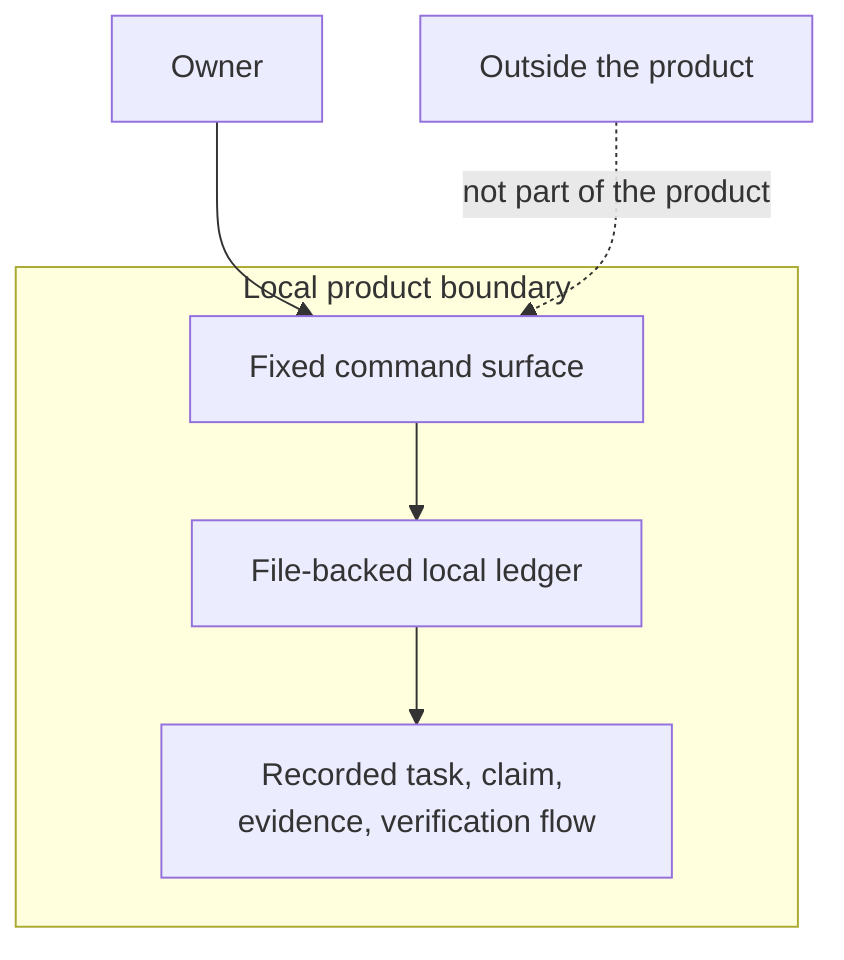
```mermaid
flowchart TD
  O[Owner]
  subgraph B[Local product boundary]
    C[Fixed command surface]
    L[File-backed local ledger]
    W[Recorded task, claim, evidence, verification flow]
    C --> L --> W
  end
  X[Outside the product]
  O --> C
  X -. not part of the product .-> C
```

This diagram shows the owner using a local product boundary that contains a fixed command surface, a file-backed local ledger, and the recorded task-to-claim-to-evidence-to-verification flow. Anything outside that boundary is not part of the product's scope.

### What You Should Be Able To Explain

- Understand that operator is a local CLI plus a .operator/ ledger, not a hosted SaaS control plane.
- Recognize the native roles: operator, assigned harness, review harness, and verifier.
- See the core product frame: task, claim, evidence, then verification.
- Know that brief and handoff records are the continuity path between harnesses.
- Notice the main boundary risks before deciding what to trust or correct.

### Mental Model

The owner should read operator as a local governance ledger for software work. The product matters because it turns scattered multi-agent activity into a recorded sequence: work is assigned as a task, assertions become claims, claims are supported by evidence, and trust changes only through verification. That is the load-bearing frame of the product, and it is the reason the manual keeps returning to the same vocabulary instead of treating this as generic ticket tracking.

This chapter stays at the level of identity and boundary. The detailed movement of work through the ledger belongs in the lifecycle chapter, and the mechanics of records belong in the surfaces chapter.

> **Figure:** Continuity is not informal memory here. The next harness starts from recorded context, so the handoff path keeps work legible across role changes instead of forcing a cold restart.

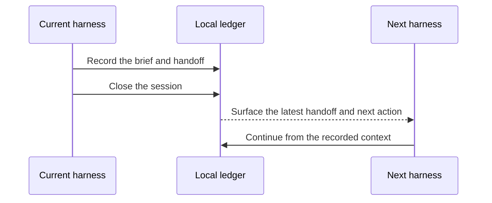
```mermaid
sequenceDiagram
  participant Current as Current harness
  participant Ledger as Local ledger
  participant Next as Next harness
  Current->>Ledger: Record the brief and handoff
  Current->>Ledger: Close the session
  Ledger-->>Next: Surface the latest handoff and next action
  Next->>Ledger: Continue from the recorded context
```

The current harness writes the brief and handoff into the local ledger, then closes the session. The next harness reads that recorded context and continues from the latest handoff and next action. The consequence is that work moves forward through saved records rather than through memory alone.

### How It Works

The executable surface is a fixed CLI, and the durable surface is the .operator/ ledger. Some write commands bind to the current task when the task is not passed explicitly, so the product expects there to be an active piece of work already in view. A new claim begins unverified and linked to its task; it does not become trusted just because it exists.

Briefs and handoffs are the continuity layer between harnesses. Sessions, usage, and provenance records support the work, but they do not replace the core task-to-claim-to-evidence-to-verification sequence. That keeps the product centered on accountable work records rather than on a generic activity log.

> **Figure:** Convenience comes with a dependency: if the task is omitted, the write falls back to the current ledger state, so the command is only safe when the active task is already set.

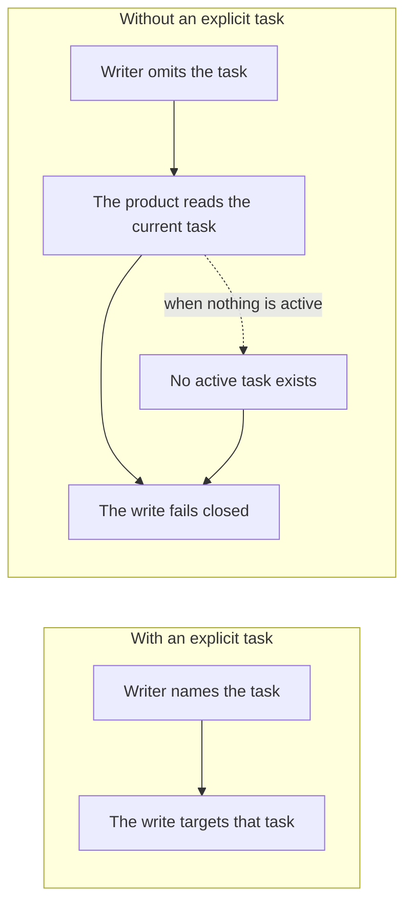
```mermaid
flowchart LR
  subgraph A[With an explicit task]
    A1[Writer names the task]
    A2[The write targets that task]
    A1 --> A2
  end
  subgraph B[Without an explicit task]
    B1[Writer omits the task]
    B2[The product reads the current task]
    B3[No active task exists]
    B4[The write fails closed]
    B1 --> B2 --> B4
    B2 -. when nothing is active .-> B3 --> B4
  end
```

With an explicit task, the writer points the command at a known target and the write goes there directly. Without an explicit task, the product tries to use the current task from the ledger; if no active task exists, the write stops instead of guessing. The consequence is that these writes depend on existing task state when the task is not named.

### Verified Facts

- The CLI surface is statically enumerated, not dynamically discovered.
- The first run creates the standard .operator/ structure, and rerunning bootstrap does not repair a tree that already exists.
- Several task-bound writes fall back to the current task when no task is supplied, and they fail closed if no active task exists.
- Claims start unverified, with no verifier and no evidence refs, then link back to the task that owns them.
- Briefs and handoffs are designed to carry context forward to the next harness.
- Operational writes record executor provenance, while doctor acts as a diagnostic check for identity and drift rather than the product's main identity.

> **Figure:** A claim does not become trusted just because it exists, and closeout is not final if quarantine comes later. The owner should treat the terminal state as reversible when that later signal appears.

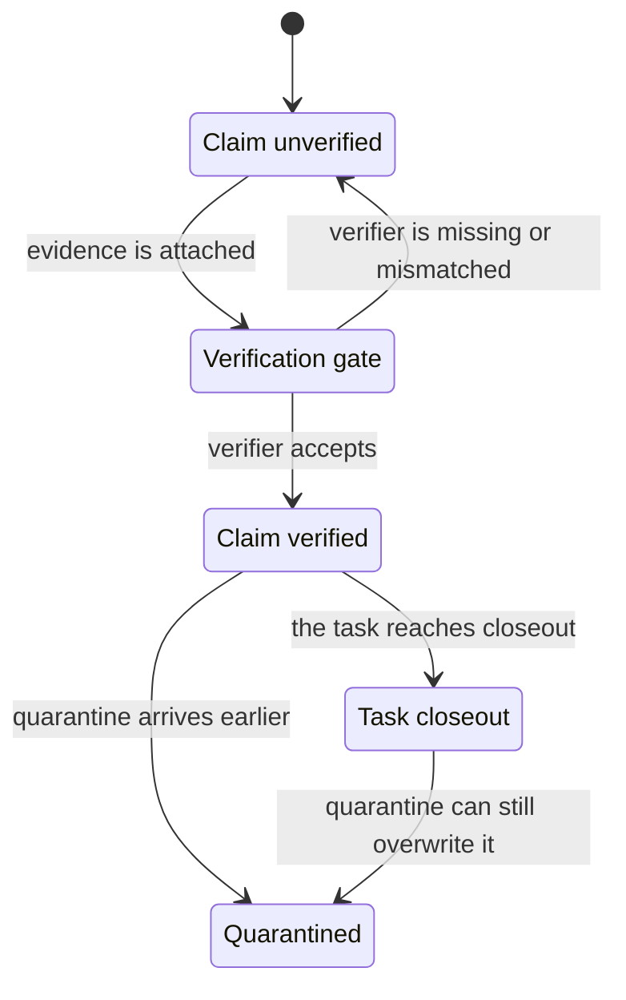
```mermaid
stateDiagram-v2
  [*] --> Unverified
  state "Claim unverified" as Unverified
  state "Verification gate" as Gate
  state "Claim verified" as Verified
  state "Task closeout" as Closed
  state "Quarantined" as Quarantined
  Unverified --> Gate: evidence is attached
  Gate --> Verified: verifier accepts
  Gate --> Unverified: verifier is missing or mismatched
  Verified --> Closed: the task reaches closeout
  Verified --> Quarantined: quarantine arrives earlier
  Closed --> Quarantined: quarantine can still overwrite it
```

A claim starts unverified. When evidence is attached, it enters a verification gate; if the verifier is accepted, the claim becomes verified, and if the verifier is missing or mismatched, it stays unverified. When the task reaches closeout, a later quarantine can still overwrite that terminal state. The consequence is that trust is gated, and terminal status is not one-way.

### Strengths

The strongest thing about the product is that it makes work legible across harnesses without asking the owner to trust memory. The vocabulary is consistent across the command surface and the recorded workflow, which makes it easier to tell whether a task is actually supported, merely asserted, or already verified.

A second strength is that the product keeps continuity explicit. Briefs, handoffs, sessions, and provenance are recorded as part of the workflow instead of being left as informal side notes, so the ledger can answer what happened and who acted even when the work moved between roles.

### Evidence Boundary

> **Evidence boundary** — Reviewed:
- The CLI command surface and its fixed product vocabulary.
- The local .operator/ ledger layout and first-run bootstrap behavior.
- Task-bound writes that use the current task when one is not passed explicitly.
- Claim creation as an unverified task-linked record.
- Brief, handoff, session, and provenance behavior as the continuity layer around the core workflow.

Not reviewed:
- A live runtime .operator/ snapshot from an actual working workspace.
- External session logs used by usage import.
- Owner interview answers that would confirm the broader operating boundary.
- Any workflow beyond the bounded local tool that the repository evidence does not prove.

Recheck the manual against a fresh workspace by exercising the visible CLI entry points and comparing the resulting .operator/ layout and records with the described workflow. Confirm that first-run setup, repeat setup, task-bound writes, claim creation, brief and handoff generation, and session closeout still behave the same way. If live evidence shows a repair path, a broader system boundary, or different task-binding rules, revise the chapter boundary instead of stretching the current claims.

> Reviewed: blue-az/operator-control-plane repository snapshot, Founder/owner context

> Not reviewed: External runtime and integrations, Unreviewed runtime and owner context


---

## How Work Moves Through the Ledger

_The product matters to the owner because it turns work into a governed record instead of a pile of loosely related notes. A task becomes a claim when an assigned harness says what it did, evidence supports that claim, and verification is the separate trust step that decides whether the claim should be treated as trusted._

### One-Minute Snapshot

The product matters to the owner because it turns work into a governed record instead of a pile of loosely related notes. A task becomes a claim when an assigned harness says what it did, evidence supports that claim, and verification is the separate trust step that decides whether the claim should be treated as trusted. Sessions, briefs, and handoffs sit around that core path so the next harness can continue without losing context. Usage records are also governed, but they are secondary to the trust path and should not be mistaken for proof of work.

### What You Should Be Able To Explain

- Understand the difference between a task, a claim, evidence, and verification.
- See why claims and evidence stay separate until a verifier signs off.
- Recognize which records are essential for auditability and which records mainly preserve continuity.
- Spot where the workflow can drift, downgrade, or stay ambiguous before it becomes a governance problem.
- Know which follow-on chapters handle surfaces, trust, usage, and operating rhythm in more detail.

### Mental Model

Think of the ledger as a governed work trail. The task is the container for work. The claim is the statement that something was done. Evidence is the support for that statement. Verification is the trust step that tells the owner whether the claim should count as trusted. Those are related, but they are not the same thing.

The supporting records sit beside that core path. Briefs and handoffs are there so the next harness can pick up the work with context intact. Sessions capture the working period and help close it out cleanly. Usage records account for activity and cost. A healthy workflow makes those layers visible instead of blending them into one vague status stream.

> **Figure:** The owner should read trust as a separate gate, not something created by the claim itself. A task can become a claim before it is trusted, and only evidence plus verification changes how that claim counts.

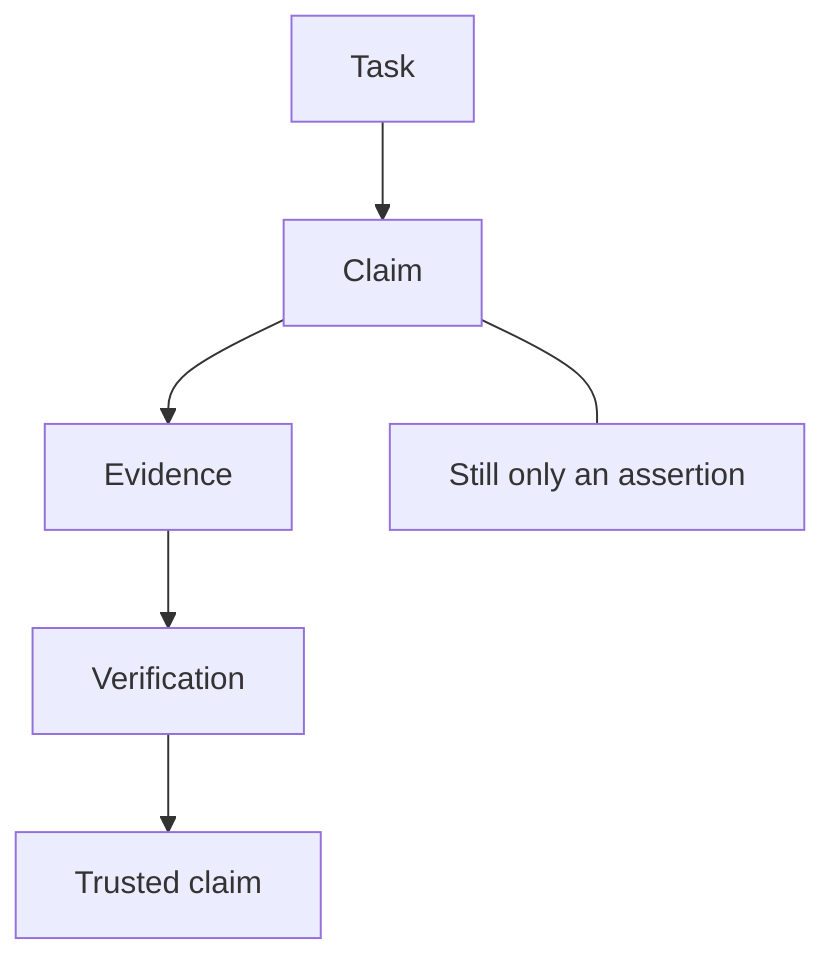
```mermaid
flowchart TD
  T[Task]
  C[Claim]
  E[Evidence]
  V[Verification]
  R[Trusted claim]
  N[Still only an assertion]
  T --> C
  C --> E
  E --> V
  V --> R
  C --- N
```

A task leads to a claim. The claim can gather evidence. Verification is a separate step that decides whether the claim becomes trusted. Until that review happens, the claim remains only an assertion about work, not proof.

### How It Works

The normal sequence is straightforward: a task exists, an assigned harness works it, a claim records what was done, evidence supports that claim, and verification decides whether the claim is trusted. The owner should read that as a chain of responsibility, not a set of interchangeable statuses.

A few supporting rules matter for how the chain behaves. Some writes follow the current active task automatically when no task is named, so the ledger depends on task state being correct. A new claim starts unverified and has no verifier until later evidence and verification are recorded. When claim-backed evidence is being marked with a status, the verification step is separate from the evidence itself, and the trust check is stricter in enforced mode than in single-user mode. Briefs and handoffs carry the latest context to the next harness, while session start and end frame the working period and the usage placeholder that belongs to it.

> **Figure:** Briefs, handoffs, sessions, and usage records sit beside the core path to preserve continuity and accounting. They help the next harness continue cleanly, but they do not replace the proof path.

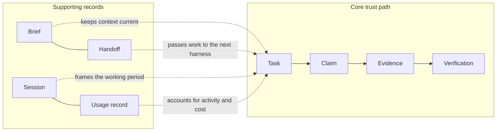
```mermaid
flowchart LR
  subgraph Core[Core trust path]
    T[Task] --> C[Claim] --> E[Evidence] --> V[Verification]
  end
  subgraph Support[Supporting records]
    B[Brief] --- H[Handoff]
    S[Session] --- U[Usage record]
  end
  B -. keeps context current .-> T
  H -. passes work to the next harness .-> T
  S -. frames the working period .-> T
  U -. accounts for activity and cost .-> T
```

The core path is task, claim, evidence, and verification. Around it sit briefs, handoffs, sessions, and usage records. Those supporting records keep context moving, frame the working period, and account for activity and cost, but they do not serve as proof of work.

### Verified Facts

The reviewed evidence supports a few concrete behaviors that matter to the owner:

- Claim creation is not trust creation. A new claim begins unverified, with no verifier and no evidence refs, and it is linked back to its task.
- Claim-backed evidence updates only enforce the verifier rule when a status is being recorded on a claim. That is the protected trust path; it is not a blanket rule for every evidence write.
- Local evidence copying is best-effort. If the copy fails, the ledger write can still proceed, so the owner should not assume the file itself always landed safely just because the ledger entry exists.
- Doctor is a diagnostic check, not a single binary gate. It separates self-verification errors, reviewer mismatch warnings, and legacy records that lack verifier metadata.
- Briefs are meant to hand work to the next harness. They carry the latest handoff, the current task state, and the next action, and they tell builders to attach evidence while leaving verification to the review harness.
- Usage has two lanes. Imported usage is tied to session history, while direct usage intake is a separate accounting write that goes straight into the dated usage ledger.
- Executor identity is stamped on operational writes, but bootstrap is a known exception, and single-user mode can accept a write while still warning that verification is not identity-enforced.

> **Figure:** Verified promotion is guarded by terminal-state checks, but quarantine still has the power to overwrite the parent task. That makes closeout reversible when late quarantine evidence arrives.

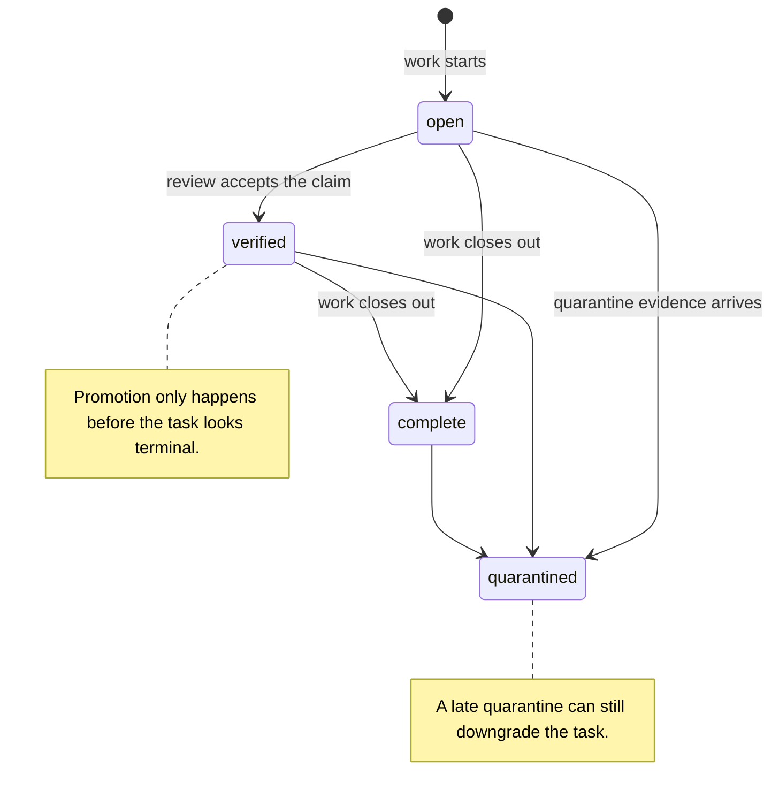
```mermaid
stateDiagram-v2
  [*] --> open: work starts
  open --> verified: review accepts the claim
  open --> complete: work closes out
  verified --> complete: work closes out
  open --> quarantined: quarantine evidence arrives
  verified --> quarantined
  complete --> quarantined
  note right of verified
    Promotion only happens before the task looks terminal.
  end note
  note right of quarantined
    A late quarantine can still downgrade the task.
  end note
```

A task can move from open to verified or complete when review and closeout happen. Verified promotion only happens before the task looks terminal. If quarantine evidence arrives later, the task can still be moved to quarantined even after it looked finished. The owner should treat terminal-looking status as provisional when quarantine remains possible.

### Strengths

The strongest part of this lifecycle is that it separates assertion, support, and trust. That gives the owner a cleaner audit trail than a simple done/not-done status. The workflow also preserves continuity: the next harness does not have to guess what happened, because the brief and handoff records carry the recent context forward.

The second strength is that the ledger does not force every record into one bucket. Usage, session closeout, and direct handoff records remain visible as supporting material instead of being hidden inside the claim itself. That makes it easier to tell whether the workflow is actually trusted, merely in progress, or already drifting into a state that needs review.

### Evidence Boundary

> **Evidence boundary** — Reviewed:
- Reviewed the task, claim, evidence, verification, session, handoff, usage, identity, and bootstrap behaviors that define how work moves through the ledger.
- Reviewed the diagnostic behavior that separates trust errors, reviewer mismatch warnings, and in-flight lifecycle drift.
- Reviewed the boundary between core auditability records and supporting coordination records such as briefs, handoffs, sessions, and usage.

Not reviewed:
- No live runtime ledger snapshot was mounted, so the chapter stays with documented behavior rather than observed production state.
- No external home-directory session log corpus was available for usage import, so source availability and exact import results remain runtime-unverified.
- Owner-confirmed product intent was not supplied, so the chapter avoids broader product-framing claims beyond the reviewed repository evidence.

Recheck the command surface, bootstrap path, claim creation, evidence update behavior, brief and handoff generation, session closeout, usage import, direct usage intake, and doctor diagnostics if the implementation or manual vocabulary changes. Mount a live ledger snapshot and the external session logs before making stronger claims about on-disk state or import source selection.

> Reviewed: blue-az/operator-control-plane repository snapshot, Founder/owner context

> Not reviewed: External runtime and integrations, Unreviewed runtime and owner context


---

## The Surfaces and Records You Actually Operate

_This chapter gives the owner the map of what is actually operated: a fixed command surface and a durable local ledger. The important part is not the command count, but which records the product creates, what it expects you to inspect, and how briefs, handoffs, sessions, and usage move context between harnesses._

### One-Minute Snapshot

This chapter gives the owner the map of what is actually operated: a fixed command surface and a durable local ledger. The important part is not the command count, but which records the product creates, what it expects you to inspect, and how briefs, handoffs, sessions, and usage move context between harnesses. Because no live runtime ledger snapshot is mounted here, this chapter stays at the documented category level instead of pretending to show observed live state.

### What You Should Be Able To Explain

- Recognize that operator is a fixed CLI surface, not a loose script.
- See the local ledger as the durable record surface that matters for inspection and backup.
- Understand how briefs and handoffs move context between an assigned harness and a review harness.
- Know the main record families: tasks, claims, evidence, verification, sessions, usage, briefs, and handoffs.
- Notice where this chapter relies on documented behavior rather than a live runtime snapshot.

### Why the Surfaces Matter

If you do not know which surfaces are real, you cannot tell what to inspect, what to back up, or what to review after something drifts. Here the product is not a single opaque script; it is a fixed CLI family plus a durable local ledger. That ledger is where the product remembers tasks, claims, evidence, verification, sessions, usage, briefs, and handoffs. The evidence for this chapter is bounded, and there is no live runtime ledger snapshot mounted here, so the safe reading is the documented surface, not an imagined live state.

> **Figure:** The owner should treat the CLI as a fixed front door and the ledger as the durable record surface; first-run setup lays the scaffold once, but the real operating records live in the ledger.

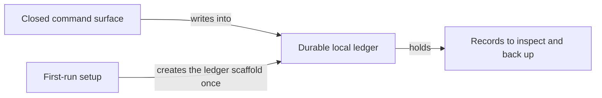
```mermaid
flowchart LR
  C[Closed command surface]
  I[First-run setup]
  L[Durable local ledger]
  R[Records to inspect and back up]
  C -->|writes into| L
  I -->|creates the ledger scaffold once| L
  L -->|holds| R
```

The diagram shows a fixed command surface feeding a durable local ledger. First-run setup creates the ledger scaffold once. The ledger holds the records the owner inspects and backs up.

### How the Surface and Ledger Fit Together

The command surface is a family of named entry points, and several write paths follow the current task automatically when the caller does not supply one. That makes the local ledger behave like a governed workspace, not a free-form note pad. First-run bootstrap creates the standard local ledger structure; it does not repair an already-partial tree. Briefs and handoffs are the native document flow between an assigned harness and a review harness, and the generated brief is meant to carry forward the latest handoff, the current state, and the next action. Usage has a separate path: some usage comes from imported session records, and some comes from direct usage intake. The direct path is a first-class ledger write, not a hidden side channel.

> **Figure:** Context moves through recorded briefs, handoffs, and session transitions, while usage follows a separate intake path instead of being reconstructed from memory.

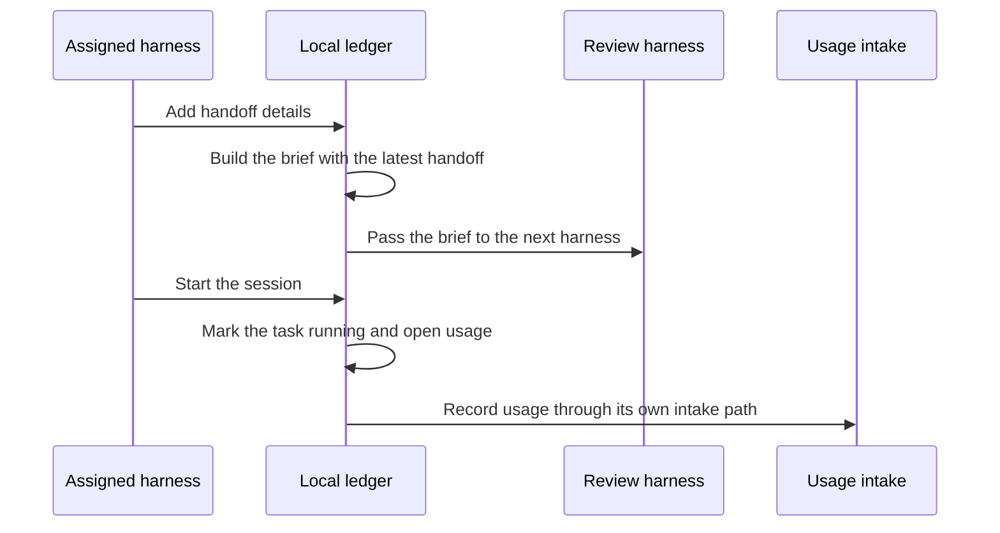
```mermaid
sequenceDiagram
  participant A as Assigned harness
  participant L as Local ledger
  participant R as Review harness
  participant U as Usage intake
  A->>L: Add handoff details
  L->>L: Build the brief with the latest handoff
  L->>R: Pass the brief to the next harness
  A->>L: Start the session
  L->>L: Mark the task running and open usage
  L->>U: Record usage through its own intake path
```

An assigned harness writes handoff details into the local ledger, the ledger builds the brief and passes it to the review harness, and the session marks the task running while opening usage. Usage is recorded through its own intake path.

### What the Reviewed Evidence Supports

A task is the parent record; a claim is a tracked assertion attached to that task; a fresh claim starts unverified, with no verifier and no evidence links. Evidence can be attached to a claim, but verification is not the same thing as simply adding a record. The record families around the core lifecycle are distinct enough to matter: sessions frame activity, usage records account for it, and briefs and handoffs carry context forward. The command surface and the README use the same lifecycle vocabulary, which reduces the chance that the manual invents terms the product itself does not use.

> **Figure:** The claim-based verifier gate is narrower than a blanket evidence rule, so a status write without a claim can still change the task path without passing the same check.

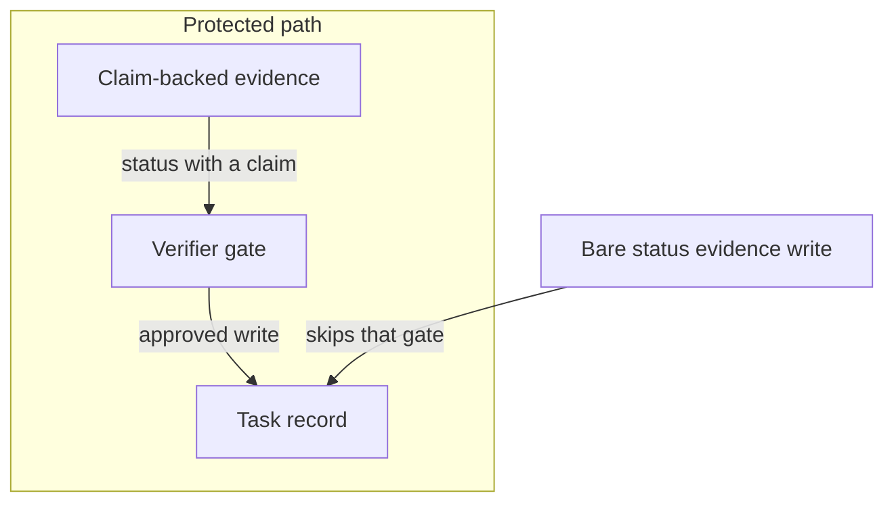
```mermaid
flowchart TD
  subgraph Protected path
    C[Claim-backed evidence]
    G[Verifier gate]
    T[Task record]
    C -->|status with a claim| G
    G -->|approved write| T
  end
  B[Bare status evidence write]
  B -->|skips that gate| T
```

Claim-backed evidence goes through the verifier gate before it changes the task record. A bare status evidence write goes straight to the task record without that same gate, so verification is not universal across every evidence write.

### What Is Strong Here

The strongest part of this product is the clarity of its surface. The ledger is local and durable, so inspection, backup, and review can happen on the same machine that created the records. Bootstrap is predictable. The command surface is fixed rather than discovered at runtime. The brief and handoff flow gives the next harness something structured instead of forcing it to reconstruct context from memory. Executor stamping on operational writes gives the operator a provenance trail for most ongoing record changes.

> **Figure:** Imported usage is built for reconciliation and can fill an open placeholder instead of creating a fresh row, while direct intake writes straight to the ledger and keeps provenance simpler but less source-linked.

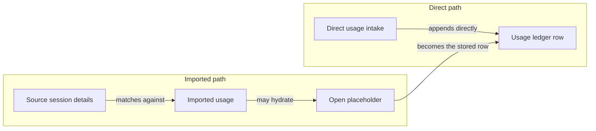
```mermaid
flowchart LR
  subgraph Imported path
    M[Source session details]
    I[Imported usage]
    H[Open placeholder]
    M -->|matches against| I -->|may hydrate| H
  end
  subgraph Direct path
    D[Direct usage intake]
    R[Usage ledger row]
    D -->|appends directly| R
  end
  H -->|becomes the stored row| R
```

One path imports usage from source session details, where it can fill an open placeholder and rewrite that row in place. The other path adds usage directly to the ledger as a first-class write. The owner gets smoother reconciliation on the import path and a cleaner source trail on the direct path.

### Evidence Boundary

> **Evidence boundary** — Reviewed:
- The reviewed evidence covers a fixed command family, a local durable ledger, and the native record categories that the owner is expected to inspect.
- It also covers first-run bootstrap, task-bound writes, claim creation, evidence and verification behavior, briefs and handoffs, usage intake and import, and the diagnostic checks that surface drift.
- The reviewed material is enough to describe the documented operating surfaces, but not enough to pretend there is a live runtime example in this chapter.

Not reviewed:
- No live local ledger snapshot was mounted for this stage.
- No runtime session log corpus from the host environment was mounted for this stage.
- Owner interview answers and product-intent framing were not supplied for this run.

Compare the current executable and documentation with a live local ledger snapshot and a real session log from the same environment. Then confirm that the command surface, bootstrap behavior, task binding, brief and handoff flow, usage intake, and diagnostic checks still match the record categories described here.

> Reviewed: blue-az/operator-control-plane repository snapshot, Founder/owner context

> Not reviewed: External runtime and integrations, Unreviewed runtime and owner context


---

## Trust, Identity, and Verification

_Trust in this product is not a feeling; it is the result of separated roles, evidence-backed claims, and identity checks. A task becomes dependable only when the assigned harness has produced a claim, the evidence is attached, a separate verifier has confirmed it under the right identity rules, and doctor no longer sees integrity drift._

### One-Minute Snapshot

Trust in this product is not a feeling; it is the result of separated roles, evidence-backed claims, and identity checks. A task becomes dependable only when the assigned harness has produced a claim, the evidence is attached, a separate verifier has confirmed it under the right identity rules, and doctor no longer sees integrity drift. The risky part is that several of these guarantees change with mode or command path, so the operator has to watch the boundaries, not just the status label.

### What You Should Be Able To Explain

- Tell whether work is merely recorded or actually trusted.
- See the difference between assigned harness, review harness, and verifier.
- Understand which command paths enforce identity and which only warn.
- Spot when missing evidence, self-verification, or quarantine drift weakens the ledger.
- Decide where the product needs a stricter rule instead of another reminder.

### Mental Model

Trust is a governance layer on top of the ledger, not a synonym for activity. The assigned harness does the work, the review harness checks it, and the verifier is the identity attached when trust is written. A claim starts unverified, so present, supported, and trusted are different states. Doctor is the integrity audit that looks for self-verification, reviewer mismatch, missing verifier metadata, and session or usage drift before the ledger quietly drifts. Some of this trust framing comes from the command behavior itself, and some from the surrounding policy language that explains how those commands are meant to be interpreted.

> **Figure:** Recording the work and trusting the work are different steps: the assigned harness can create the claim, but trust only exists after a separate review harness writes a verifier identity.

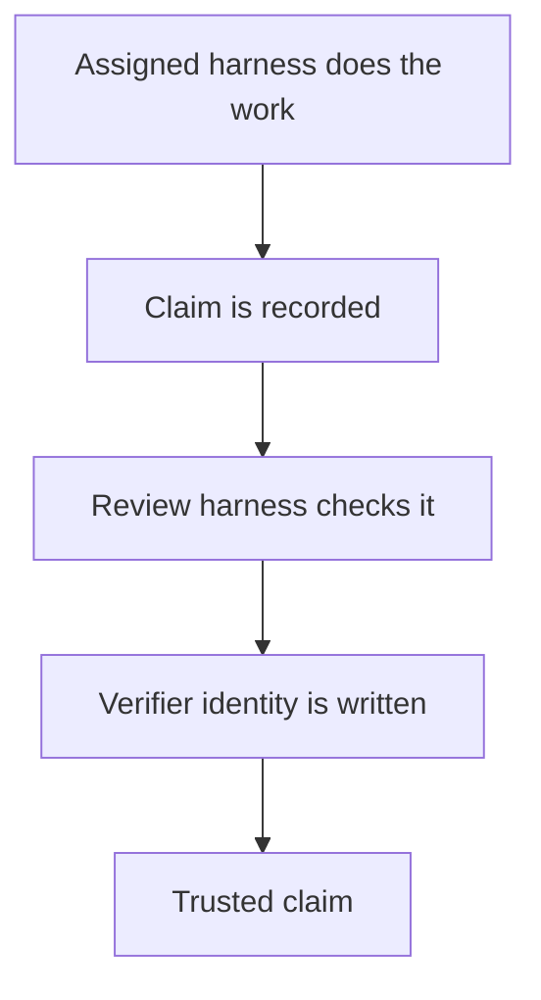
```mermaid
flowchart TD
A[Assigned harness does the work] --> B[Claim is recorded]
B --> C[Review harness checks it]
C --> D[Verifier identity is written]
D --> E[Trusted claim]
```

The assigned harness does the work first, then a claim is recorded. A separate review harness checks that claim, and only after that is a verifier identity written. The consequence for the owner is that trust depends on a second role, not just on work being present in the ledger.

### How It Works

The trust path is narrow on purpose. A new claim is unverified and carries no verifier or evidence refs. When evidence is attached to a claim and a status is being set, the command requires a verifier identity; in enforced mode it rejects unknown identities and mismatches before the ledger accepts trusted verification. If identity is configured more loosely, the command can still accept the write and doctor will warn rather than treat the mismatch as fully enforced. The generated brief is meant to hand the task to the next harness with the latest handoff and next action, while telling the builder to attach evidence and leave verification to the review harness. Sessions and handoffs support continuity, but they are not the same thing as trust; they help the next harness continue work without pretending the work has already been proven.

> **Figure:** The same write can carry different trust strength: claim-backed status updates hit a hard gate in enforced mode, but single-user mode only warns, and bare evidence updates can bypass verifier checks altogether.

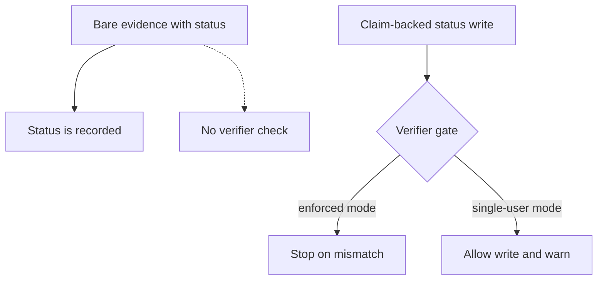
```mermaid
flowchart TD
A[Bare evidence with status] --> B[Status is recorded]
A -.-> C[No verifier check]
D[Claim-backed status write] --> E{Verifier gate}
E -->|enforced mode| F[Stop on mismatch]
E -->|single-user mode| G[Allow write and warn]
```

Bare evidence with status moves straight to a recorded status and is shown outside the verifier gate. Claim-backed status writes pass through a verifier gate, where enforced mode stops mismatches and single-user mode allows the write but records a warning. The consequence is that not every status update carries the same trust guarantee.

### Verified Facts

The CLI surface is fixed rather than dynamically discovered. Task-bound writes fall back to the current task if no task id is provided and fail closed when there is no active task. Init creates the standard ledger layout on first run and does not repair an existing partial tree. Most operational writes stamp executor identity, but init is exempt. Claim-backed evidence updates require a verifier identity and can change task status to verified or quarantined. Quarantine can overwrite terminal task status. Usage import can match a source session by more than exact equality, can hydrate an existing placeholder, and rewrites that row in place. Direct usage intake writes a row without a source-session import trail. Doctor separates self-verification errors, reviewer mismatch warnings, and legacy no-verifier informational cases instead of collapsing them into one bucket.

> **Figure:** Verification can move a task forward only before it reaches a terminal state, but quarantine can still land later and pull a finished task back to a quarantined state. Closeout is therefore reversible when integrity evidence arrives late.

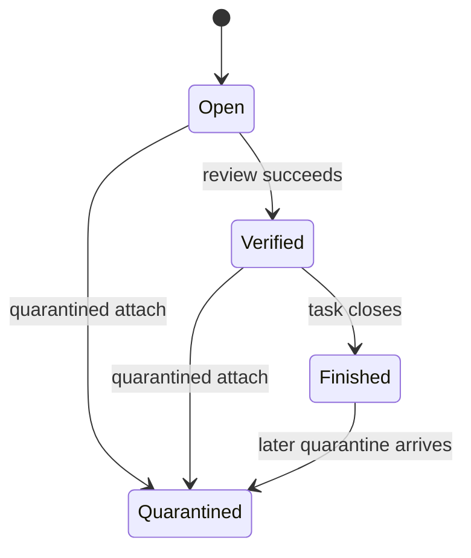
```mermaid
stateDiagram-v2
[*] --> Open
Open --> Verified: review succeeds
Verified --> Finished: task closes
Open --> Quarantined: quarantined attach
Verified --> Quarantined: quarantined attach
Finished --> Quarantined: later quarantine arrives
```

A task starts open, can move to verified after review, and can then close. A quarantined attach can move an open, verified, or finished task into quarantined. The important consequence is that closeout is not final when a later integrity finding arrives.

### Strengths

The design already gives the owner several guardrails that make trust legible. Role separation is explicit. Unverified claims stay untrusted until evidence and verification are added. Doctor does not collapse every irregularity into one failure bucket; it separates self-verification, reviewer mismatch, legacy gaps, and in-flight drift. Handoffs and briefs keep cross-harness continuity structured, and usage imports are idempotent on their provenance key instead of blindly duplicating records. Those are real strengths because they let the owner inspect trust as a set of narrow checks instead of one vague sense of progress.

### Evidence Boundary

> **Evidence boundary** — Reviewed:
- The executable CLI surface, including the trust-related command paths for claims, evidence, doctor checks, sessions, handoffs, and usage import.
- The repository README and tests where they describe the same lifecycle vocabulary and the trust rules around verification and identity.
- The policy and spec language that sits beside the executable surface where it affects how trust and verification are interpreted.
- The ledger behaviors that matter to this chapter: unverified claims, identity enforcement, quarantine handling, executor provenance, and usage import rules.

Not reviewed:
- No live .operator snapshot was mounted, so this chapter does not claim observed live-state behavior beyond the reviewed material.
- External session logs used by usage import were not mounted, so import-source availability remains runtime-unverified.
- No owner interview answers were supplied, so the chapter stays inside repository evidence and does not widen the product boundary.

Recheck the command inventory, claim-backed evidence verification, doctor classifications, identity enforcement, and usage import behavior whenever the CLI, policy text, or tests change. Reverify bootstrap behavior if first-run setup changes, and recheck quarantine handling if task closeout rules are edited.

> Reviewed: blue-az/operator-control-plane repository snapshot, Founder/owner context

> Not reviewed: External runtime and integrations, Unreviewed runtime and owner context


---

## Sessions, Usage, and Accountability

_Sessions are the accountability wrapper around governed work. For the operator, usage is a way to explain what happened and when, not the product's center. A session opens usage, writes the brief that hands the task to the next harness, and closes usage when the work stops. Imported usage can pull external session history into the ledger; direct usage entries remain a separate write path._

### One-Minute Snapshot

Sessions are the accountability wrapper around governed work. For the operator, usage is a way to explain what happened and when, not the product's center. A session opens usage, writes the brief that hands the task to the next harness, and closes usage when the work stops. Imported usage can pull external session history into the ledger; direct usage entries remain a separate write path. Read usage as supporting evidence, not as a spend dashboard.

### What You Should Be Able To Explain

- Understand why sessions exist and why they support, rather than replace, the core ledger workflow.
- Separate imported session usage from direct usage entries and know why the product keeps both.
- See where matching rules, closeout behavior, and external logs can change the usage trail.
- Know which usage facts are verified and which still depend on runtime evidence that was not mounted here.

### The role sessions play

Think of a session as the time boundary around the real work record. The work still lives in task, claim, evidence, and verification; the session only gives that work a start, a stop, and a handoff to the next harness. For the operator, that makes usage a supporting record, not the decisive record.

### How sessions and usage move together

Starting a session writes the brief, opens a usage placeholder, and marks the task running. That gives the assigned harness a clean start while leaving verification to the review harness. Ending a session closes usage, can force-close a previously closed record, and normally lets the task fall back to assigned once no open usage remains unless someone supplies an explicit final state.

Imported usage is selected from external session data by more than one path: exact session match, a matching source reference fragment, a time window, overlap with the operator session, or a score-based fallback. Re-importing the same source is idempotent on the source reference, and an existing open placeholder can be filled in place instead of appended again. Direct usage entries are separate writes with caller-supplied details and no imported-session trail.

> **Figure:** Session boundaries are not just timestamps: they open the usage wrapper, close it, and can still reshape the task's ending. The important consequence for the owner is that assigned is a fallback, not a guarantee, and explicit closeout choices can override it.

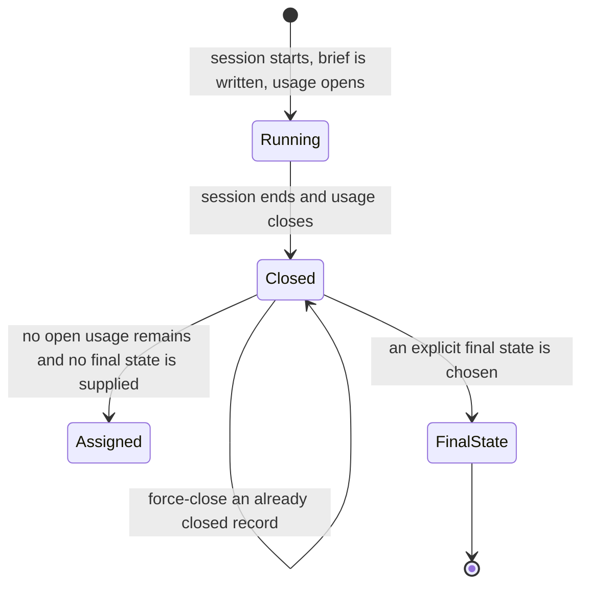
```mermaid
stateDiagram-v2
    [*] --> Running: session starts, brief is written, usage opens
    Running --> Closed: session ends and usage closes
    Closed --> Closed: force-close an already closed record
    Closed --> Assigned: no open usage remains and no final state is supplied
    Closed --> FinalState: an explicit final state is chosen
    FinalState --> [*]
```

A session starts in the running state, where the brief is written and the usage placeholder opens. When the session ends, usage closes. If no open usage remains and nobody supplies a final state, the task falls back to assigned. If an explicit final state is chosen, that state wins instead. The diagram also shows that an already closed record can be force-closed again.

> **Figure:** Import is flexible on purpose, which is useful when source logs are messy, but it also means the importer is choosing among several possible matches. The owner should read the result as a selected-and-merged path, not a single exact lookup.

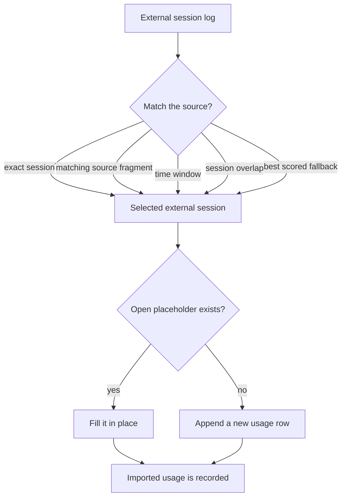
```mermaid
flowchart TD
    A[External session log] --> B{Match the source?}
    B -->|exact session| C[Selected external session]
    B -->|matching source fragment| C
    B -->|time window| C
    B -->|session overlap| C
    B -->|best scored fallback| C
    C --> D{Open placeholder exists?}
    D -->|yes| E[Fill it in place]
    D -->|no| F[Append a new usage row]
    E --> G[Imported usage is recorded]
    F --> G
```

Imported usage begins with an external session log and then chooses a source session by one of several matching paths: exact session, matching source fragment, time window, session overlap, or a best-scored fallback. After a session is selected, the importer checks whether an open placeholder already exists. If it does, the importer fills that row in place; otherwise it appends a new usage row. The consequence is that import can merge into existing accounting instead of always creating a duplicate row.

### What is actually recorded

Most operational writes carry executor identity, which helps retrospective accountability, but the initial bootstrap path is a special case. Usage records also stay split between token-based and activity-based accounting, and the diagnostic check treats missing pricing coverage or automatic activity cost as accounting problems rather than hiding them.

The boundary to keep in mind is that usage records are evidence-adjacent. They help explain what happened and when, but they do not replace claim verification or make imported history complete on their own.

> **Figure:** There are two different trust paths here: imported usage preserves where it came from, while direct usage writes do not. For the owner, the consequence is that a later review can trust imported provenance more easily than a manual row, so the two habits must stay distinct.

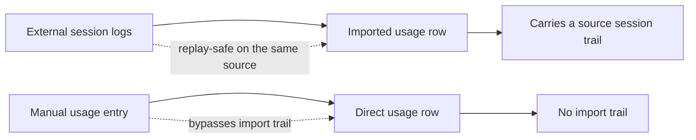
```mermaid
flowchart LR
    ext[External session logs] --> imp[Imported usage row]
    imp --> trail[Carries a source session trail]
    ext -. replay-safe on the same source .-> imp
    manual[Manual usage entry] --> direct[Direct usage row]
    direct --> bare[No import trail]
    manual -. bypasses import trail .-> direct
```

External session logs feed imported usage rows, and those imported rows carry a source session trail. Re-importing the same source is replay-safe on that same source. Manual usage entries follow a separate direct path into the ledger, creating direct usage rows that do not carry the import trail. The key consequence is that imported and direct usage should not be treated as the same kind of evidence.

### What this layer does well

The strongest part of this layer is structure. Briefs and handoffs carry the latest handoff, current state, and next action forward to the next harness instead of leaving the operator to reconstruct context from memory. Imported usage is replay-safe on its source reference, so repeated intake does not automatically duplicate accounting. That combination gives the owner something usable for review and continuity without pretending this is a spend dashboard.

### Evidence Boundary

> **Evidence boundary** — Reviewed:
- Reviewed only repository evidence, with no owner-confirmed product intent supplied for this run.
- Reviewed the documented session start and end flow, including how usage opens, closes, and can shape task state at closeout.
- Reviewed the handoff and brief behavior that carries the next harness forward.
- Reviewed the imported-versus-direct usage split, the separate accounting classes, and the diagnostic checks that surface identity and accounting drift.

Not reviewed:
- No live runtime ledger snapshot was mounted, so active on-disk session state could not be observed here.
- The external session logs that imported usage depends on were not mounted, so source availability and log-convention edge cases remain unverified.

Compare the documented flow against a live ledger and representative source logs. Confirm that session start still opens usage and writes the brief, that imported usage still follows the same selection and merge behavior, that direct usage entries still stay separate, and that session closeout still falls back to assigned when open usage ends.

> Reviewed: blue-az/operator-control-plane repository snapshot, Founder/owner context

> Not reviewed: External runtime and integrations, Unreviewed runtime and owner context


---

## Running a Multi-Harness Workflow

_This chapter is about continuity. The product does not just record isolated tasks; it keeps a local operating rhythm where an operator, an assigned harness, and a review harness move work forward through briefs, handoffs, session closeout, and usage records._

### One-Minute Snapshot

This chapter is about continuity. The product does not just record isolated tasks; it keeps a local operating rhythm where an operator, an assigned harness, and a review harness move work forward through briefs, handoffs, session closeout, and usage records. The practical question for the owner is whether each handoff still points to the same task, the same next action, and the same trust boundary, or whether the workflow has drifted into overlapping sessions, mismatched status, or unclear accountability.

### What You Should Be Able To Explain

- Understand how briefs and handoffs carry work from one harness session to the next.
- See which actions stay bound to the current task and which ones can change task state across closeout.
- Recognize when continuity is healthy and when the ledger is drifting away from the work actually being done.
- Know where the local ledger workflow ends and where any broader external system would still need separate confirmation.

### Mental Model

Think of this product as a governed local workflow, not a loose pile of notes. The operator keeps continuity, the assigned harness does the work, and the review harness checks it before trust changes. The important pattern is not just task to claim to evidence to verification, but the wrapper around that pattern: a brief starts the next session, a handoff records what changed, and the session records keep the work aligned with the current task.

Because owner-confirmed operating context is not supplied, this chapter treats the workflow as a local multi-harness rhythm rather than a proven end-to-end external system. That means the owner should read every continuity rule as a local ledger rule first, and only extend it outward if later evidence proves a larger orchestration boundary.

> **Figure:** The handoff does not live as a loose note stream. It becomes a brief that carries the task, the latest handoff, and the next action into the next session, so continuity stays attached to the active task instead of drifting.

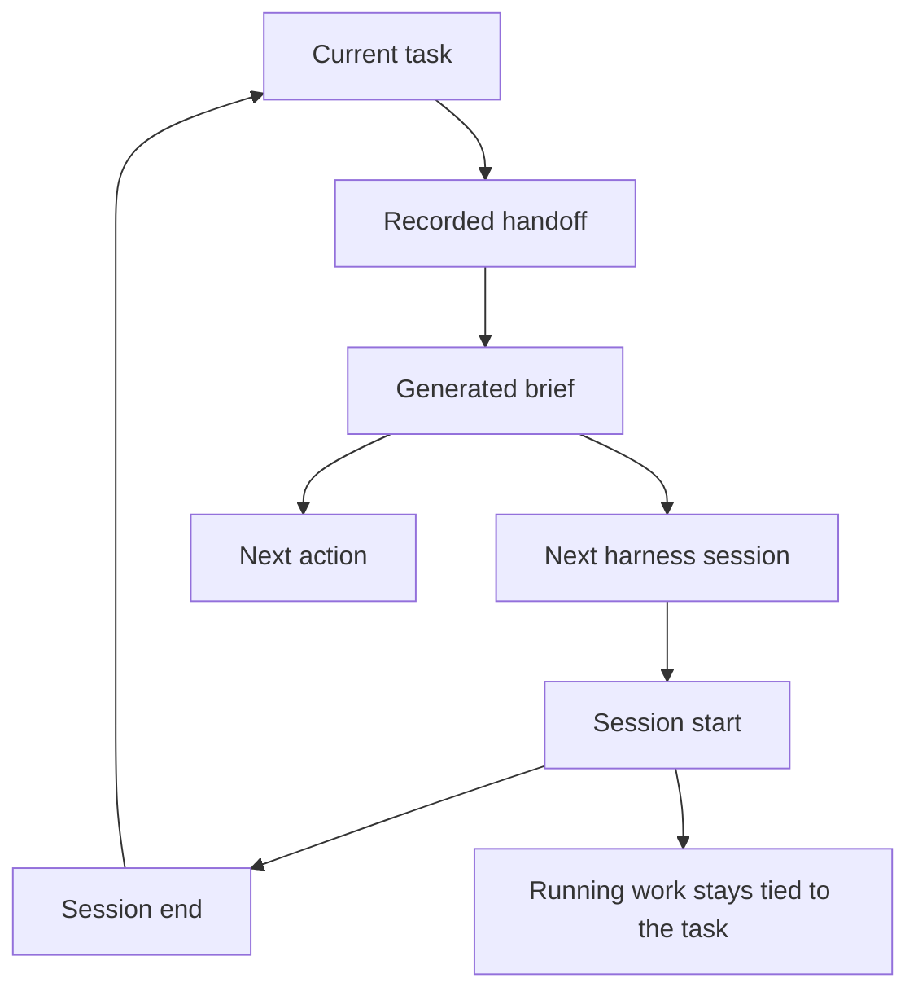
```mermaid
flowchart TD
  A[Current task] --> B[Recorded handoff]
  B --> C[Generated brief]
  C --> D[Next harness session]
  D --> E[Session start]
  E --> F[Session end]
  F --> A
  C --> G[Next action]
  E --> H[Running work stays tied to the task]
```

The diagram shows a current task feeding a recorded handoff, which is packaged into a generated brief for the next harness session. Session start and session end keep the work moving while preserving the tie back to the same task. The consequence is that continuity stays in the ledger as a structured transfer, not an informal handoff.

### How It Works

The handoff path is deliberate. A handoff can come in through structured input, and it is stored against the task rather than floating as an informal note. The generated brief then packages the latest handoff, the current task state, and the next action so the next harness does not have to reconstruct context from scratch. It also tells builders to attach evidence and leave verification to the review harness, which keeps work and trust in separate lanes.

Session start and session end are part of the same rhythm. Starting a session writes the export brief, opens usage, and marks the task running. Ending a session closes usage and usually returns the task to assigned when no open usage remains, unless an explicit status is supplied. That matters because task state and usage closeout are related but not identical, so the owner should read them as linked records, not one merged state.

Usage import sits beside that flow as a secondary accounting path. It can match by more than one selector, and it can update an existing open placeholder instead of always appending a fresh row. Direct usage intake is also separate: it writes a usage record from caller-provided input without using the same import trail. That means accountability is real, but it is not all funneled through a single path.

> **Figure:** Imported usage is forgiving and can land on an existing open placeholder, which makes it good for recovery but risky for mistaken attachment. Direct intake skips the source-session trail and writes a fresh ledger row, so it is simpler but less connective.

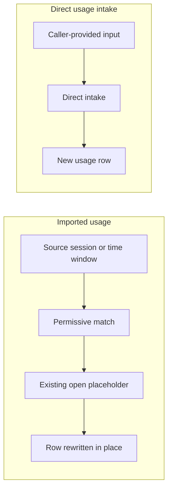
```mermaid
flowchart LR
  subgraph I[Imported usage]
    A[Source session or time window] --> B[Permissive match]
    B --> C[Existing open placeholder]
    C --> D[Row rewritten in place]
  end
  subgraph J[Direct usage intake]
    E[Caller-provided input] --> F[Direct intake]
    F --> G[New usage row]
  end
```

The left side shows imported usage: the importer looks for a source session or time window, makes a permissive match, and can rewrite an existing open placeholder in place. The right side shows direct usage intake: caller-provided input goes straight into a new usage row. The consequence is that import is more flexible and can merge into existing accounting, while direct intake is a standalone write without the same source-session trail.

### Verified Facts

The workflow surface is fixed rather than open-ended: the command set is enumerated, and the same vocabulary appears in the manual and the executable surface.

Several task-bound writes depend on the current task when no explicit task is supplied. That makes the active task record part of the operating state, not just a convenience.

A new claim starts unverified, with no verifier and no evidence attached. Claim creation records that an assertion exists; it does not make the assertion trusted.

Verification checks are not blanket checks on every evidence write. The trusted-status branch is gated by the presence of a claim and a status update, and identity enforcement can be strict or warning-only depending on configuration.

Doctor is a diagnostic check, not a generic failure for every inconsistency. It separates self-verification, reviewer mismatch, legacy verifier gaps, and lifecycle drift so the owner can see what is broken versus what is merely incomplete.

> **Figure:** Verification is a gated path, not a blanket promise over every evidence write. Even after a task appears finished, quarantine still has the power to pull it back and change the owner’s reading of completion.

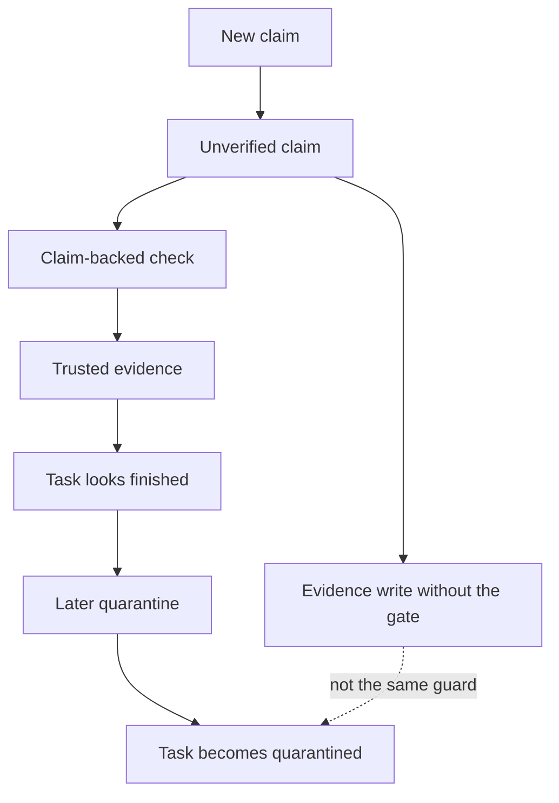
```mermaid
flowchart TD
  A[New claim] --> B[Unverified claim]
  B --> C[Claim-backed check]
  C --> D[Trusted evidence]
  B --> E[Evidence write without the gate]
  D --> F[Task looks finished]
  F --> G[Later quarantine]
  G --> H[Task becomes quarantined]
  E -. not the same guard .-> H
```

The diagram starts with a new claim that is still unverified. Only the claim-backed check leads into trusted evidence. A separate evidence write path is shown outside that gate. After a task looks finished, a later quarantine can still move it to quarantined. The consequence is that closeout is not one-way, and finish-like status can be reversed.

### Strengths

The strongest part of this design is that continuity is explicit. Briefs and handoffs are structured records, not casual conversation, so the next harness can inherit work with a real task state and a real next action.

The second strength is separation. Work creation, review, session closeout, and usage accounting do not collapse into one vague status. That separation makes it easier for the owner to see whether the system is progressing, merely logging, or actually crossing a trust boundary.

A third strength is auditability. Re-importing usage does not have to create duplicates, and executor provenance is stamped on operational writes. That gives the owner a better chance of spotting drift instead of guessing which session produced which record.

### Evidence Boundary

> **Evidence boundary** — Reviewed:
- The command surface and bootstrap behavior of the local CLI, including how the ledger is initialized and what happens on repeat initialization.
- The way work binds to the current task when no task is passed, and how that affects task creation, evidence, usage, handoff, and session actions.
- The claim, evidence, and verification flow, including the difference between unverified claims, claim-backed verification, and diagnostic checks.
- The brief and handoff flow, including how the next harness receives the latest handoff, current task state, and next action.
- Session start and session end behavior, including usage placeholders, running state, and closeout fallback.
- Usage import and direct usage intake, including idempotent re-import behavior, placeholder hydration, and separate manual usage records.
- Identity and provenance stamping on operational writes, plus diagnostic checks that reveal drift.

Not reviewed:
- A live runtime ledger snapshot under .operator, so the chapter does not claim to have observed active on-disk state directly.
- External session logs that usage import searches, so the chapter does not claim runtime availability or completeness of those sources.
- The owner’s preferred operating scenario and the broader system boundary, so the chapter does not pretend to know whether this repository is the whole product or one governed part of it.

Recheck the command inventory, bootstrap path, task-bound writes, brief and handoff generation, session closeout, usage import, and doctor diagnostics against a fresh workspace with a live ledger and real session logs. If the owner clarifies the broader system, revisit the boundary sentence first before expanding any claims beyond the local workflow.

> Reviewed: blue-az/operator-control-plane repository snapshot, Founder/owner context

> Not reviewed: External runtime and integrations, Unreviewed runtime and owner context

## Command Reference

The `operator` CLI exposes 20 subcommands across the task → claim → evidence → verification →
session → usage lifecycle. Run `./operator <command> --help` for full flags.

**Setup** — `init` create the `.operator/` ledger in the current repo.

**Tasks**
- `task-create --objective "…" [--id ID] [--repo R] [--assign A] [--review R]` — open a task.
- `task-show [ID]` — show a task's claims, evidence, and status.
- `task-list` — list all tasks with outcome summaries.

**Claims** (a claim is a typed, checkable assertion bound to a gate)
- `claim-add --type TYPE --text "…" [--task ID] [--gate GATE] [--by WHO]` — register a claim.
  Types: `file_exists, test_passes, numeric_measurement, real_data, model_output,
  firmware_behavior, deployment_state, supervision_credit, paper_or_report_claim`.
- `claim-show [ID]` / `claim-list [--task ID]` — inspect claims.

**Evidence & verification** (the core: a claim is only as good as its evidence + a different-identity sign-off)
- `evidence-attach PATH_OR_URL --claim CID --type TYPE [--status {verified,false,quarantined}] [--verified-by WHO] [--verify-cmd CMD]`
  — attach an artifact and optionally verify the claim. Evidence types: `run_log, manifest,
  database_query, test_output, git_commit, screenshot, transcript, paper_section, external_doc`.
- `verify RUN_DIR` — automated audit of a run directory's artifacts.
- `doctor [--audit]` — read-only consistency check across the ledger: flags unverified claims,
  **self-verification**, and **enforcement downgrades** (a claim that would be rejected under
  enforced identity mode but is silently accepted under `single_user`).

**Sessions** (track a coding session and its cost)
- `session-start --harness H [--task ID] [--force]`
- `session-end --outcome {useful,partial,no_go,quarantined,reverted,unknown} --cost N`
- `session-list [--open] [--task ID] [--harness H]`

**Usage / quota accounting**
- `usage-add --harness H [--model M] [--outcome …]` — capture a pasted usage snippet.
- `usage-import --harness {claude,codex,gemini-agy} [--since …] [--dry-run]` — auto-ingest
  token/usage from harness session logs.
- `usage-summary [--by-task] [--by-harness] [--by-model] [--metering]` / `usage-annotate [--cost …] [--note …]`.

**Briefs & handoff**
- `brief --for H [--task ID]` / `export-brief --for H [--task ID]` — generate a harness-specific
  brief (copy-paste for the next agent).
- `handoff-add [--task ID] [--changed …] [--verified …] [--claimed …] [--open …]` — record a closeout.

## Configuration

Operator is driven by files under `.operator/` (created by `init`); behavior is governed by a small
set of product-facing config:

- **`.operator/identity.yaml`** — the identity-enforcement policy:
  ```yaml
  mode: enforced          # or: single_user (advisory)
  uids:
    1001: reviewer
    1002: builder
  ```
  In `enforced` mode, writes bind to the executing OS uid and a claim verified by the wrong
  identity is **rejected** (impersonation guard). In `single_user` mode the binding is advisory —
  and `doctor` warns when a claim *would* be rejected under enforced mode (an enforcement downgrade).
- **`.operator/{tasks,claims,evidence,sessions}/`** — append-only YAML records (the ledger; gitignored).

This config is what makes the guarantees real: the gate, the identities, and the fail-closed
verification all read from it.

## Appendix — Attention Items & Owner Decisions

_The deduplicated set of caveats and open decisions Reflect surfaced (52 in-chapter cards collapsed to the distinct items below)._

### Operating caveats — things to know
- **A status needs a claim.** `evidence-attach --status` fails closed without `--claim` (now enforced).
- **`init` creates, it doesn't repair.** Re-running it won't fix a broken `.operator/`; back up and re-init.
- **Quarantine can reopen a finished task.** A late quarantine overrides verified/complete — intended (late findings should reopen); closeout isn't one-way.
- **Identity mode sets the guarantee.** `enforced` = fail-closed on mismatch; `single_user` = warn only (`doctor` flags the relaxation).
- **A claim isn't trusted at creation** — it's an assertion until evidence + verification land.
- **Evidence copy is best-effort** — the ledger can record a verification even if the file copy failed; don't assume the artifact is on disk.
- **Usage import is fuzzy** — it matches beyond an exact session ID and can merge into an open row; use exact IDs for strict provenance.
- **Direct usage intake lacks the import provenance trail** — first-class, but distinct from imported usage.
- **Task-bound writes use the current-task fallback** — they depend on ledger state; pass an explicit task for high-stakes writes.
- **Session closeout can fall back to `assigned`** — set an explicit final state if you want a deterministic lifecycle.

### Open owner decisions
- Should `init` also repair an existing ledger, or stay create-only? _(currently create-only)_
- Should quarantine override a verified/complete task? _(currently yes — late findings reopen)_
- Should usage import be exact-match / append-only, or stay permissive? _(currently permissive)_
- Should `single_user` fail closed when an identity map is configured? _(currently warn-only)_
- Should the generated brief remain the canonical handoff? _(currently yes)_
