# Owner's Manual for blue-az/operator-control-plane

_6 generated chapters from the reviewed repository snapshot_

> Source: blue-az/operator-control-plane:master@c5cd06fca49d13e59ffb989d928d7c8fe923819f

---
## What the Operator Control Plane Is For

_The Operator Control Plane is the owner's local supervision layer for auditable multi-agent software work. It matters because it keeps work, proof, and review in one file-backed ledger instead of letting them scatter across chat, ad hoc notes, or a generic project board._

### One-Minute Snapshot

The Operator Control Plane is the owner's local supervision layer for auditable multi-agent software work. It matters because it keeps work, proof, and review in one file-backed ledger instead of letting them scatter across chat, ad hoc notes, or a generic project board.

The operator steers the ledger through the CLI, the assigned harness does the work, the review harness checks it, and the record trail uses task, claim, evidence, handoff, session, brief, doctor, and verify as the product's core nouns. The next chapters explain how those records move, how trust is checked, how harnesses coordinate, and where the product stops.

> **Figure:** The owner should read the product as a local supervision layer that keeps the record trail in one place while outside harnesses only feed it output. That makes the system file-backed and inspectable instead of hosted and scattered across separate tools.

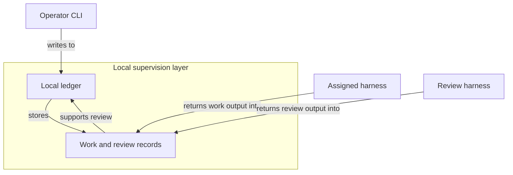

The diagram shows an operator CLI feeding a local ledger inside the product boundary. The local ledger stores work and review records. An assigned harness and a review harness stay outside the boundary and contribute their output through those recorded records. The consequence is that the supervision trail remains local and inspectable rather than living in a hosted workflow system.

### What You Should Be Able To Explain

- Understand why the Operator Control Plane matters to the owner and what problem it is solving.
- Recognize the core nouns and roles: operator, task, claim, evidence, handoff, session, assigned harness, review harness, and doctor.
- See the primary surfaces: the operator CLI, the local .operator ledger, and the external harnesses that participate through it.
- Know what not to assume: this is local and file-backed, not a hosted control plane or generic project-management system.

### The product in one sentence

The Operator Control Plane is the product's supervisory layer for auditable multi-agent software work. Its job is to keep the important facts in one local ledger: what the work is, what claim was made, what evidence backs it, who handed it off, and when a session was open. That makes it a governance tool first and a task tracker only in a limited sense. The next chapter explains how those records move.

> **Figure:** Work and proof stay in one auditable chain, so the owner can trace a final review result back to the task that started it. The important consequence is that the product does not treat evidence as a separate afterthought; it is part of the same record trail that determines the outcome.

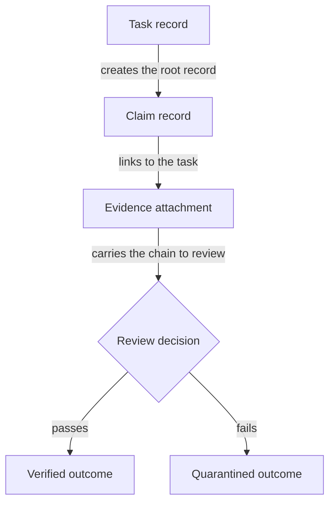

The diagram starts with a task record, then shows a claim record linked to that task, then an evidence attachment that carries the chain into a review decision. From that decision, the chain ends in either a verified outcome or a quarantined outcome. The consequence is that work, proof, and result remain one auditable sequence.

### What the local control plane contains

Think of the local .operator ledger as the working memory of the product. The operator CLI writes into it, and the same vocabulary appears in the command surface so the owner can read the product the same way the system speaks: task, claim, evidence, usage, handoff, session, brief, verify, and doctor. Some actions bind to the current task through local settings, while harness-linked actions depend on a registered harness entry and fail closed when that entry is missing.

External harnesses matter only because the ledger records their output and review, not because the product exposes a hosted control plane. That distinction is deliberate: the control plane is local, file-backed, and specific to this bounded product view.

> **Figure:** A handoff by itself preserves the next step, but it does not mean the task has started. The state only falls back to assigned after the last open session closes, so closure is conditional rather than automatic.

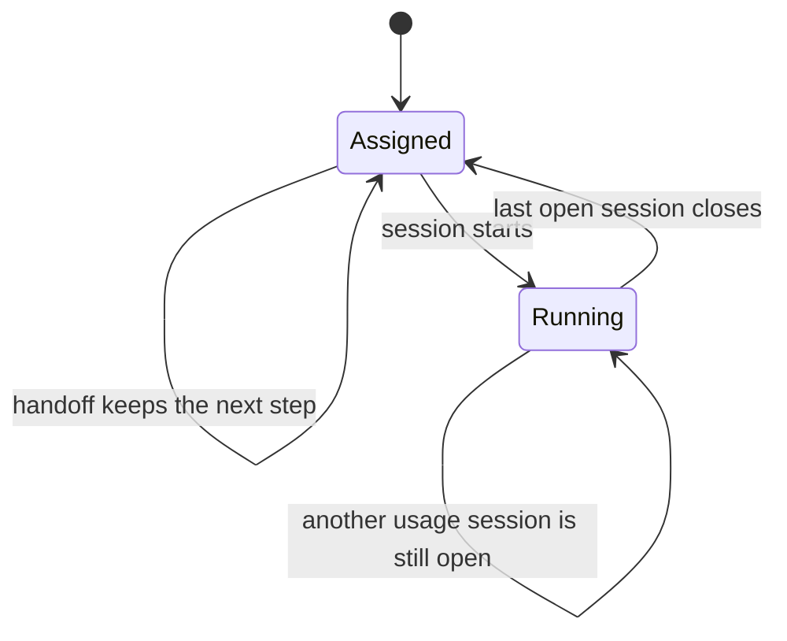

The lifecycle begins in assigned. A handoff leaves the task in assigned while keeping the next step. When a session starts, the task moves to running. When the last open session closes, the task can return to assigned. If another usage session is still open, the task stays running. The consequence is that session closure only returns the task to assigned when the task is still running and no other usage session remains open.

### What is actually established

Three facts are solid from the evidence. Verification is not a free-floating approval label: in enforced mode it is tied to a configured identity map, and doctor can flag self-verification, reviewer mismatch, legacy claims, or test-hook drift.

Usage import also has real boundaries: provider-specific parsing keeps accounting separate across sources, and imported records keep a local provenance pointer even if the original source log later disappears. The result is a product that can explain what it knows, but not pretend that every imported or verified record is equally strong.

> **Figure:** Verification is only strong when the claimed verifier passes through the configured identity map in enforced mode. Doctor does not erase that boundary; it keeps highlighting places where the owner should treat the result as weaker or only informational.

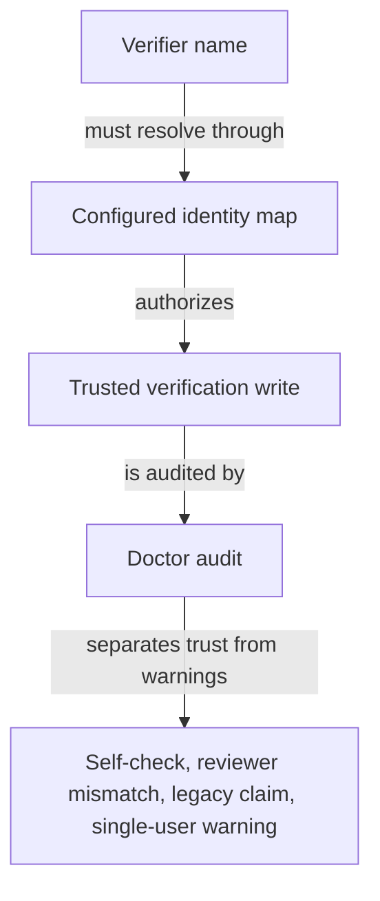

The diagram shows a verifier name passing through a configured identity map before the system treats the verification write as trusted. Doctor then audits the write and separates real trust from warnings such as self-checks, reviewer mismatches, legacy claims with no verifier, and single-user limitations. The consequence is that not every verified claim deserves the same level of confidence.

### Why this shape is useful

This shape gives the owner three practical advantages. It keeps the audit trail local and inspectable, it separates work from review instead of collapsing them into one status change, and it preserves the manual-versus-auto baseline when usage is edited. It also helps prevent a single merged usage number from hiding which harness produced which kind of record. For an owner, that means the product is better at supervision and review than at looking broad or polished.

### Attention Cards

#### ⚠ Verification is only as strong as the identity boundary  _(attention · critical)_

**What happens:** Verification writes are tied to a configured identity map in enforced mode, while doctor flags self-verification, reviewer mismatch, and guarded override drift.

**Why it matters:** If the owner reads verification as a blanket truth stamp, accepted work can look more trustworthy than it really is.

**What to do:** Review this boundary and decide whether the current behavior is intentional.

**Revisit when:** When control plane foundation behavior or related owner decisions change.

#### ⚠ Imported usage is useful but not complete proof  _(attention · high)_

**What happens:** Usage import keeps a local provenance path, but if the source log later disappears, doctor only warns.

**Why it matters:** The owner should treat imported activity as audit support, not as a stronger record than the source actually provides.

**What to do:** Review this boundary and decide whether the current behavior is intentional.

**Revisit when:** When control plane foundation behavior or related owner decisions change.

#### ⚠ Do not let the scope inflate  _(attention · medium)_

**What happens:** The product is framed as a local, file-backed ledger under .operator/, not as a hosted service or shared platform.

**Why it matters:** Scope drift changes what the owner should expect from access, durability, and operational responsibility.

**What to do:** Review this boundary and decide whether the current behavior is intentional.

**Revisit when:** When control plane foundation behavior or related owner decisions change.

### Owner Decisions

#### ⚖ Should the manual keep the product framed as a local governance ledger, not a generic workflow platform?  _(owner decision · open)_

**Why it matters:** This choice determines whether later chapters speak in product terms or drift into broad process language.

**Revisit when:** Before changing the related control plane foundation behavior.

### Evidence Boundary

> **Evidence boundary** — Reviewed:
- The product framing in the README and the CLI surface were reviewed to confirm the local-ledger vocabulary and the primary nouns.
- The task, claim, evidence, handoff, session, brief, verify, and doctor paths were reviewed only enough to confirm that they belong to the same local control plane.
- The verification and usage-import guardrails were reviewed to confirm the trust boundary, identity checks, and provenance behavior.

Not reviewed:
- The later lifecycle chapter, verification governance chapter, harness coordination chapter, usage import chapter, and operating boundaries chapter were not re-read in full for this orientation chapter.
- Broader product intent, hosted deployment assumptions, and the larger surrounding system were not established by the evidence used here.
- Owner priorities were not supplied, so this chapter cannot decide whether the main emphasis should be auditability, coordination, or usage visibility.

Recheck the README, the CLI surface, the verification guardrail path, and the usage import path if the product scope expands, the command set changes, or the manual starts claiming hosted behavior or broader system ownership. If you later receive owner intent, revisit this chapter's scope wording first, then update the handoffs to the later chapters.

> Reviewed: blue-az/operator-control-plane repository snapshot, Founder/owner context

> Not reviewed: External runtime and integrations, Unreviewed runtime and owner context

---

## How Work Moves Through the Ledger

_This chapter explains the part of the product that turns supervised work into a record. A task is the unit of work, a claim is the asserted outcome, evidence is the proof attached to that claim, a handoff keeps the next step visible, and a session marks when work is active and when it closes. Read the ledger as a linked trail of records, not as one simple status field._

### One-Minute Snapshot

This chapter explains the part of the product that turns supervised work into a record. A task is the unit of work, a claim is the asserted outcome, evidence is the proof attached to that claim, a handoff keeps the next step visible, and a session marks when work is active and when it closes. Read the ledger as a linked trail of records, not as one simple status field. The main owner risk is that some transitions are conditional, especially session closure and the return to assigned, so a quick read can hide whether work is still live.

### What You Should Be Able To Explain

- You can tell what each ledger record means in plain terms: task, claim, evidence, handoff, and session.
- You can follow how work becomes proof without collapsing the whole flow into one status value.
- You can see where the ledger preserves the next step and where it marks work as still active.
- You can spot the conditional points that matter for reassignment, closure, and later review.
- You can separate this workflow chapter from the later chapters that deal with trust, harness coordination, and imported usage.

### Mental Model

This chapter owns the path from supervised work to later audit trail. The operator starts with a task, attaches claims to that task, and then attaches evidence to the claim. A handoff keeps the next step visible across time. A session marks the active stretch of work so the ledger can say when work is open and when it has closed. The safest way to read the product is as a chain of linked records, not as a single status field that tells the whole story.

> **Figure:** The owner should read the ledger as a chain of linked records, not as one status field. That matters because disputes and later review depend on the full trail: the task, the claim, the attached proof, the preserved next step, and the active work marker all carry different parts of the story.

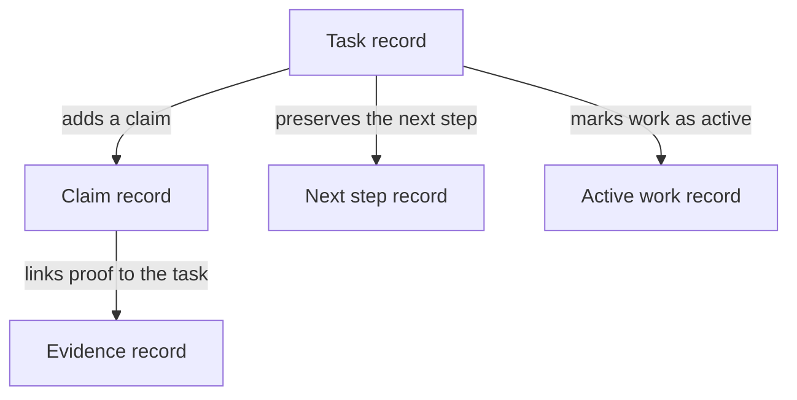

A task record sits at the center of the ledger. From that task, a claim record is added. The claim points to an evidence record that carries the proof. The task also keeps a next step record for handoff and an active work record for the session that marks when work is running. The consequence is that the owner has to read several linked records together to understand what actually happened.

### How It Works

Work begins as a task record and becomes more specific as the operator adds claims, evidence, and handoffs. Evidence attachment is not just a note; it can also change the claim and the task outcome. Handoffs preserve the next step on the task so the work does not lose its direction when time passes or the work moves between harnesses. Sessions show when work is active. Closing a session is not a blind flip back to idle: if the task is still running and no open sessions remain, the ledger can return it to assigned unless the close request asks for a different outcome. That conditional return is the point where a quick reading can go wrong.

> **Figure:** Session closure is conditional, so the owner should not read every finished session as an automatic return to assigned. The important consequence is that reassignment only happens when the task is still running and nothing is left open, while an explicit outcome or a guarded second close keeps the task from falling back.

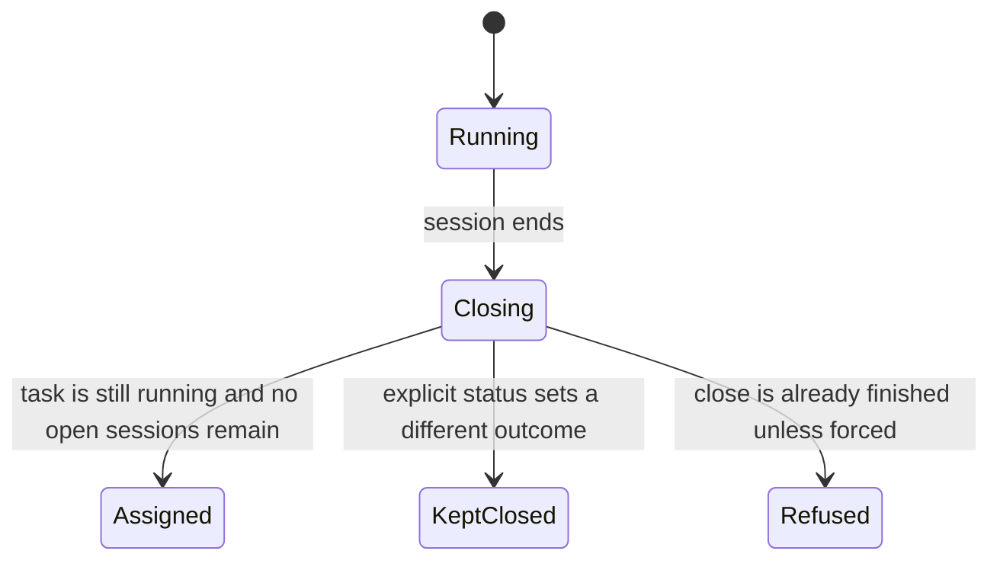

The lifecycle begins in running. When a session ends, the task moves into a closing step. From there, it returns to assigned only if the task is still running and no open sessions remain. If an explicit status requests a different outcome, the task stays kept closed. If a close is already finished and not forced, the close is refused. The consequence is that session end does not by itself mean the task is ready for reassignment.

### Verified Facts

The reviewed evidence supports a small, local, file-backed ledger model with the same workflow nouns the command line uses. It also supports a single mutation chain from task to claim to evidence, where proof material and task history stay linked. Handoff capture stores the next step on the task, and session start and end record when work is running and when it closes. The manual also shows that omitting a task name is only a shortcut on task-scoped commands, while commands that depend on harness registration fail if that local registry entry is missing. That makes the workflow more precise than a generic project tracker, but also less forgiving if the operator assumes one rule applies everywhere.

> **Figure:** The shortcut is narrow, not universal. The owner should expect omitted task context to work only where the command is already task-scoped, while commands that depend on local harness state still stop when that record is missing.

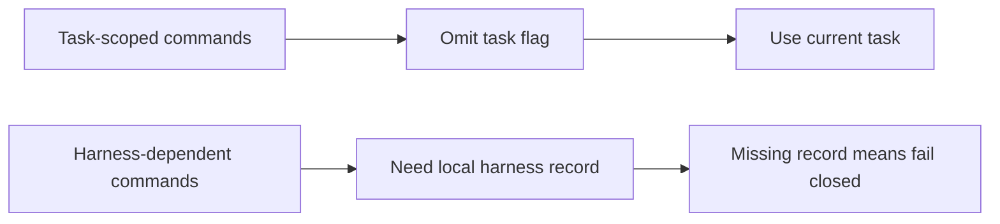

One branch shows task-scoped commands: if the task flag is omitted, the command uses the current task. The other branch shows harness-dependent commands: they need a local harness record, and if that record is missing they fail closed. The consequence is that omitted task context does not apply everywhere, so the owner should read fallback behavior per command.

### Strengths

The strongest part of this workflow is traceability. The owner can follow a task from creation, to claim, to evidence, to handoff, to session closure without losing the thread. The second strength is restraint: the ledger does not pretend that one status change is enough to prove the work is finished. Session closure has a duplicate-close guard, and the return to assigned is conditional rather than automatic. The third strength is boundary discipline. This chapter can stay focused on the movement of work while later chapters handle trust, identity, and external coordination.

### Attention Cards

#### ⚠ Do not treat one status as the whole story  _(attention · high)_

**What happens:** Task state is spread across task, claim, evidence, handoff, and session records. Evidence attachment and session closure can change more than one record at once, so the latest status by itself is not the full audit trail.

**Why it matters:** If the owner reads only the end state, disputes can hide the record chain that shows what actually happened.

**What to do:** Review this boundary and decide whether the current behavior is intentional.

**Revisit when:** When ledger workflow behavior or related owner decisions change.

#### ⚠ Session closure only returns to assigned under narrow conditions  _(attention · high)_

**What happens:** A finished session does not automatically mean the task is back at assigned. The task must still be running, no open sessions can remain, and an explicit close request can override the fallback.

**Why it matters:** The owner could think work is ready for reassignment while the ledger still treats it as active.

**What to do:** Review this boundary and decide whether the current behavior is intentional.

**Revisit when:** When ledger workflow behavior or related owner decisions change.

#### ⚠ Current-task fallback is command-specific  _(attention · medium)_

**What happens:** Omitting a task name binds only some task-scoped commands to the current task. Commands that depend on harness registration also fail closed when that local registry entry is missing.

**Why it matters:** If the manual overgeneralizes this rule, operators will expect the same fallback or the same validation everywhere.

**What to do:** Review this boundary and decide whether the current behavior is intentional.

**Revisit when:** When ledger workflow behavior or related owner decisions change.

### Owner Decisions

#### ⚖ Should this chapter keep the product framed as a local ledger rather than a hosted workflow system?  _(owner decision · open)_

**Why it matters:** That framing sets the owner's expectation for where records live and how much of the workflow is meant to be local and inspectable.

**Revisit when:** Before changing the related ledger workflow behavior.

#### ⚖ Should the manual say session closure falls back to assigned only when the task is still running and no open sessions remain?  _(owner decision · open)_

**Why it matters:** This is the point where a quick reading can produce the wrong operational conclusion about whether the work is actually finished.

**Revisit when:** Before changing the related ledger workflow behavior.

#### ⚖ Should the manual list which commands use the current-task fallback and which commands check harness state?  _(owner decision · open)_

**Why it matters:** This affects how much the owner can trust omitted task context and missing harness files.

**Revisit when:** Before changing the related ledger workflow behavior.

#### ⚖ Should this chapter keep evidence capture separate from later verification?  _(owner decision · open)_

**Why it matters:** The workflow is easier to understand when proof material is attached first and trust is judged in the later chapter.

**Revisit when:** Before changing the related ledger workflow behavior.

### Evidence Boundary

> **Evidence boundary** — Reviewed:
- The local ledger framing and the command vocabulary that this product uses to talk about work.
- The linked path from task to claim to evidence, including how evidence can also change the recorded outcome.
- The handoff and session lifecycle, including the conditional return to assigned after the last open session closes.
- The fact that current-task fallback is command-specific rather than a blanket rule, with missing harness registration causing some commands to fail closed.

Not reviewed:
- The full identity and trust rules for verification.
- The external harness coordination model beyond how it affects this workflow.
- Imported usage and cost accounting in depth.
- Broader durability, retention, recovery, and stewardship guarantees.

Recheck this chapter when task, claim, evidence, handoff, or session commands change, when the close-and-return behavior changes, or when the product scope moves beyond the local ledger model.

> Reviewed: blue-az/operator-control-plane repository snapshot, Founder/owner context

> Not reviewed: External runtime and integrations, Unreviewed runtime and owner context

---

## How Verification Creates Trust

_Verification is the point where recorded work becomes something the operator can trust. The assigned harness does the work and leaves evidence; the review harness is the separate checker; and doctor is the backstop for spotting self-verification, reviewer mismatch, and identity drift._

### One-Minute Snapshot

Verification is the point where recorded work becomes something the operator can trust. The assigned harness does the work and leaves evidence; the review harness is the separate checker; and doctor is the backstop for spotting self-verification, reviewer mismatch, and identity drift. The important boundary is that verification is a governance signal, not a decorative status, and the product only earns that signal when the verifier identity matches the configured rules.

### What You Should Be Able To Explain

- Understand why verification is separate from execution and why the review harness matters.
- See how verifier identity turns a verified claim into something the ledger can trust.
- Recognize self-verification and identity mismatch as real risks, not edge-case noise.
- Know what doctor checks and what responsibility remains with the operator.

### Mental Model

Verification is the product's trust layer. Work can be completed, logged, and handed off, but that is not the same thing as trusted work. The assigned harness produces the evidence trail; the review harness checks it; and the operator still owns the rules that decide which verification is credible. Session movement and handoff state organize the work, but they do not by themselves prove anything.

That separation is the core governance idea in this chapter: the ledger should show who did the work, who reviewed it, and whether the verifier identity is the one the operator intended to trust.

> **Figure:** A task only turns into a trusted claim after evidence is attached and the separate review step accepts it; completion by itself does not earn trust.

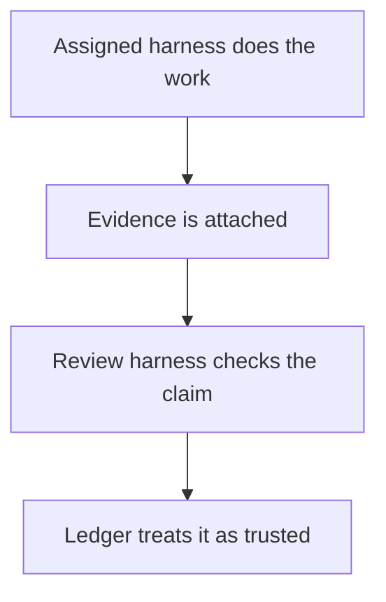

The diagram shows two distinct steps. First, the assigned harness does the work and evidence is attached. Second, the review harness checks that evidence. Only after that does the ledger treat the claim as trusted. The consequence is that finished work is not automatically trusted work.

### How It Works

The builder instructions keep evidence capture separate from verification. The generated brief tells the worker to attach evidence and leave final status to the review harness, which keeps the review step from being blurred into the work step.

When a claim status is written, the verifier name is required. In enforced mode, the product resolves that name against the configured identity map and fails closed if the identity cannot be matched. That is the practical guardrail against a status that looks verified but is not tied to the verifier the operator expects.

Doctor is the follow-up check. It looks for self-verification, warns when the verifier is not the task's review harness, treats older verified claims with no verifier as informational, and warns in single-user mode instead of pretending that local use alone proves identity separation. The product does not claim that its own checks replace broader machine or container isolation.

> **Figure:** A verified claim only becomes trustworthy after the verifier name passes the operator's configured identity map; a typed name by itself is not enough.

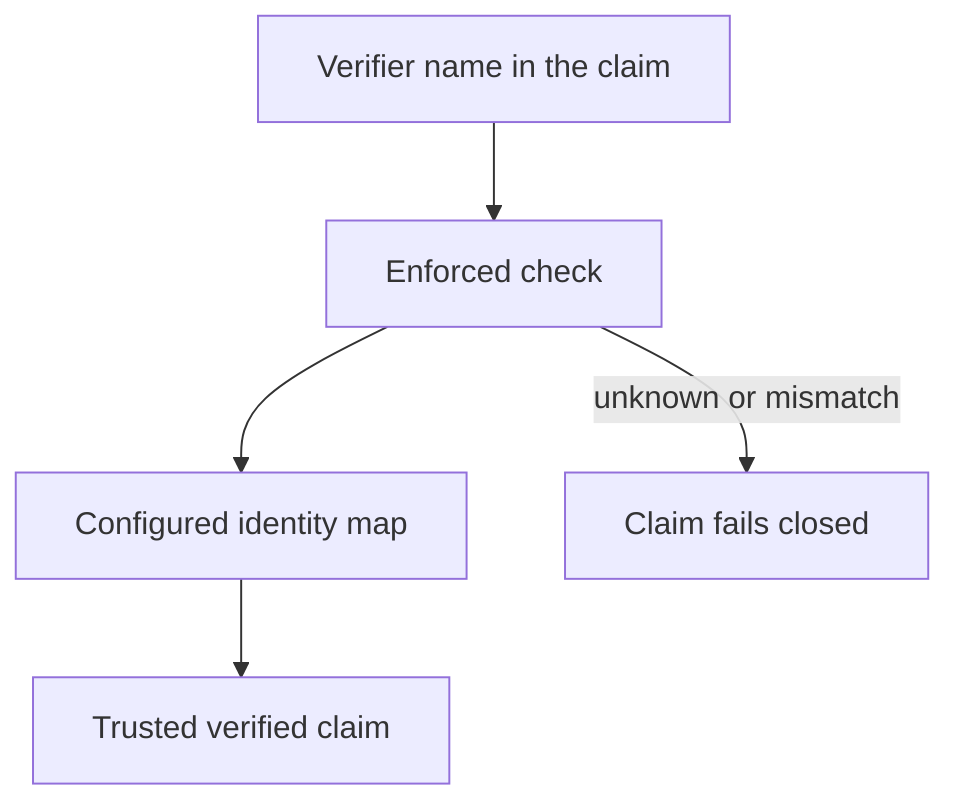

The diagram shows a verifier name entering an enforced check that consults the configured identity map. When the name matches, the claim becomes a trusted verified claim. When the name cannot be matched or does not fit the mapping, the claim fails closed. The consequence is that trust depends on the operator's configured identity rules, not on the presence of a name alone.

### Verified Facts

Verification is not a decorative label. It is the signal that the ledger can treat a claim as reviewed rather than merely reported.

A verified claim status cannot be written without naming the verifier.

Enforced verification uses the configured identity map and fails closed when the verifier cannot be matched.

Doctor does not flatten all verification cases into one answer. It distinguishes self-verification, review-harness mismatch, older claims that carry no verifier, and the single-user warning path.

Workflow movement and trust are related but not identical. A task can move through handoff and session states without that movement becoming proof of verified work.

> **Figure:** Doctor does not flatten verification into one verdict. The owner has to treat the branches differently, or real trust problems get mixed together with softer warnings.

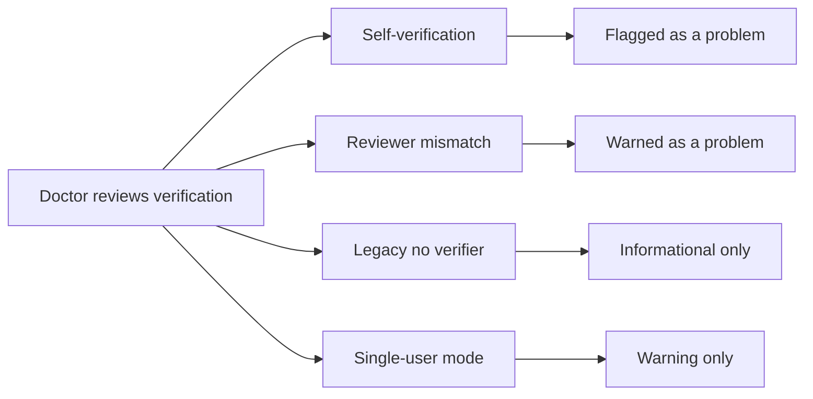

The diagram splits doctor's verification checks into four branches. Self-verification is flagged as a problem. A mismatch between the verifier and the review harness is also treated as a problem. Older verified claims with no verifier remain informational. Single-user mode produces a warning rather than proof of identity separation. The consequence is that the owner must read the branches differently instead of assuming one generic verification result.

### Strengths

The strongest part of this model is separation. The work path, the review path, and the verifier identity are not collapsed into one vague status. That makes the ledger more useful to an owner who needs to ask, "Who actually checked this?"

A second strength is that the product keeps a visible audit trail for the trust decision itself. The operator can see when verification was intended, who it was tied to, and whether doctor considers the result trustworthy or suspicious. That is more useful than a simple done-or-not-done marker.

A third strength is that the product does not pretend local use is enough on its own. It keeps the manual honest about where trust comes from and where it still depends on the operator's environment and discipline.

### Attention Cards

#### ⚠ Self-verification can undermine the whole trust model  _(attention · critical)_

**What happens:** If the same party can do the work and present the work as independently verified, the ledger can carry a trusted-looking record that is not actually independent review.

**Why it matters:** The product's value here is audit credibility. If self-verification slips through, downstream decisions can rest on a false trust signal.

**What to do:** Review this boundary and decide whether the current behavior is intentional.

**Revisit when:** When verification governance behavior or related owner decisions change.

#### ⚠ The tool is not the whole identity boundary  _(attention · high)_

**What happens:** The product checks verifier identity through its own rules, but the reviewed evidence also says real isolation may still depend on the broader machine or container setup.

**Why it matters:** A clean ledger check is not the same thing as a fully isolated execution environment. The owner should not read the tool's own guardrails as a universal security guarantee.

**What to do:** Review this boundary and decide whether the current behavior is intentional.

**Revisit when:** When verification governance behavior or related owner decisions change.

#### ⚠ Doctor warns, it does not replace judgment  _(attention · medium)_

**What happens:** Doctor surfaces self-verification, wrong-reviewer verification, legacy no-verifier cases, and single-user mode warnings, but those warnings still need owner interpretation.

**Why it matters:** A warning-only path can be easy to overread. The owner should decide which warnings are tolerable and which ones mean the process has drifted too far.

**What to do:** Review this boundary and decide whether the current behavior is intentional.

**Revisit when:** When verification governance behavior or related owner decisions change.

### Owner Decisions

#### ⚖ Should verified claim writes stay locked to the configured identity map, or do you want a stronger external isolation rule in the operating setup?  _(owner decision · open)_

**Why it matters:** The current model depends on a configured identity map, but the evidence also says broader isolation may live outside the tool. If you need stronger trust, that boundary should be explicit in the manual.

**Revisit when:** Before changing the related verification governance behavior.

#### ⚖ Should doctor warnings about self-verification or reviewer mismatch be treated as stop-the-line issues?  _(owner decision · open)_

**Why it matters:** This changes whether audit drift is acceptable noise or a release blocker. The answer should match how much you rely on verification for protected decisions.

**Revisit when:** Before changing the related verification governance behavior.

#### ⚖ Should single-user mode remain only a warning, rather than being described as enforced identity separation?  _(owner decision · open)_

**Why it matters:** The reviewed behavior does not treat single-user mode as strong identity enforcement. Overstating it would make the manual more confident than the product is.

**Revisit when:** Before changing the related verification governance behavior.

### Evidence Boundary

> **Evidence boundary** — Reviewed:
- The local ledger framing of the product and the matching workflow nouns used by the CLI.
- The brief guidance that separates evidence capture from verification and leaves final review to the review harness.
- The claim-status rules that require a named verifier and use the configured identity map in enforced mode.
- The doctor checks that look for self-verification, reviewer mismatch, legacy no-verifier claims, and the single-user warning path.
- The session and handoff state transitions that can move task status but do not themselves establish proof.

Not reviewed:
- We did not verify any broader hosted service, shared platform, or SaaS-style surface.
- We did not prove the operator's real deployment isolation, so broader machine or container controls remain outside this chapter's guarantee.
- We did not receive owner-confirmed product intent, so the chapter stays scoped to the evidence supplied here.

After any change to verification writes, identity mapping, review-harness rules, or doctor output, rerun the relevant verification and audit paths and confirm that self-verification, reviewer mismatch, legacy no-verifier cases, and single-user warnings still behave the same. If the deployment boundary changes, rewrite the boundary language instead of assuming the tool itself supplies that guarantee.

> Reviewed: blue-az/operator-control-plane repository snapshot, Founder/owner context

> Not reviewed: External runtime and integrations, Unreviewed runtime and owner context

---

## How Harnesses Coordinate Work

_This chapter shows how the Operator Control Plane coordinates external harnesses through the local ledger and the CLI nouns your product already uses. It does not own the harness machines; it records the work, the handoff, the brief, the session, and the review step so an operator can keep supervision intact._

### One-Minute Snapshot

This chapter shows how the Operator Control Plane coordinates external harnesses through the local ledger and the CLI nouns your product already uses. It does not own the harness machines; it records the work, the handoff, the brief, the session, and the review step so an operator can keep supervision intact. The reviewed code shows the assigned harness doing the work, the review harness checking it, brief export carrying the same instructions into chat, and session close only returning a task to assigned when the task is still running and the open session is actually done. That is the product's current behavior, so it tells you what the system does today, not the broader operating model you may want tomorrow.

### What You Should Be Able To Explain

- Explain the difference between the assigned harness, the review harness, and the local ledger that records their work.
- Describe how briefs, handoffs, and sessions keep work continuous across harnesses without pretending the product owns their runtime.
- Tell which commands change coordination state and which ones only package, carry, or review the work.
- Spot the places where coordination stops short of orchestration, scheduling, or environment control.

### The Coordination Model

### Ledger first
The right way to picture this product is as a local ledger that supervises outside work, not as a system that owns the harness machines or promises control over their runtime. The ledger is where the operator keeps the running record of the task, the claim, the evidence, the brief, the handoff, and the session. Coordination happens because those records give the operator a stable place to direct the next step and to see what happened after the fact. What the product does not establish is control over the harness environment itself: the evidence supports supervision through the ledger, not ownership of the machine that executes the work.

That distinction matters because it sets the boundary of responsibility. If the assigned harness stalls, changes, or gets replaced, the operator is not relying on a hidden scheduler inside the product to recover the work. The continuity comes from the ledger entries and the instructions they carry forward. In practice, that means the manual should be read as a guide to supervised work, not as a promise of full orchestration. The product records enough to keep the work legible and restartable, but it does not claim to run the harness for you.

### Two harness jobs
The assigned harness and the review harness are not two names for the same role. The assigned harness is the one doing the work and producing the next claim or evidence. The review harness is the separate checker that confirms or rejects what was produced. Keeping those jobs apart is what makes the coordination model readable: one harness advances the task, the other evaluates the result, and the ledger remembers which step is which.

For an owner, the consequence is practical. A task should not be treated as finished just because one harness produced output, and a review harness should not be treated as a second worker that simply repeats the same job. The product’s vocabulary draws a line between execution and verification so the operator can tell who was supposed to do what. That separation also reduces confusion when the work moves between harnesses. If a claim comes back needing review, the ledger still tells the operator which harness created the work and which one is expected to examine it.

### Briefs carry continuity
Briefs are the mechanism that keeps the next step from being reinvented every time the work changes hands. The reviewed behavior shows that generated briefs tell the builder to attach evidence and leave verification to the review harness, and that exported briefs preserve the same brief body for copy-paste into chat. The important point is not the packaging itself; it is that the instruction survives the handoff. A new harness or a new operator can continue from the same brief without re-deriving the process from memory.

That gives the operator a concrete continuity model: the brief defines the work, the export keeps the wording intact for transfer, and the ledger retains the surrounding record so the next person is not starting from a blank page. The reviewed evidence also shows that when a handoff is captured, it preserves the next step, and that session closure only falls back to an assigned state when the task is still running and the open session is actually finished. That is enough to maintain continuity across turns, but it still stops short of saying the product schedules the harness or manages its runtime. The continuity is real; the orchestration remains external.

A simple example makes the model easier to hold in mind. An operator gives an assigned harness a task, exports the brief into chat, and later a different harness picks up the same brief. Because the brief body stayed intact and the ledger kept the handoff context, the new harness does not need a fresh process invented for it. It can continue the same work, and the operator can still see, in the ledger, how the task moved from one step to the next.

> **Figure:** The owner should read the ledger as the place where work is remembered, not as the place where harnesses live. That boundary matters because coordination only works through the records that the ledger keeps; the product supervises the work, but it does not absorb the harness runtime.

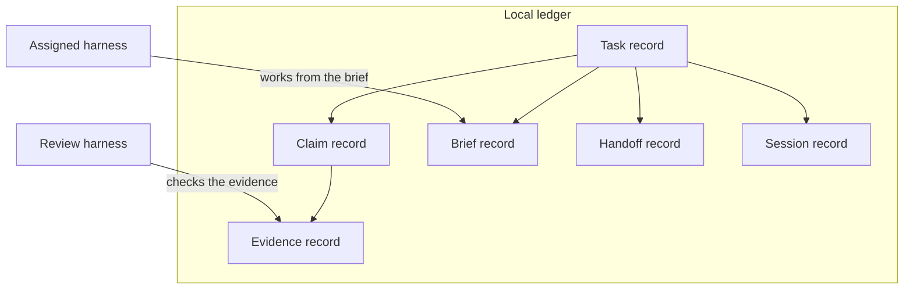

The local ledger contains the task record, claim record, evidence record, brief record, handoff record, and session record. The assigned harness stays outside the ledger and works from the brief, while the review harness stays outside and checks the evidence. The consequence is that coordination happens by writing and reading records, not by taking ownership of the harness machines.

### What the Workflow Actually Does

When this workflow generates a brief, it is doing two things at once: it gives the assigned harness the next step, and it deliberately stops short of deciding whether the work is done. The brief tells the builder to attach evidence, but not to set a final status. That matters because it keeps the work instruction separate from the judgment call. Verification is left to the review harness, so the brief is a handoff into execution, not a substitute for review. The boundary is important: the product is preserving the sequence of work, not collapsing builder and reviewer into one role.

The export brief path keeps that same instruction intact. It does not rewrite the body for a different audience or invent a second version of the message. Instead, it wraps the same brief body so it can be copied into chat. For an operator, the practical consequence is that the wording the builder receives and the wording that gets pasted elsewhere stay aligned. That reduces drift between the local ledger and the external conversation. The limit is just as important: this preserves text, not meaning beyond what was already in the brief. If the brief is vague, export makes it portable, not better.

Handoff capture is the point where the ledger records continuity between one step and the next. It writes a handoff record for the task and updates the task's next step. That means the system is not merely logging that something happened; it is pointing the task forward. A concrete example is a task that finishes evidence collection and hands the work to review. The handoff record preserves what was passed on, while the updated next step tells the next actor what should happen now. The qualifier is that this is a record of intended continuity. It does not prove the next step succeeded, only that the task was advanced cleanly in the ledger.

Session start and session end are the other gates that change live task state. Starting a session opens a usage placeholder and marks the task as running. Ending a session is narrower than a simple close button. The system refuses to re-close a finished usage record unless the operator forces it. If the task is still running and the last open session has just been closed, the task returns to assigned unless an explicit status was requested. Otherwise, the close result follows the explicit status or the duplicate-close guard instead of falling back automatically. For the owner, that means session closure is conditional state management, not a blanket reset. The product only restores assigned in the narrow case where the task is still active and no open sessions remain.

| Closure case | Task result | Condition |
| --- | --- | --- |
| Duplicate close without force | Close is blocked; the finished usage record stays closed | Session end reaches a usage record that is already finished, and force is not supplied |
| Same close with force | Close completes | Force is supplied, overriding the duplicate-close guard |
| Normal close where the task is still running and no open sessions remain | Task falls back to assigned | The last open session closes, the task is still running, and no explicit status was requested |
| Fallback case when the return-to-assigned conditions are not met | No automatic return to assigned; the explicit close result or duplicate-close guard controls the outcome | The task is not still running, open sessions remain, or an explicit status was provided |

Read that table as a gate map, not as a promise of orchestration. The workflow is precise about when a session may close, when a task can be handed back to assigned, and when it must stay in whatever status was explicitly chosen. That precision is what keeps the ledger coherent across brief, handoff, and session boundaries, while still stopping short of claiming control over the harness runtime itself.

> **Figure:** The important part is not that text moves around; it is that the text does not mutate while the task advances. That keeps the builder instructions and the later handoff aligned, so the operator can move work between surfaces without re-deriving the rules.

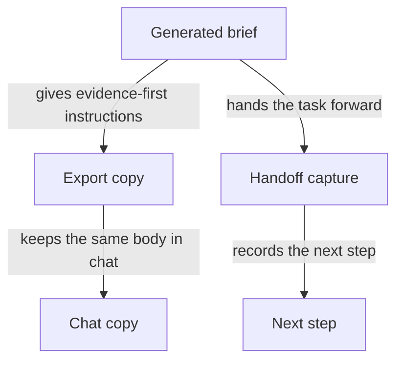

A generated brief gives the builder evidence-first instructions. The same brief body is exported into a chat copy without being rewritten. Handoff capture then records the next step for the task. The consequence is that the instructions stay stable while the task moves forward.

> **Figure:** Session close is a gate, not a reset button. The task only returns to assigned when the last open session has gone away and the task is still running; explicit outcomes and duplicate-close protection can keep it somewhere else.

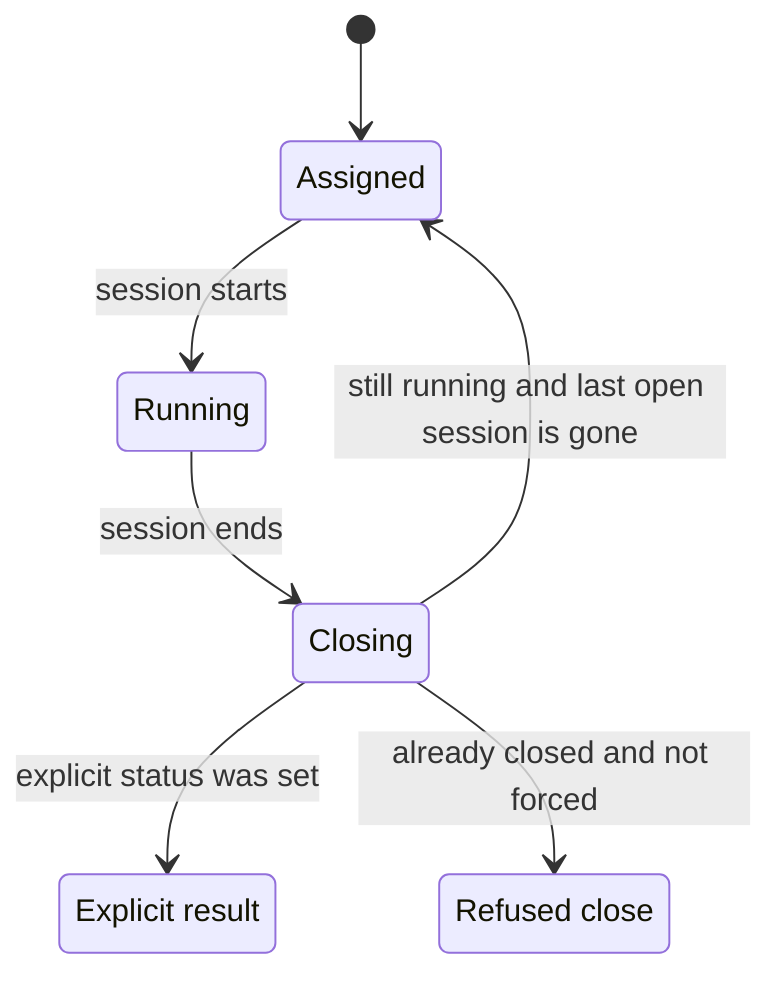

The lifecycle starts assigned, moves to running when a session starts, and enters closing when a session ends. From closing, the task returns to assigned only if it is still running and no open sessions remain. If an explicit outcome is set, the task follows that outcome instead. If the session is already finished and not forced, the close is refused. The consequence is that reassignment happens only in the narrow case the reviewed behavior allows.

### What the Evidence Confirms

The reviewed material is consistent on the product's basic framing: it presents the Operator Control Plane as a small, local, file-backed governance ledger, and it uses the same workflow nouns in the CLI that the manual uses in prose. That matters because it fixes the scope of the chapter. The evidence supports a ledger-centered model of work, proof, handoffs, and sessions; it does not support recasting the product as a hosted workflow platform or a general orchestration layer. In other words, the vocabulary is not decorative. It is the operating boundary the product itself is already using.

| Evidence area | Confirmed behavior | Why it matters |
|---|---|---|
| Local ledger framing and shared workflow nouns | The manual-facing framing and the CLI vocabulary both point to a local governance ledger with the same core workflow words: task, claim, evidence, usage, handoff, session, brief, export, doctor, and verify. | The owner can keep the manual aligned with the product's own language instead of drifting into hosted-platform or project-management terms. |
| Brief generation and copy-paste export | The brief generator keeps builder and reviewer instructions separate, and the export path carries the same brief body into a copy-paste wrapper without rewriting it. | A handoff can move between tools without the instructions changing underneath the operator, which reduces ambiguity when a new harness or a chat channel picks up the work. |
| Task, claim, and evidence updates | Task creation records the task and executor, claim registration appends the claim to the task, and evidence attachment can copy a local artifact into task-scoped evidence storage, hash it, link it to the claim, and update the task and claim status. The reviewed tests cover that end-to-end mutation chain. | Work, proof, and status stay in one auditable chain instead of spreading into separate, unlinked records. The owner can trace what happened without treating evidence as a loose attachment. |
| Handoff capture and session handling | Handoff capture writes a task-scoped handoff record and updates the task's next step. Session start opens usage and marks the task running; session end refuses to close the same usage record twice unless forced, and only falls back to assigned when the task is still running and no open sessions remain. | The ledger keeps continuity across pauses and resumptions. The task does not drift back to assigned too early, but it also does not stay stuck in a running state after the last open session is gone. |

Taken together, these checks show a narrow but useful truth: coordination is recorded locally, not inferred from conversation history. A concrete example is a task that moves from assignment to claim, then receives attached evidence, then gets a handoff when the work pauses. If the open session later closes and the task is still running, the ledger can return it to assigned only under the reviewed conditions. That gives the operator a durable record of where the work stands and what the next step is, while still keeping the actual harness work external to the product.

The brief path confirms the same discipline at the text level. A generated brief tells the builder to attach evidence and leaves verification to the separate review side, while export preserves that same body so it can be pasted into chat without being rewritten. The practical consequence is that the instruction set does not fork just because the medium changes. The owner gets a single source of handoff text for the builder path, and the review role remains distinct because the brief itself does not collapse evidence capture into verification. This is the current reviewed behavior, so it should be treated as confirmed for the present snapshot, not as a claim about every possible future brief format or export style.

### What Is Solid Here

### Narrow on purpose

The strongest thing about this coordination layer is that it stays narrow and explicit. It does not try to look like a general harness platform, and that restraint is a feature for an owner: the product is framed as a local governance ledger with a small set of workflow nouns, not as a system that owns external execution environments. That keeps the manual honest about what the product is actually responsible for. The reader can see that the control point is the ledger, while the harnesses remain external actors whose work is recorded, handed off, and reviewed rather than magically absorbed into the product itself. The boundary matters because it prevents a false expectation of orchestration, scheduling, or machine control that the evidence does not establish.

### Briefs keep the divide intact

The brief and export path is also a clean design choice. A generated brief tells the builder to attach evidence and leave verification to the review harness, while export preserves that same brief body in a form that is easy to paste into chat. Mechanically, that means the instructions do not need to be reinvented every time work moves between people or harnesses; the same underlying guidance can be carried forward without blurring who is supposed to do what. For the owner, this reduces a common failure mode in multi-harness work: the builder starts acting like the reviewer, or the reviewer starts inheriting builder language by accident. The evidence supports the split, but only within this workflow boundary. It does not prove that every possible manual process outside this path will stay that clean; it shows that this product gives you a reliable place to keep the divide visible.

### The branches are exercised, not implied

The chapter can speak with confidence because the relevant branches are covered by tests. Task creation, claim registration, evidence attachment, handoff capture, and session start and end are not just described in prose; the reviewed evidence shows that these state changes are exercised as a chain. That matters because coordination systems are easy to oversimplify: a handoff can look sound in a diagram even when the actual transitions around claims, evidence, and session closure are inconsistent. Here, the test coverage lets the manual say that the coordination behavior is grounded in checked branches rather than in a hoped-for flow. The qualifier is still important: the tests support the behavior that was reviewed, but they are not a promise about every future change or every external harness condition.

### A ledger you can reconstruct from

The local ledger is the other solid anchor. Because the task, claim, evidence, handoff, and session records live together, an operator can reconstruct who did what, when it was handed off, and what happened next without stitching together an outside system of record. That is the practical value of the model: continuity survives even when the work itself moves across harnesses. A concrete example is a task that is claimed by one harness, receives evidence, gets a handoff record with the next action, and then moves through a session boundary before returning to a ready state. The ledger keeps those steps legible as one chain. What the evidence does not establish is stronger storage guarantees such as tamper resistance or indefinite retention. What it does establish is enough to make the coordination trail durable in the ordinary owner sense: you can come back later and reconstruct the sequence from the local records that were written.

### Attention Cards

#### ⚠ Do not turn coordination into runtime ownership  _(attention · critical)_

**What happens:** The product coordinates external harnesses through records and handoffs, but the evidence does not show it launching, hosting, or fully managing their execution environments.

**Why it matters:** If the manual blurs this boundary, the reader will assume the product controls infrastructure that it does not actually own.

**What to do:** Review this boundary and decide whether the current behavior is intentional.

**Revisit when:** When harness coordination behavior or related owner decisions change.

#### ⚠ Do not blur the builder/reviewer split  _(attention · high)_

**What happens:** Generated briefs tell builders to attach evidence and leave verification to the review harness; export keeps that same body for carry-forward.

**Why it matters:** If that separation softens, the handoff instructions stop matching the real operating model.

**What to do:** Review this boundary and decide whether the current behavior is intentional.

**Revisit when:** When harness coordination behavior or related owner decisions change.

#### ⚠ Do not describe session close as automatic reassignment  _(attention · high)_

**What happens:** Session end only falls back to assigned when the task is still running and there are no open sessions left; otherwise the explicit status or duplicate-close guard controls the result.

**Why it matters:** A simplified description would mislead operators about when a task actually returns to assigned.

**What to do:** Review this boundary and decide whether the current behavior is intentional.

**Revisit when:** When harness coordination behavior or related owner decisions change.

#### ⚠ Harness metadata is secondary to the ledger record  _(attention · medium)_

**What happens:** Harness details matter for coordination, but the ledger remains the source of record for work, handoff, and session continuity.

**Why it matters:** This chapter should stay focused on supervision, not drift into harness-administration detail.

**What to do:** Review this boundary and decide whether the current behavior is intentional.

**Revisit when:** When harness coordination behavior or related owner decisions change.

### Owner Decisions

#### ⚖ Should the manual keep the assigned harness and review harness as a hard distinction?  _(owner decision · open)_

**Why it matters:** That choice determines whether the chapter reads as supervised multi-harness work or as a generic collaboration flow.

**Revisit when:** Before changing the related harness coordination behavior.

#### ⚖ Should coordination be framed as controlled recordkeeping rather than orchestration?  _(owner decision · open)_

**Why it matters:** This is the main boundary that keeps the chapter honest about what the product does and does not own.

**Revisit when:** Before changing the related harness coordination behavior.

#### ⚖ Should session close be documented as a conditional return to assigned?  _(owner decision · open)_

**Why it matters:** The operator needs the exact fallback rule to avoid assuming a task is reassigned earlier than it really is.

**Revisit when:** Before changing the related harness coordination behavior.

### Evidence Boundary

> **Evidence boundary** — Reviewed:
- The README framing of the product as a local ledger with the workflow nouns used in the manual.
- The brief generation and export behavior that separates evidence capture from verification.
- The task, claim, evidence, handoff, and session lifecycle, including the tested branches around session close.
- The explicit review-harness instruction that keeps verification separate from builder work.

Not reviewed:
- Any hosted UI, shared service, or broader platform behavior.
- Any harness infrastructure, scheduling system, or environment ownership beyond the local coordination model.
- Any owner intent beyond the supplied prompt.
- Any adjacent chapter topics that belong to verification governance, usage import, or operating boundaries.

If the CLI nouns, brief wording, or session-close rules change, re-check the README, command registry, brief generation and export path, and lifecycle tests. If the product gains a hosted surface or harness scheduling, widen the boundary before rewriting this chapter.

> Reviewed: blue-az/operator-control-plane repository snapshot, Founder/owner context

> Not reviewed: External runtime and integrations, Unreviewed runtime and owner context

---

## How Usage Import Supports the Audit Trail

_Usage import gives the owner a second line of sight into work: it pulls supported harness activity into the local ledger so you can reconstruct sessions, compare activity or cost patterns, and review provenance. It helps the audit trail, but it does not replace claims, evidence, or verification, and it should stay subordinate when imported activity conflicts with verified ledger records._

### One-Minute Snapshot

Usage import gives the owner a second line of sight into work: it pulls supported harness activity into the local ledger so you can reconstruct sessions, compare activity or cost patterns, and review provenance. It helps the audit trail, but it does not replace claims, evidence, or verification, and it should stay subordinate when imported activity conflicts with verified ledger records.

### What You Should Be Able To Explain

- Understand what imported usage adds to the audit trail and what it does not prove.
- See how imported activity relates to sessions, task records, and later review.
- Recognize the split between token-metered and activity-only harnesses.
- Know the main risks: uneven coverage, best-effort provenance, and the need to keep claims and evidence authoritative.

### Usage import is audit context, not proof

Usage import is native to the Operator Control Plane, but it is a secondary line of sight. It collects activity from supported harness ecosystems so an operator can reconstruct work, compare sessions, and review activity patterns. The record that matters most is still the ledger record attached to the task, claim, evidence, and verification chain; imported activity helps the review, but it does not replace it.

> **Figure:** Imported usage helps the owner reconstruct work and review patterns, but it stays on the lower side of the trust boundary. If it conflicts with the verified record, the claims, evidence, and verification chain still decide what the product should treat as authoritative.

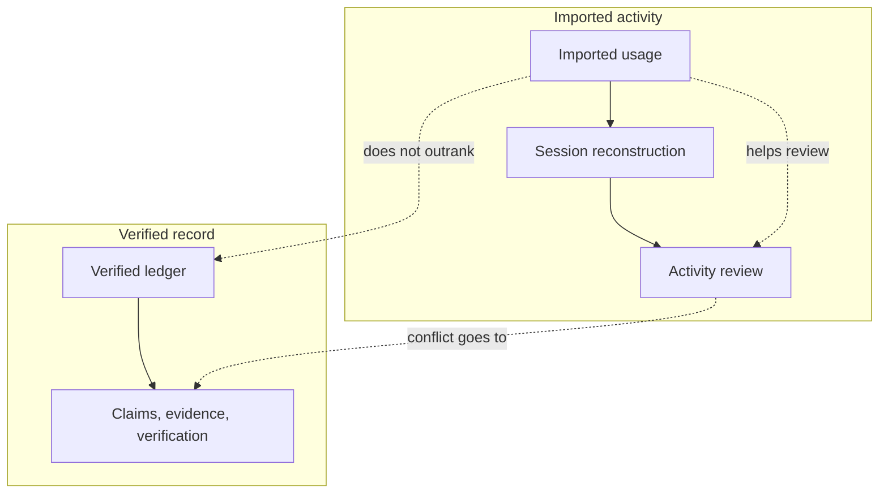

The diagram separates imported activity from the verified record. Imported usage feeds session reconstruction and activity review, while the verified ledger leads to the claims, evidence, and verification chain. Imported usage can help explain what happened, but when the two disagree the verified record remains the authority.

### Imported activity is matched back to a source session

The import path can select a source session by an exact session ID, a time window, overlap with the current operator session, or a scored fallback. Once matched, repeated imports do not create a duplicate for the same source session; they update the existing record instead. The local record keeps the auto-derived baseline while marking manual edits separately, so later review can still see what came from the harness and what was adjusted locally. Different providers do not all land in the same shape: Claude and Codex are treated as token-metered, while Gemini-Agy is activity-only. That split matters because the imported record is carrying audit context, not a single blended accounting story.

> **Figure:** The owner gets a stable review trail because repeat imports update the same record instead of creating another copy. That preserves the auto-derived baseline while keeping later manual changes visible as edits, so provenance survives without turning the import into duplicate noise.

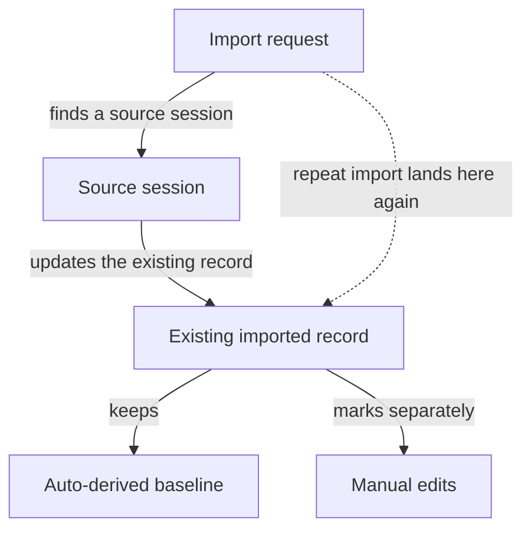

An import request finds a source session, then updates the existing imported record. If the same source session is imported again, it lands on that same record instead of creating a duplicate. The record keeps the auto-derived baseline and marks manual edits separately. The consequence is a single provenance trail that still shows what was imported and what was changed locally.

### What the current behavior actually preserves

Usage import is not one uniform meter across all harnesses. The summary keeps token-metered and activity-only records in separate blocks, and it labels turns and wall-clock as harness-internal rather than cross-harness comparable. Imported records are idempotent on the source session reference, so the same source session updates an existing record instead of accumulating a duplicate. If the source file later disappears, doctor warns instead of treating the import as broken. That means the provenance is useful, but it is not fail-closed after import.

> **Figure:** The owner should not expect one blended usage total, because the imported data does not all measure the same thing. Keeping token-metered and activity-only sources in separate summary blocks prevents a false comparison and keeps harness-internal numbers from looking more universal than they are.

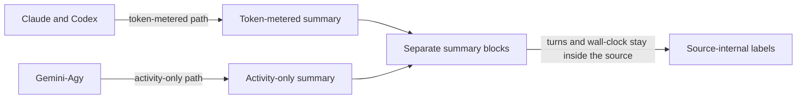

Claude and Codex follow a token-metered path into a token summary, while Gemini-Agy follows an activity-only path into a separate activity summary. Both branches feed separate summary blocks, and the result keeps turns and wall-clock labeled as harness-internal. The consequence is that the owner sees distinct accounting modes instead of a single blended total.

### Why this layer is still worth having

The value of usage import is that it gives the owner something concrete without pretending too much. It helps reconstruct what happened when direct proof is thin, it preserves a manual-versus-auto provenance trail for later review, and it avoids double-counting the same imported source session. Used well, it supports oversight of activity and cost patterns while keeping the audit trail anchored in the ledger.

### Attention Cards

The main risk is over-weighting imported activity because it is concrete and measurable. That temptation is exactly what makes this chapter easy to misread: the data is useful, but it is still downstream of the records that establish claims, evidence, and verification. The other risk is assuming coverage is uniform across providers or that source provenance is permanent after import. Neither assumption is supported by the current evidence.

#### ⚠ Imported activity is context, not proof  _(attention · high)_

**What happens:** Imported usage helps reconstruct what happened, but it does not outrank verified claims, evidence, or verification. If the manual treats imported activity as proof on its own, it overstates what the product knows.

**Why it matters:** Owners need a clear trust order. Otherwise a noisy import can look more authoritative than the ledger record that was actually verified.

**What to do:** Review this boundary and decide whether the current behavior is intentional.

**Revisit when:** When usage import audit behavior or related owner decisions change.

#### ⚠ The accounting model is not uniform across harnesses  _(attention · high)_

**What happens:** Claude and Codex are treated as token-metered, while Gemini-Agy is activity-only. Summary blocks stay separate, so one blended total would hide differences in what each provider actually records.

**Why it matters:** The owner can misread cost or activity if the chapter collapses distinct metering rules into one number.

**What to do:** Review this boundary and decide whether the current behavior is intentional.

**Revisit when:** When usage import audit behavior or related owner decisions change.

#### ⚠ Missing source logs only warn  _(attention · high)_

**What happens:** Imported records keep a local link back to the source session, but if that source later disappears, doctor warns instead of failing the record.

**Why it matters:** The audit trail remains useful, but the owner should not assume fail-closed retention or permanent source-log availability.

**What to do:** Review this boundary and decide whether the current behavior is intentional.

**Revisit when:** When usage import audit behavior or related owner decisions change.

### Owner Decisions

#### ⚖ Should imported usage stay advisory when it conflicts with verified ledger records?  _(owner decision · open)_

**Why it matters:** This chapter currently treats import as supporting evidence, not the record of truth. Changing that would change how every audit review is read.

**Revisit when:** Before changing the related usage import audit behavior.

#### ⚖ Should the manual keep separate language for token-metered and activity-only harnesses?  _(owner decision · open)_

**Why it matters:** A single blended summary would hide the real differences in the imported data.

**Revisit when:** Before changing the related usage import audit behavior.

#### ⚖ Should a missing source log stay a warning instead of a hard failure?  _(owner decision · open)_

**Why it matters:** The current behavior preserves best-effort provenance after import, but it does not guarantee permanent source availability.

**Revisit when:** Before changing the related usage import audit behavior.

### Evidence Boundary

> **Evidence boundary** — Reviewed:
- I reviewed the product framing that keeps the control plane local and file-backed, plus the command behavior that makes usage import a first-class but secondary workflow.
- I reviewed the import behavior that matches records back to a source session, deduplicates repeated imports, and preserves manual-versus-auto provenance.
- I reviewed the summary behavior that keeps token-metered and activity-only records separate and labels some reported values as harness-internal.
- I reviewed the audit behavior that warns, rather than fails, when a source log later disappears.

Not reviewed:
- I did not review any hosted UI, server API, broader platform service, billing system, or other surface that was not established in the supplied evidence.
- I did not review providers beyond the supported usage import paths, so coverage for other harnesses is not claimed.

Recheck this chapter if usage import gains new providers, changes how it selects a source session, stops deduplicating repeated imports, starts treating missing source logs as errors, or begins overriding verified ledger records.

> Reviewed: blue-az/operator-control-plane repository snapshot, Founder/owner context

> Not reviewed: External runtime and integrations, Unreviewed runtime and owner context

---

## Operating Boundaries, Failure Modes, and Stewardship

_This chapter is about the limits around a local CLI ledger, not a hosted service. The reviewed evidence shows a product that records tasks, claims, evidence, handoffs, sessions, verification checks, and usage in local files, with some commands binding to the current task and others stopping when the right registry or identity file is missing._

### One-Minute Snapshot

This chapter is about the limits around a local CLI ledger, not a hosted service. The reviewed evidence shows a product that records tasks, claims, evidence, handoffs, sessions, verification checks, and usage in local files, with some commands binding to the current task and others stopping when the right registry or identity file is missing. It also shows where the product stops: the CLI can check and record a lot, but it does not prove durable, tamper-proof history or host-level identity separation on its own. Imported usage keeps a source reference, yet a missing source log later only warns instead of stopping the record from existing. This chapter stays honest about what the product does today and where your operating environment still has to carry part of the burden.

### What You Should Be Able To Explain

- Explain which trust boundaries are enforced inside the product and which still depend on the host environment.
- Distinguish fail-closed behavior from warning-only or fallback behavior when records, identity, or source logs are missing.
- Describe what verification and usage import do not guarantee, even when they leave a record behind.
- Decide where external controls are needed for retention, identity separation, or provenance.
- Keep later chapter boundaries narrow when the reviewed evidence does not establish the broader system around the product.

### Treat It as a Local Ledger, Not a Hosted Service

### A local ledger, not a platform
The cleanest way to read the Operator Control Plane is as a local governance ledger that lives with the workspace and speaks in the product’s own workflow nouns: task, claim, evidence, usage, handoff, session, brief, export brief, doctor, and verify. That framing matters because it tells you what kind of system you are actually steering. It is not presented as a hosted service with a remote control plane of its own; it is a small, file-backed record of work and review that depends on the local environment to exist and remain meaningful.

That mental model changes how you interpret every record the CLI creates. A task is not just a loose ticket; it is part of a local chain that the product is trying to keep auditable. A claim and its evidence are not decorative metadata; they are the product’s way of binding proof to work inside that ledger. Verification, doctor, and the surrounding handoff and session vocabulary exist to make the local record usable for stewardship. The point is to make work legible in one place, not to pretend the product has become the whole operating system around it.

### Stewardship does not stop at the CLI
The reviewed evidence also leaves a boundary that matters for owners: some identity and isolation guarantees may still depend on the surrounding operating system or container. In other words, the CLI can record and check a lot, but it does not, by itself, prove that two operators are truly isolated from one another on the same machine, or that the environment has given each person a durable, separate identity boundary. The repository snapshot explicitly does not establish the wider deployment shape, and it even notes that real deployment isolation belongs outside the snapshot.

For an owner, that means the stewardship burden is shared. You can rely on the local ledger to structure work, but you still need the host environment to supply the parts that the product does not claim to own: separation between people, stable execution boundaries, and whatever local policy is needed to keep the ledger attached to the right operator. If you run the product in a shared shell, on a shared workstation, or inside a container whose identity rules are not already clear, the ledger may still function while the human boundary around it becomes weaker than the manual suggests. The product can record who it thinks the verifier is, but the surrounding environment is what determines how strong that identity claim really is.

A simple example makes the risk concrete. Two people open the same workspace on a shared machine. The ledger still writes task, claim, and verification records locally, so the history looks orderly. But if the machine or container does not separate identities the way you expect, the records can still be tied to the wrong human context. That is why the manual should not read the CLI as a full trust boundary. It is a governance layer over local files, not a substitute for host-level isolation.

### Preserve the boundary when evidence stops
The last rule is disciplined restraint. When the reviewed evidence does not confirm the wider product boundary or owner intent, treat that as a boundary to preserve rather than a gap to fill with guesswork. This chapter is the place to keep that honesty intact. If the snapshot does not establish a hosted surface, a broader system scope, or an owner-confirmed intent, do not promote any of those into the manual as if they were already proven.

That discipline is not a disclaimer for its own sake; it is how you avoid building false confidence into the operating model. The verified chapters can explain how records move, how verification is checked, and how usage is imported. This chapter’s job is narrower: hold the line around what the product demonstrably is, and keep the unproven parts outside the frame until better evidence appears. If the manual says the product is a local ledger, then the owner knows where to look for truth, where to add external controls, and where not to assume more than the evidence supports.

> **Figure:** The product can keep an auditable local ledger, but the stronger boundary around who is actually separated still comes from the host or container. Owners should not treat the ledger itself as the whole trust boundary.

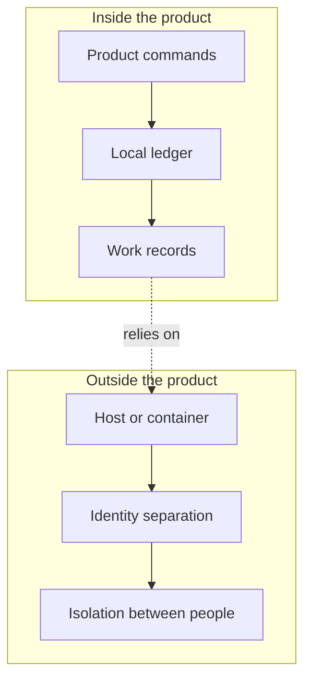

The figure splits the system into what the product controls and what the host or container controls. Inside the product, commands write to a local ledger and produce work records. Outside the product, the host or container determines identity separation and isolation between people. The consequence is that the ledger can organize and check work, but it does not by itself prove the stronger human separation boundary.

### What the Product Enforces, and What It Leaves Outside

## Task binding and registry checks

When a task-scoped command is allowed to omit a task, it does not create a new target. It binds to the current task already recorded in the local settings, so the operator stays on the same ledger state without having to repeat the task every time. That fallback is narrow. It applies only where the command is already task-scoped, and it stops there. If the command also depends on a harness registry entry, the behavior changes from fallback to refusal: a missing registry file is treated as a stop, not a guess.

A concrete case makes the boundary clear. If an operator runs a task-scoped write without naming the task, the product can attach it to the current task. If the same operator then runs a harness-dependent command after the registry has been removed, the command does not silently continue. The ledger does not pretend it knows which harness should answer.

| Situation or action | What it changes | Key condition or exception |
| --- | --- | --- |
| Task-scoped command without an explicit task | Uses the current task from local settings | This fallback applies only to task-scoped commands, not every write path |
| Command that depends on a harness registry entry | No ledger change; the command stops | Missing registry data causes fail-closed behavior |
| Handoff capture | Records the next step on the task and updates the task's next action | The handoff is task-scoped and preserves the next step rather than inventing a new one |
| Session start | Opens usage and marks the task running | The open usage record is part of the state change, not a separate afterthought |
| Session end | Returns the task to assigned only when the closeout conditions are met | The task must still be running and there must be no open usage sessions; otherwise explicit status or the duplicate-close guard controls the result |
| Verification write | Records a named verifier and the claim status | A named verifier is required; enforced mode checks the configured identity map and rejects unknown or mismatched names; guarded test overrides are stamped for later audit |
| Doctor review | Flags self-verification, reviewer mismatch, and guarded test overrides | Legacy verified claims with no verifier remain informational, and single-user mode is only a warning |

## Handoffs and session state

Handoff capture writes the next step into the task record, which keeps the ledger's forward motion visible instead of leaving it inside conversation state. That matters because the next step is not just a note to the operator. It is part of how the product remembers what should happen after the current work is done. Session start works the same way: it opens usage and marks the task running in one move, so activity becomes an explicit open period in the ledger rather than a vague sign that work began.

Session end is more conditional than session start. It does not simply flip the task back to assigned. The fallback only happens when the task is still running and no open usage sessions remain. That protects the ledger from closing over an active session or from returning a task to the queue too early. If those conditions are not met, the explicit status or the duplicate-close guard decides what happens instead. In practice, that means the product prefers an honest state boundary over an optimistic one.

## Verification identity gates

Verification writes are stricter than ordinary workflow notes because they need a named verifier. In enforced mode, that name is checked against the configured identity map. If the name is unknown or does not match the mapped identity, the write fails closed rather than recording a doubtful verifier as if it were valid. The guarded test path is different: it is allowed, but it is marked so doctor can recognize it later instead of treating it as ordinary identity.

For the owner, the consequence is straightforward. A verification record only carries full weight if it passed the identity gate. The ledger may still keep the record when the path is guarded, but the trust level changes because the product has preserved the fact that the identity was special. That is why the audit branch matters here: doctor does not rewrite the workflow, but it can flag self-verification, reviewer mismatch, and the guarded test override so the owner does not overread a result that came through a weaker path.

> **Figure:** Session start opens usage and marks the task running. Session end only falls back to assigned after the last open session is closed while the task is still running, otherwise explicit status or duplicate-close rules decide the outcome.

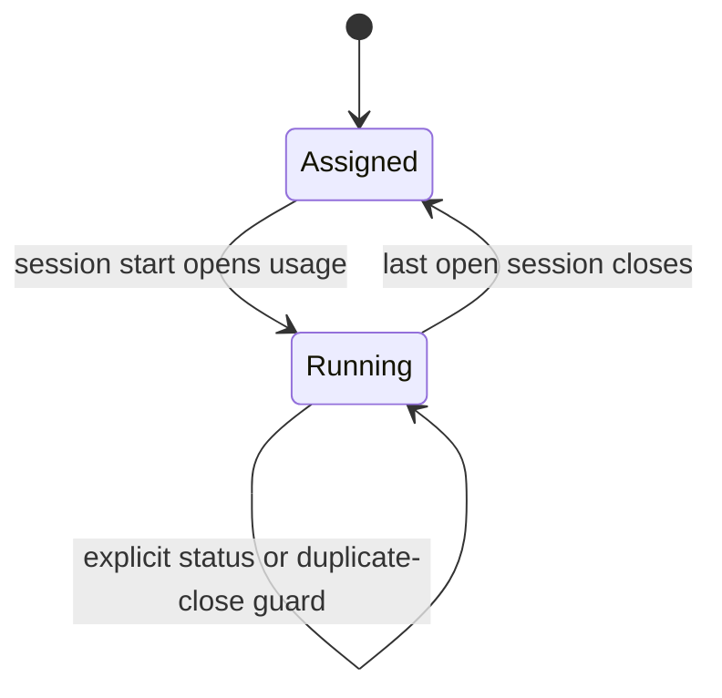

The lifecycle starts in assigned. A session start moves the task to running and opens usage. When the last open session closes, the task can return to assigned, but only if it is still running. If that condition is not met, the explicit status or the duplicate-close guard controls the result instead of an automatic return.

> **Figure:** Only enforced-mode verification that matches the configured identity carries the strong trust boundary. Single-user, legacy, and guarded test paths stay visibly weaker, and doctor is where that weakness is surfaced later.

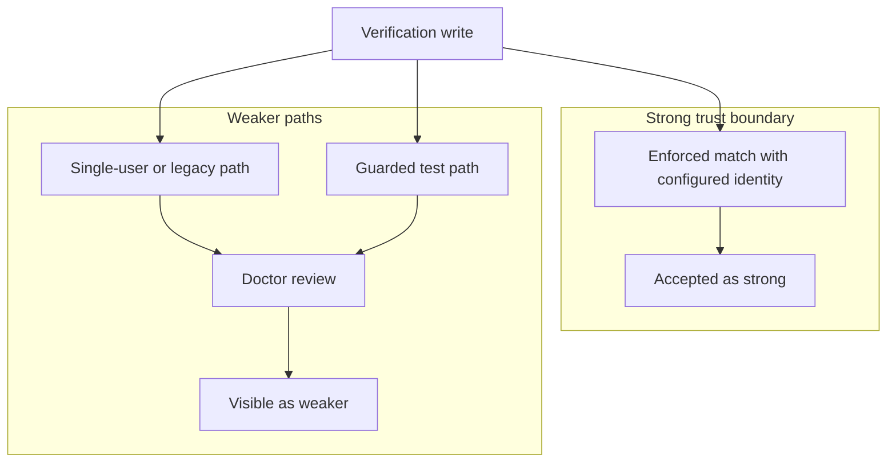

The diagram shows one strong path and several weaker paths. A verification write can go through an enforced match with the configured identity, which is treated as the strong boundary. Single-user, legacy, and guarded test paths do not get the same strength; they go through doctor review and remain visible as weaker. The consequence is that the owner should trust only the enforced path as strong identity proof.

### Checkable Facts the Evidence Confirms

### Separate by source type
The evidence draws a clean line between how the product counts different harness logs. Claude and Codex are treated as token-metered sources, which means their imported records carry token accounting and the parser looks for session, model, token, tool-call, and quota details. Gemini-Agy is treated differently: it is activity-only. For the owner, that split matters because a blended summary would overstate what the ledger can compare across providers. The ledger keeps separate accounting rules instead of forcing one common metric, so the report reflects the source it came from. That is a boundary, not a promise of cross-provider equivalence; the evidence shows separation, not a universal normalization layer.

| Source type or import condition | How it is counted or matched | What stays separate or preserved |
| --- | --- | --- |
| Claude or Codex source logs | Counted as token-metered imports, with parser rules that extract session, model, token, tool-call, and quota fields | Provider-specific accounting rules stay separate |
| Gemini-Agy source logs | Counted as activity-only rather than token-metered | Activity-only records stay separate from token-metered records |
| Exact session ID match | Matched directly to the named session | The imported record keeps its source-session reference |
| Time-window match | Matched by falling within the selected time window | Matching stays tied to the imported session record |
| Overlap with the current operator session | Matched by overlap with the active operator session | The record remains tied to the current operator session context |
| Scored fallback match | Matched by the scored fallback when the stronger matches are not available | The chosen source-session reference is still recorded |
| Repeat import of the same source session | Matched back to the existing source-session reference instead of being appended again | The earlier record is updated in place rather than duplicated |
| Missing source file later | Doctor only warns when the source file has disappeared | The source-session reference remains as provenance, but not as fail-closed retention |
| Manual override after import | Manual edits are written after import while preserving the earlier auto-derived values | Auto-derived values stay in the baseline, and edited fields are marked separately |

### What the summary tells you
The reporting behavior is also intentionally split. Usage summary can put token-metered and activity-metered records into separate blocks, with harness-internal labels for the measures it uses. That means the owner should read the summary as an accounting view, not a merged story about every harness in one number. If a report shows both types side by side, that is the point: the product is preserving the distinction rather than flattening it.

### Why provenance still has a limit
The strongest continuity the evidence establishes is local, not archival. Imported usage keeps a source-session reference, so later review can point back to where the record came from. But if the source file disappears afterward, doctor warns instead of stopping the record from existing. In practice, that means a deleted log does not erase the imported entry, and it does not cause the product to fail closed on the already-imported data. It does, however, leave the owner with a weaker chain than a retained source file would have provided.

A simple example makes the boundary clear. Suppose an operator imports one Claude log and one Gemini-Agy log from the same week. The Claude entry lands as token-metered, the Gemini-Agy entry lands as activity-only, and usage summary keeps them in separate blocks. If the same Claude source is imported again, the ledger updates the existing source-linked record instead of creating a second one. If the original log file is later deleted, doctor warns about the missing source, but the imported record and its source reference remain. If the operator then adds a manual correction, the earlier automatic numbers stay available in the baseline while the edited fields are marked as such. That is a useful audit shape, but it is still a local accounting record, not a guarantee that the underlying source will remain present forever.

> **Figure:** The provider split is preserved instead of flattened: Claude and Codex stay token-metered, Gemini-Agy stays activity-only, repeated imports update the same source-linked record, and a missing source file later weakens provenance without erasing the imported usage.

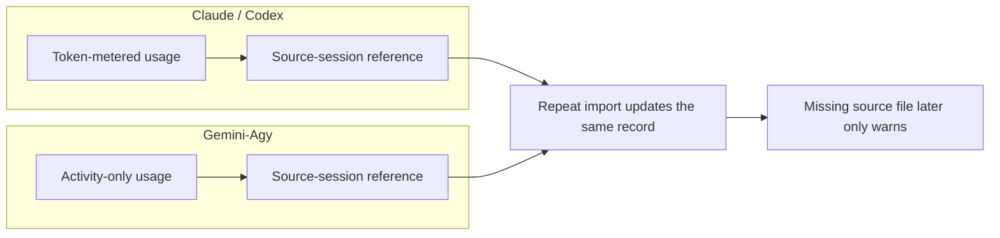

The comparison shows two parallel accounting branches. Claude and Codex imports are token-metered, while Gemini-Agy imports are activity-only. Both branches keep a source-session reference, and repeat imports update the existing record instead of creating a duplicate. If the source file disappears later, the product only warns, so the imported usage remains but the provenance is weaker.

### Where the Reviewed Evidence Is Strongest

## The product boundary is consistent

The strongest part of the reviewed record is that it says the same thing from three angles: the documentation, the command behavior, and the tests all point to a local, file-backed ledger rather than a hosted workflow system. That matters because it gives the owner a stable operating picture. The product is not being described as a remote service that centralizes state for you; it is a local control plane whose records live alongside the rest of the operator’s working files. In practice, that means the owner should expect the usual responsibilities of a local system: the machine, container, or workspace still carries part of the burden for identity, isolation, and preservation. What this evidence does establish is the product’s own stance. It is organized around local governance records, and the vocabulary in the interface matches that model closely.

The boundary here is also clear. This evidence does not turn the ledger into a promise of durable infrastructure or tamper-proof history. It is strong on product identity, not on enterprise guarantees. So the useful owner conclusion is narrower and more reliable: if you are deciding how much trust to place in the product itself, the review supports treating it as a local ledger with explicit records and checks, not as a hosted system that silently supplies the missing operational guarantees.

## The workflow is exercised, not just described

The second strong point is that the task, claim, evidence, handoff, and session path is directly exercised. That is a higher-quality signal than prose alone, because it shows the workflow is not only intended but actually driven end to end. A task is recorded, a claim is attached, evidence can be linked to that claim, and the transitions around handoff and session closure are tested as part of the same chain. For the owner, this reduces the risk that the manual is describing an aspirational process. The records are being mutated in the order the product claims to support, so the workflow can be explained as an operating sequence rather than as a loose set of nouns.

That direct exercise also makes the consequence easier to understand. If the owner is supervising work, the important question is not just whether the product names these records, but whether the records actually move together in a coherent way. The evidence says yes. It supports a model where the next step survives as a handoff, a session can open usage and mark the task running, and session closure can return the task to assigned only when the recorded conditions are satisfied. That is a concrete workflow boundary, not a vague claim about automation.

The qualifier is important: this strength is about the path the tests and commands cover, not about every conceivable workflow state in the universe of local files. The reviewed evidence is enough to trust the documented chain, but it does not license broad assumptions about unrelated states or external integrations.

## The guardrails have explicit branches

Verification and imported usage are easier to explain honestly than a softer product would be because both have explicit branch checks. Verification does not simply accept any asserted identity and call that trust. In enforced mode, it checks the verifier against a configured identity map, and the audit path distinguishes self-verification, reviewer mismatch, legacy records with no verifier, and single-user warnings. That is valuable to the owner because it makes the limits legible: the product is not pretending that every verification is equally strong. It is separating stronger and weaker cases so the manual can describe what the system actually did, rather than smoothing all outcomes into a single approval story.

Imported usage shows the same kind of honesty. The import path preserves a source reference, distinguishes provider types, keeps token-metered and activity-only records separate, and treats missing source logs as a warning branch rather than as a hard stop after the fact. For the owner, this is useful precisely because it is bounded. It means imported usage can support auditability without being oversold as proof of completed work or as fail-closed provenance. The product keeps the provenance trail, but it does not claim that a later missing source file erases the imported record or turns the system into a stronger retention mechanism than it is.

The practical upside of these branch checks is that the manual can stay precise. A looser product would force the owner into broad, hand-wavy statements about trust. Here, the evidence gives specific branches that can be described plainly: verified or not, reviewer-aligned or not, imported from a known source session or recovered through fallback, and later warned on if the source file goes missing. That clarity is the real strength. It lets the owner plan oversight around known branches instead of assuming a single, uniform trust level across all records.

### Attention Cards

#### ⚠ Local files are not proven durable or tamper-proof  _(attention · critical)_

**What happens:** The reviewed evidence shows a local, file-backed ledger and path-backed imported usage, but it does not establish enterprise-grade durability, retention, or tamper resistance.

**Why it matters:** If you treat the ledger as stronger than the evidence supports, you can lose records or trust a history the product does not actually guarantee.

**What to do:** Review this boundary and decide whether the current behavior is intentional.

**Revisit when:** When operating boundaries behavior or related owner decisions change.

#### ⚠ Identity checking still leans on the host boundary  _(attention · high)_

**What happens:** Verification can be checked inside the CLI, but the review also says real enforcement needs separate OS users or containers, and single-user mode is only an honor-system warning path.

**Why it matters:** Do not assume the command alone creates a hard identity boundary.

**What to do:** Review this boundary and decide whether the current behavior is intentional.

**Revisit when:** When operating boundaries behavior or related owner decisions change.

#### ⚠ Imported provenance can survive a missing source file  _(attention · high)_

**What happens:** The import keeps a reference to the source session, yet if that source file disappears later, doctor warns instead of failing closed.

**Why it matters:** Missing source logs do not erase the imported record, so audit confidence drops quietly unless you watch for it.

**What to do:** Review this boundary and decide whether the current behavior is intentional.

**Revisit when:** When operating boundaries behavior or related owner decisions change.

#### ⚠ Session closure is conditional, not automatic  _(attention · medium)_

**What happens:** Session end only falls back to assigned when the task is still running and no open usage sessions remain.

**Why it matters:** A reader can wrongly assume closure is automatic when it is actually state-dependent.

**What to do:** Review this boundary and decide whether the current behavior is intentional.

**Revisit when:** When operating boundaries behavior or related owner decisions change.

#### ⚠ Owner intent is still missing  _(attention · medium)_

**What happens:** The supplied evidence does not confirm whether this repository is the whole product or one component in a larger system.

**Why it matters:** Boundary, retention, and dependency language should stay narrow until the real operating context is confirmed.

**What to do:** Review this boundary and decide whether the current behavior is intentional.

**Revisit when:** When operating boundaries behavior or related owner decisions change.

### Owner Decisions

#### ⚖ Do you want the local ledger to be your operational source of truth, or do you need extra backup and retention controls around it?  _(owner decision · open)_

**Why it matters:** The reviewed evidence does not establish durable or tamper-proof storage.

**Revisit when:** Before changing the related operating boundaries behavior.

#### ⚖ Is CLI-level identity checking enough, or do you need real separation from the host OS or container?  _(owner decision · open)_

**Why it matters:** The review says the stronger identity boundary may sit outside the product itself.

**Revisit when:** Before changing the related operating boundaries behavior.

#### ⚖ Should missing source logs stay a warning, or should they trigger stricter handling?  _(owner decision · open)_

**Why it matters:** Imported usage can remain present after the source file is gone.

**Revisit when:** Before changing the related operating boundaries behavior.

### Evidence Boundary

> **Evidence boundary** — Reviewed:
- The reviewed notes about the local ledger model, workflow nouns, and CLI entry points.
- The reviewed notes about task, claim, evidence, handoff, session, verification, and usage-import behavior.
- The reviewed notes about identity checks, doctor warnings, and the difference between local checks and host-level enforcement.
- The reviewed notes about usage import idempotency, provenance, and missing-source warnings.
- The open decision that broader owner intent is still unconfirmed.

Not reviewed:
- Raw source files, tests, or commands outside the supplied reviewed knowledge.
- Any hosted user interface, shared service, or API surface not established by the supplied evidence.
- Any retention, backup, disaster recovery, or tamper-proofing design not established by the supplied evidence.

Recheck the chapter evidence if the product gains a hosted surface, the local record layout changes, verification rules change, or usage import stops preserving source references and manual-versus-auto provenance.

> Reviewed: blue-az/operator-control-plane repository snapshot, Founder/owner context

> Not reviewed: External runtime and integrations, Unreviewed runtime and owner context

